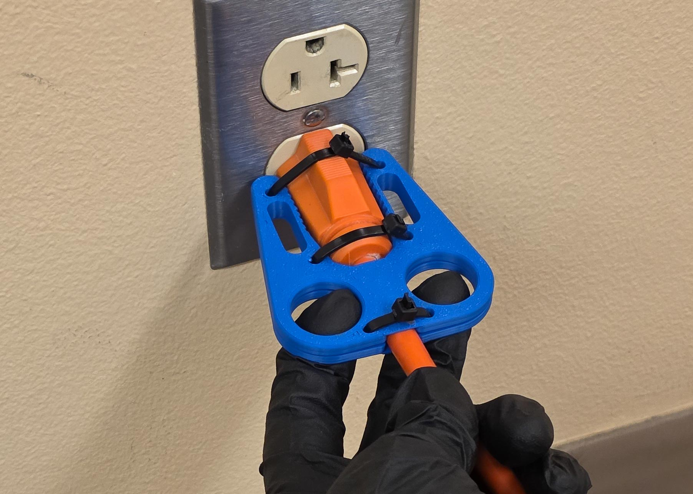

# openscad-plug-puller

[](LICENSE)
[](https://openscad.org/downloads.html)
[](CHANGELOG.md)
[](https://github.com/BrennenJohnston/openscad-plug-puller/actions/workflows/stl-validation.yml)

Parametric OpenSCAD model of the **Plug Puller** — a handheld assistive
device that helps users grip and remove electrical plugs from wall
outlets. One model builds **two tools**, chosen with a Step 0
`tool_style` selector: a **flat tool** (a slab with a plug pocket,
finger holes, a cord hook, and zip-tie / velcro attachment) and a
**heavy-duty clamshell** (a pair of identical serrated collar plates
that zip-tie around a fat extension-cord plug). A few quick steps drive
the whole model:

0. **Tool style** — `Auto from plug` (clamshell for thick plugs, else the
   flat tool), or force `Flat tool` / `Heavy-duty clamshell`
1. **Your Plug** — pick a `plug_preset` quick-select (top-3 US plug
   families, measured from reference plugs) *or* type the measurements
   of your plug and outlet: its length plus width and thickness **near
   the wall** and **near the cord** (the pocket, notch, cord hook, and
   the plug side rail are built from them — no protractor needed)
2. **Size** — `Small` / `Medium` (the reference) / `Large`
   (research-grounded ANSUR-II hand pairs), or `Measure my hand` to type
   two hand measurements
3. **Attachment** — `Zip ties`, `Velcro strap` (`Wing` or `Classic slot`
   style with a `strap_width` setting), both (the default), or none
4. **Cord hook** — `hook_hand` picks the J-hook's chirality (`Right` =
   the reference device)

`Custom` size unlocks every individual slider for power users (sections
marked "(Custom size only)"). Smooth-sided round plugs are held by the
pocket walls plus a zip tie cinched through the existing zip-tie holes;
fat round plugs are gripped between two serrated clamshell plates.



> **Version 0.10** — one step from the **v1.0** public milestone. The
> geometry and guides are complete and print-tested, the shipped STLs
> are CI-validated against golden fixtures, and the model is
> customizable in the browser with nothing to install.

> ### 🌐 Customize in your browser — no install
>
> **[Open the Plug Puller in the OpenSCAD Playground](https://ochafik.com/openscad2/#url=https://raw.githubusercontent.com/BrennenJohnston/openscad-plug-puller/main/dist/Plug_Puller_SingleFile.scad)**
> — the full customizer form runs in your web browser, nothing to
> install, works on a phone. The
> **[Web Customizer Guide](docs/guides/web-customizer.md)** walks
> through it step by step.

> ### I'm new — start here
>
> You don't need to know OpenSCAD (or any 3D modeling) to make a Plug
> Puller that fits **your** plug and **your** hand. Measure a few
> things with a ruler, type them into a form, export, print.
>
> **The one page to start from is the
> [Starter Guide](docs/guides/starter-guide.md)** — match your plug
> against the measuring stencil (or measure it), fill in the steps,
> print. Also available as a printable PDF with a built-in 1:1 paper
> stencil sheet:
> [`docs/Plug_Puller_Starter_Guide.pdf`](docs/Plug_Puller_Starter_Guide.pdf).
>
> The deep dives it points into:
>
> 1. **[Measuring Guide](docs/guides/measuring-guide.md)** — the
>    measurements and exactly how to take them (≈ 5 minutes)
> 2. **[Quick Start for Beginners](docs/guides/quick-start-beginner.md)**
>    — install → type numbers → export the print file, every click
>    spelled out — or skip the install with the
>    **[Web Customizer Guide](docs/guides/web-customizer.md)**
> 3. **[Fit Troubleshooting](docs/guides/fit-troubleshooting.md)** —
>    if the print is snug or loose, which one number to nudge
> 4. **[Try Before You Print](docs/guides/print-preview-outlines.md)** —
>    1:1 paper outline sheets for every quick-select combination, plus
>    a printable measuring stencil (plug silhouettes, ruler, cord gauge,
>    finger holes)
>
> Or skip straight to the [ready-to-print STLs](#ready-to-print-stls)
> below.
>
> The Customizer form itself is tiered the same way: the numbered
> **Steps 0–4** are the whole beginner path; the **`Advanced -`**
> sections and the **`(Custom size only)`** sections below them are
> optional power dials.

> ### I'm a power user — start here
>
> The **[Power User Guide](docs/guides/power-user-guide.md)** covers the
> two upper tiers: manual zip/velcro placement along the plug side rail,
> heavy-duty clamshell tuning (grip teeth, `clam_wall_boost` strength
> dial), Custom mode's full slider unlock, CLI batch export, saved
> parameter sets, hidden render modes, and the console diagnostics. The
> machine-readable slider matrix is
> [`parameter_mapping.json`](parameter_mapping.json); the engineering
> deep-dive is
> [`docs/Plug_Puller_Reference.md`](docs/Plug_Puller_Reference.md).

## Quick start

1. Open [`src/Plug_Puller_Parametric.scad`](src/Plug_Puller_Parametric.scad)
   in OpenSCAD (v2021.01 or later; recent builds with the Manifold
   backend render fastest).
2. Open the **Customizer** panel (`View ▸ Hide Customizer` unchecked;
   older builds: `Window ▸ Customizer`).
   - **Step 0 - Tool Style**: `Auto from plug` (default) picks the
     clamshell for thick plugs and the flat tool otherwise; or force
     `Flat tool` / `Heavy-duty clamshell`.
   - **Step 1 - Your Plug**: pick a `plug_preset` (or leave it on
     `Measure my plug` and type your plug measurements — see the
     [Measuring Guide](docs/guides/measuring-guide.md)). Skip both to
     get the reference plug pocket.
   - **Step 2 - Size**: keep `Medium` for the flat-tool reference, pick
     `Small` / `Large`, or pick `Measure my hand` and fill in the two
     hand measurements below the dropdown.
   - **Step 3 - Attachment**: `Zip ties + Velcro` (default), `Zip ties`,
     `Velcro strap`, or `None` — shapes both tools (flat-tool hole grid /
     wing slots, clamshell zip stations / arm slots); `velcro_style` is
     `Wing` (default) or `Classic slot` (flat tool only).
   - **Step 4 - Cord Hook - Flat Tool**: `hook_hand` = `Right` (the
     reference device) or `Left`; ignored by the clamshell.
3. Press **F6** to render, then `File ▸ Export ▸ STL` to save the
   print file. (The heavy-duty clamshell is a single plate — print it
   twice and flip one copy over, then zip-tie the pair face to face
   around the plug.)

Everything below Step 4 in the Customizer is optional: the `Advanced -`
sections hold placement overrides and clamshell tuning, and the
`(Custom size only)` sections only apply when `size = Custom` — see the
[Power User Guide](docs/guides/power-user-guide.md).

Prefer a single file (e.g. for the MakerWorld customizer or offline
sharing)? Use [`dist/Plug_Puller_SingleFile.scad`](dist/Plug_Puller_SingleFile.scad)
— the same model flattened into one file.

## Ready-to-print STLs

No OpenSCAD needed — three pre-rendered flat tools with default
settings live in [`stl/`](stl), plus the measuring stencil:

| File | Size | Fits |
| ---- | ---- | ---- |
| [`stl/Plug_Puller_Small.stl`](stl/Plug_Puller_Small.stl) | Small | ≈ 5th-percentile female hand |
| [`stl/Plug_Puller_Medium.stl`](stl/Plug_Puller_Medium.stl) | Medium | the reference size — start here |
| [`stl/Plug_Puller_Large.stl`](stl/Plug_Puller_Large.stl) | Large | ≈ 95th-percentile male hand |
| [`stl/Measuring_Stencil.stl`](stl/Measuring_Stencil.stl) | — | thin measuring cards: plug-preset silhouettes (P1–P3), a tactile mm ruler (R1), a cord gauge (C1), and all 18 finger-sizing holes (F1/F2) — answer the worksheet without a caliper |

Not sure which size? Print a **[1:1 paper outline sheet](docs/guides/print-preview-outlines.md)**
of any quick-select combination first and test it against your real
plug and hand — all twelve sheets are also bundled as one printable
PDF: [`docs/Plug_Puller_Outline_Sheets.pdf`](docs/Plug_Puller_Outline_Sheets.pdf). For a tool matched to *your* plug and hand, spend five
minutes with the [Measuring Guide](docs/guides/measuring-guide.md) and
the Customizer instead.

## Customize in your browser

No install needed — the
**[OpenSCAD Playground](https://ochafik.com/openscad2/#url=https://raw.githubusercontent.com/BrennenJohnston/openscad-plug-puller/main/dist/Plug_Puller_SingleFile.scad)**
runs the full customizer form in your web browser (including on a
phone). The **[Web Customizer Guide](docs/guides/web-customizer.md)**
covers it click by click, including the manual load path and phone
usage notes. It loads the flattened single-file build,
[`dist/Plug_Puller_SingleFile.scad`](dist/Plug_Puller_SingleFile.scad).

## Publishing to MakerWorld

MakerWorld's Parametric Model Maker runs OpenSCAD files directly:

1. Upload [`dist/Plug_Puller_SingleFile.scad`](dist/Plug_Puller_SingleFile.scad)
   (the single-file build — the multi-file `src/` tree will not work
   there because `include <>` files are not uploaded alongside it).
2. MakerWorld auto-detects the `.scad` upload and adds the **Customize**
   button to the model page; the parameter form mirrors the OpenSCAD
   Customizer sections (the Step 0–4 beginner path, the `Advanced -`
   power sections, and the "(Custom size only)" expert sections).
3. Test the customizer behaviour first via **Creator Portal → Open SCAD
   File** before publishing.

Draft listing text (title, description, print settings, licensing
notes) is prepared in
[`docs/makerworld-listing.md`](docs/makerworld-listing.md). Note the
licensing decision recorded there: publishing on MakerWorld requires
granting MakerWorld's platform license terms alongside this repo's
PolyForm NC 1.0.0 — the listing stays unpublished until the maintainer
signs off on that.

## Features

| Feature | Description |
| ------- | ----------- |
| Two tools, one model | Step 0 `tool_style` picks the **flat tool** or the **heavy-duty clamshell**; `Auto from plug` chooses the clamshell for thick plugs (effective thickness ≥ 24 mm) and the flat tool otherwise |
| Heavy-duty clamshell | A pair of identical serrated collar plates that zip-tie around a fat extension-cord plug |
| Plug side rail | The flat-tool pocket walls, zip stations, and velcro slot follow one rail down the plug's side; the rail's taper angle is derived from the two Step 1 width stations over the plug length, so one taper moves everything coherently |
| Plug quick-select | `plug_preset` prefills three common US plug families (Flat NEMA 1-15, Standard NEMA 5-15, Heavy-duty round NEMA 5-15), calibrated from reference-plug measurements; `Measure my plug` keeps the sliders authoritative |
| Measurement-first Customizer | Plug measurements are Step 1 and always active; sizes and attachment are one dropdown each |
| Organic body | A rounded organic silhouette reproduced by a fitted octagon + side rounding; crisp plug end, blob-rounded cord end, wider shoulder ears |
| Dome plug pocket | A two-level pocket: a plug-shaped recess plus a deeper circular seat centered on the top edge; the two floor heights are directly settable in Custom |
| Finger holes | Mirrored pair, Ø 25.4 mm at Medium, quarter-round rim fillets on both faces |
| Cord J-hook | Chiral J-hook cord catch: an offset stem, a catch lip that reaches past the stem, and a tip that drops below Y = 0 so a hooked cord cannot back out (`hook_hand` mirrors left/right) |
| Plug wall notch | Rounded-corner notch that straddles the outlet wall plate; depth follows the wall-plate style dropdown |
| Zip-tie holes | A 2×2 grid of Ø 5.08 mm holes, with a top-face countersink flare on the exposed lower row |
| Wing velcro slots | Default `Wing` style: curved triangular cutouts filling the dead space between finger hole, pocket, side edge, and zip holes, sized to `strap_width`; a `Classic slot` fallback keeps rectangular slots |
| Round-plug retention | Smooth-sided round plugs are held by the pocket walls plus a zip tie cinched through the existing zip-tie hole grid |
| Auto-fit | Every feature is bounds-clamped against the body envelope so measured sizes never self-intersect; in Custom mode every clamp is reported in the console (`(clamped from …)`) with a preview HUD notice |
| In-model validation | Red warning tag printed flat on the bed next to the part when a check trips (flat tool W-1…W-19; clamshell WC-1…WC-11), including hole-collision checks; messages name the *measurement* to fix; a preview-only green tag confirms your numbers were applied |
| Render mode dispatch | Single SCAD renders the full model, the clamshell plate, body only, isolated cutouts, or a 2D cutout overlay |
| Try-before-you-print previews | [1:1 dimensioned outline sheets](docs/guides/print-preview-outlines.md) for every quick-select combination (cut out, hold against the plug, try the finger holes) plus a printable [measuring stencil](Measuring_Stencil.scad) with plug silhouettes, ruler, cord gauge, and finger holes |

## Sizes

All non-Custom sizes route through the measurement derivation layer
([`src/fit_measured.scad`](src/fit_measured.scad)): the plug
measurements (or a `plug_preset`) drive the pocket / notch / J-hook, and
the size picks the hand pair that drives the grip and body envelope. The
hand pairs are research-grounded (ANSUR II 2012 hand breadth + Rogers 2008
PIP-joint breadth): Small ≈ 5th %ile female, Large ≈ 95th %ile male.

| Size | Hand pair (finger / hand) | Body | Notes |
| ---- | ------------------------- | ---- | ----- |
| `Small` | 16.5 / 72 mm | ≈ 60 × 65 × 5.4 mm | scaled-down grip |
| `Medium` | 20 / 85 mm | 81.55 × 65.5 × 6.35 mm (octagon) | **= the reference device** |
| `Large` | 23 / 96 mm | ≈ 78 × 66 × 7.2 mm | scaled-up grip |
| `Measure my hand` | your two measurements | derived | defaults reproduce Medium exactly |
| `Custom` | — | sliders | measurements ignored; every slider unlocked |

### Saved Customizer parameter sets

[`presets/Plug_Puller_Parametric.json`](presets/Plug_Puller_Parametric.json)
ships example parameter sets (snapshots of Customizer values):

| Name in JSON | Loads as | Notes |
| ------------ | -------- | ----- |
| `Medium (v6 reference)` | `Medium` | the flat-tool reference device, zip ties + wing velcro |
| `Flat 2-prong lamp plug (NEMA 1-15)` | `plug_preset` | 37 mm long, width 25 → 11.2, thickness 18.6 → 8.6 (wall → cord), 3.6 mm cord |
| `Standard 3-prong plug (NEMA 5-15)` | `plug_preset` | 46.2 mm long, width 26.6 → 13.4, thickness 18.9 → 15, 7 mm cord |
| `Heavy-duty round cord (NEMA 5-15)` | `plug_preset` | 43.8 mm long, 27 mm thick at both ends (→ clamshell), 8.2 mm cord |
| `Small hands` / `Large hands` | `Small` / `Large` | ANSUR-II grip scaling |
| `Measure my plug + hand (US vacuum plug)` | `Measure my hand` | straight-sided plug 34 wide × 16 thick at both stations, 38 mm long, 5 mm cord, Decora plate, 22 / 88 mm hand |
| `Left-handed + classic velcro slots` | `Medium` | `hook_hand = Left`, `velcro_style = Classic slot` |

### Auto-fit and `custom_enable_auto_fit`

Auto-fit clamps geometry into safe ranges (always on for the measured
sizes, toggleable in Custom). When enabled, feature placement is
re-derived from the current body envelope. Disable it only when you
specifically need to push features outside the envelope; the
**in-model validation warnings** (red text past the plug end) will tell
you which checks failed.

## Render modes

The hidden `render_mode` parameter controls which subset of geometry is built:

| Mode | What it renders |
| ---- | --------------- |
| `Full` | The resolved tool — flat tool (pocketed body + cutouts + warnings) or the clamshell plate |
| `Clamshell Plate` | The heavy-duty plate (print two copies, flip one) |
| `Body Only` | Pocketed body + cutouts |
| `Body No Cutouts` | Solid body, no pocket, no holes (debug view) |
| `Only Finger Holes` / `Only T Hook` / `Only Plug Wall Notch` / `Only Zip Tie Holes` / `Only Velcro Strap Holes` | Plain body + a single feature cutout |
| `Cutouts Only 2D` | 2D overlay of every cutout + pocket profile (debug) |

## Repository layout

```
openscad-plug-puller/
  Measuring_Stencil.scad           # standalone printable measuring stencil
  src/
    Plug_Puller_Parametric.scad    # flat tool + heavy-duty clamshell — open this in OpenSCAD
    presets.scad                   # PRESET_MEDIUM reference table + routing
    fit_measured.scad              # measurement -> parameter derivations
  dist/
    Plug_Puller_SingleFile.scad    # flattened single-file build (MakerWorld / web)
  presets/
    Plug_Puller_Parametric.json    # example saved Customizer parameter sets
  stl/                             # ready-to-print samples + the sizing stencil
  docs/
    Plug_Puller_Reference.md       # exhaustive engineering reference
    Plug_Puller_Complete_Guide.pdf # printable complete guide
    Plug_Puller_Measuring_Template.pdf  # printable 1:1 measuring template
    Plug_Puller_Outline_Sheets.pdf # all twelve 1:1 outline sheets as one printable PDF
    guides/                        # beginner guides: quick start, web customizer, measuring, fit troubleshooting
      outline-sheets/              # printable 1:1 outline sheets (one per quick-select combo)
    images/                        # guide photos and model preview renders
  parameter_mapping.json           # full Customizer schema (103 parameters)
  CHANGELOG.md
  LICENSE                          # PolyForm Noncommercial 1.0.0
```

## 3D printing tips

- **Orientation:** print with `Z = 0` flat on the print bed (the flat
  bottom face) so the plug pocket faces upward. The pocket floors are
  flat terraces — no supports required.
- **Layer height:** 0.2 mm gives a clean finish on the pocket walls;
  0.16 mm sharpens the rim fillets on the 6.35 mm slab.
- **Infill:** 25–35 % cubic or gyroid is plenty for hand strength. The
  pull cord, not the slab, takes most of the load.
- **Walls / perimeters:** 3–4 walls. The zip-tie holes and optional
  velcro slots cut close to the pocket, so thin walls make those
  regions fragile.
- **Material:** PETG is the recommended default — it tolerates the
  cord-tension fatigue cycle better than PLA and resists outlet heat
  near a misbehaving plug. ABS / ASA work too. Avoid soft TPU; the
  device needs to stay rigid for the hook to grip the cord.
- **Quality slider:** the default `quality = 64` is already
  print-ready. Drop to `32` for fast previews; push to `96` or `128`
  only if you specifically need crisp curvature on a very large export.

## Troubleshooting

| Symptom | Likely cause | Where to look |
| ------- | ------------ | ------------- |
| Red warning tag lies flat on the bed past the end of the model | One of the in-model validation checks tripped | The tag text names the failed check; every warning is also echoed to the console. In the measured sizes the message names the *measurement* to fix — see the [Fit Troubleshooting Guide](docs/guides/fit-troubleshooting.md) |
| Green `MEDIUM: …` (or `MEASURED: …`) tag in the preview | Not a problem — preview-only confirmation that your measurements were applied. Never appears in the exported STL | — |
| Orange `CUSTOM SLIDERS IGNORED - SET SIZE = CUSTOM` tag in the preview | A `custom_*` slider was moved while a non-Custom size is active — those sliders only apply when `size = Custom`. The console lists each ignored slider by name | The `size` dropdown (Step 2) |
| Typed measurements but the model doesn't change | `size` is set to `Custom` — measurements are ignored there. Pick any other size | The `size` dropdown (Step 2) |
| Sliders ignored | The measured sizes override the custom sliders via the derivation layer (the preview shows the orange HUD tag). Switch `size` to `Custom` | [`src/presets.scad`](src/presets.scad) |
| Smooth round plug slips out of the pocket | Round cord ends have no shoulders for the notch to catch | Thread a zip tie down one zip-tie hole, around the plug barrel, and back up the opposite hole, then cinch it — the 2×2 grid doubles as a clamp anchor |
| Hand sliders do nothing | `measure_finger_width` / `measure_hand_width` apply only when `size = Measure my hand` | Step 2 of the Customizer |
| Customizer never shows a slider you expected | Either the parameter lives under `/* [Hidden] */` (e.g. `render_mode`), or you are not in `Custom` size | [`parameter_mapping.json`](parameter_mapping.json) lists every user-facing parameter |

## Documentation index

Organized by audience — start in the row that matches you.

### For beginners (measure, type, print)

| Document | Description |
| -------- | ----------- |
| [`docs/guides/starter-guide.md`](docs/guides/starter-guide.md) | **Start here** — the whole path on one page: match your plug against the stencil cards (or measure it), fill in the Customizer steps, print |
| [`docs/Plug_Puller_Starter_Guide.pdf`](docs/Plug_Puller_Starter_Guide.pdf) | The starter guide as a printable PDF, ending with the 1:1 paper stencil sheet |
| [`docs/guides/stencil-sheet.svg`](docs/guides/stencil-sheet.svg) | The 1:1 paper stencil sheet on its own (A4 / Letter): calibration square, P1–P3 plug silhouettes, mm ruler, finger circles |
| [`docs/guides/quick-start-beginner.md`](docs/guides/quick-start-beginner.md) | Zero-experience walkthrough: install OpenSCAD, type your measurements, export the STL |
| [`docs/guides/web-customizer.md`](docs/guides/web-customizer.md) | The same walkthrough with zero install: customize and export in your web browser (works on a phone) |
| [`docs/guides/measuring-guide.md`](docs/guides/measuring-guide.md) | The plug and hand measurements, how to take each one, printable worksheet |
| [`docs/guides/measuring-template.svg`](docs/guides/measuring-template.svg) | Printable 1:1 sheet (A4 / Letter): calibration square, mm ruler, finger-sizing circles |
| [`docs/Plug_Puller_Measuring_Template.pdf`](docs/Plug_Puller_Measuring_Template.pdf) | The same measuring template as a printable PDF |
| [`docs/guides/print-preview-outlines.md`](docs/guides/print-preview-outlines.md) | Try before you print: 1:1 outline sheets for every quick-select combination + the measuring stencil |
| [`docs/Plug_Puller_Outline_Sheets.pdf`](docs/Plug_Puller_Outline_Sheets.pdf) | All twelve 1:1 outline sheets in one printable PDF with a cover index |
| [`docs/guides/fit-troubleshooting.md`](docs/guides/fit-troubleshooting.md) | Symptom → which measurement to nudge → by how much; warning-tag decoder |
| [`docs/Plug_Puller_Complete_Guide.pdf`](docs/Plug_Puller_Complete_Guide.pdf) | The complete guide as a single printable PDF |

### For power users (the Advanced and Custom tiers)

| Document | Description |
| -------- | ----------- |
| [`docs/guides/power-user-guide.md`](docs/guides/power-user-guide.md) | The Advanced sections (rail-based zip/velcro placement, clamshell tuning and strength dials), Custom mode's full unlock, saved parameter sets, CLI batch export, hidden render modes, console diagnostics |
| [`parameter_mapping.json`](parameter_mapping.json) | Machine-readable Customizer schema (103 parameters) — every name, type, range, step, and default |

### For contributors and engineers

| Document | Description |
| -------- | ----------- |
| [`docs/Plug_Puller_Reference.md`](docs/Plug_Puller_Reference.md) | Exhaustive reference: both tools, coordinate frames, the plug side rail, clamshell geometry, CSG order, parameter catalog, sizes, derivation layer, render modes, validation warnings |
| [`CHANGELOG.md`](CHANGELOG.md) | Keep-a-Changelog release history |

## Related projects

- [`braille-stl-generator-openscad`](https://github.com/BrennenJohnston/braille-stl-generator-openscad) — sibling parametric OpenSCAD project; the pipeline conventions (presets.scad, in-model warnings) used here were adapted from it.
- [`cad-to-openscad-pipeline`](https://github.com/BrennenJohnston/cad-to-openscad-pipeline) — the general-purpose CAD-to-OpenSCAD methodology and the DXF → polygon conversion tool.

## License

[PolyForm Noncommercial 1.0.0](LICENSE). Personal, hobby, educational,
research, and other noncommercial use is permitted. Contact the
maintainer for commercial use.
