# Dial diagrams

Every dial of the one-sided puller and the two-sided puller has a picture here: the tool at its defaults in black, the plug in teal, and a red dashed trace on the part that dial moves when it goes from its default to a second value.

The pictures are cut from the same OpenSCAD files you print from, at 1 unit = 1 mm; the two values drawn are written under each picture.

black = the tool at its defaults; teal = the plug you measured; red dashed = what this dial moves.

## One-sided puller

### Step 1 - Your Plug

`plug_preset`: Plug preset

Before: Measure my plug. After: Standard 3-prong plug - NEMA 5-15. Moves: body edge, pocket, seat, wall notch, wing openings, zip-tie holes.

`measure_plug_length`: Plug length

Before: 25.5. After: 40. Moves: body edge, seat, wall notch, wing openings, zip-tie holes.

`measure_plug_width_prong_end`: Plug width at the prong end

Before: 25. After: 32. Moves: seat, wall notch, wing openings, zip-tie holes.

`measure_plug_width_cord_end`: Plug width at the cord end

Before: 25. After: 15. Moves: pocket, wing openings.

`measure_plug_thickness_prong_end`: Plug thickness at the prong end

Before: 20. After: 23.5. Section at x = 0 mm. Moves: pocket, seat.

`measure_plug_thickness_cord_end`: Plug thickness at the cord end

Before: 20. After: 23.5. Section at x = 0 mm. Moves: pocket, seat.

`measure_cord_thickness`: Cord thickness

Before: 4. After: 8. Moves: body edge, finger holes, pocket, wall notch, wing openings, zip-tie holes.

`measure_wall_plate_style`: Outlet cover plate style

Before: Standard flat plate. After: Oversized / Jumbo. Moves: body edge, pocket, wall notch, wing openings, zip-tie holes.

`show_plug_preview`: Show the see-through plug

This dial changes no shape. Changes no shape: the see-through plug is a preview aid and is never exported.

### Step 2 - Size

`size`: Hand size

Before: Medium. After: Large. Moves: body edge, finger holes, pocket, wing openings, zip-tie holes.

`measure_finger_width`: Finger width

Before: 20. After: 26. Context: `size` = Measure my hand. Moves: finger holes, pocket, wall notch, wing openings.

`measure_hand_width`: Hand width

Before: 85. After: 100. Context: `size` = Measure my hand. Moves: wing openings.

### Step 3 - Attachment

`attachment`: Attachment

Before: Zip ties + Velcro. After: Zip ties. Moves: wing openings.

`velcro_style`: Strap opening style

Before: Wing. After: Classic slot. Moves: wing openings.

`strap_width`: Strap width

This dial changes no shape. Changes no shape: it only sets the width the W-14 check compares the wing opening against.

### Step 4 - Cord Hook

`hook_hand`: Hook side

Before: Right. After: Left. Moves: hook.

### Advanced - Zip Tie Placement

`zip_placement`: Zip-tie hole placement

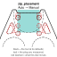

Before: Auto. After: Manual. Moves: seat, wall notch, wing openings, zip-tie holes.

`zip_row_count`: Number of zip-tie rows

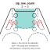

Before: 2. After: 3. Moves: wing openings, zip-tie holes.

`zip_pos_1`: Zip-tie pair 1 position

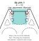

Before: 6. After: 10. Context: `zip_placement` = Manual. Moves: seat, wall notch, zip-tie holes.

`zip_pos_2`: Zip-tie pair 2 position

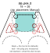

Before: 18. After: 26. Context: `zip_placement` = Manual. Moves: wing openings, zip-tie holes.

`zip_pos_3`: Zip-tie pair 3 position

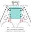

Before: 30. After: 26. Context: `zip_placement` = Manual, `zip_row_count` = 3. Moves: wing openings, zip-tie holes.

`zip_edge_offset`: Zip-tie hole distance from the pocket wall

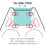

Before: 4. After: 8. Moves: wing openings, zip-tie holes.

### Advanced - Velcro Placement

`velcro_placement`: Strap slot placement

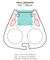

Before: Auto. After: Manual. Moves: wing openings.

`velcro_pos`: Strap slot position

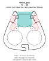

Before: 12. After: 25. Context: `velcro_style` = Classic slot, `velcro_placement` = Manual. Moves: classic slots.

### Advanced - Render Quality

`quality`: Render quality

This dial changes no shape. Changes no shape: it only sets the number of segments in every circle and arc.

### Custom Mode

`reset_custom_to_medium`: Reset Custom to the Medium reference

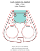

Before: false. After: true. Context: `size` = Custom. Moves: finger holes, wall notch, wing openings, zip-tie holes.

`custom_enable_auto_fit`: Auto-fit

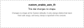

This dial changes no shape. Changes no shape at the Custom defaults: it only clamps sliders that leave their safe range, and every clamp is reported in the console.

### Body Shape (Custom size only)

`custom_puller_length`: Body length

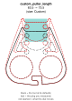

Before: 63.5. After: 73.5. Context: `size` = Custom. Moves: body edge, pocket, seat, wall notch, zip-tie holes.

`custom_puller_bottom_width`: Body width at the widest point

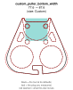

Before: 77.6. After: 87.6. Context: `size` = Custom. Moves: body edge.

`custom_puller_bottom_corners`: Cord-end corner width

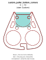

Before: 3. After: 13. Context: `size` = Custom. Moves: body edge.

`custom_puller_top_width`: Body width at the plug end

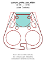

Before: 31.75. After: 41.75. Context: `size` = Custom. Moves: body edge, wing openings.

`custom_puller_middle_width`: Body width at the middle

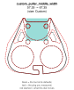

Before: 57.35. After: 67.35. Context: `size` = Custom. Moves: body edge, wing openings.

`custom_puller_side_corner`: Side corner position

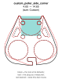

Before: 4.65. After: 14.65. Context: `size` = Custom. Moves: body edge, wing openings.

`custom_body_thickness`: Body thickness

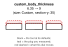

Before: 6.35. After: 9. Context: `size` = Custom. Section at y = 35 mm. Moves: body edge.

`custom_body_round_bottom_only`: Round the cord half only

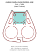

Before: true. After: false. Context: `size` = Custom. Moves: body edge, hook, seat, wall notch.

### Plug Pocket (Custom size only)

`custom_pocket_seat_diameter`: Pocket seat diameter

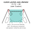

Before: 31.75. After: 28. Context: `size` = Custom. Moves: seat.

`custom_pocket_width`: Pocket width

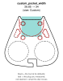

Before: 28.85. After: 34. Context: `size` = Custom. Moves: pocket, seat, wing openings, zip-tie holes.

`custom_pocket_depth`: Pocket depth

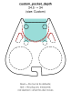

Before: 24.5. After: 34. Context: `size` = Custom. Moves: pocket, wing openings.

`custom_pocket_dome_drop`: Pocket reference drop

This dial changes no shape. Changes no shape: the recess is a rounded-nose shape whose width at the plug end is the pocket width and whose walls follow the side taper, so this reference point cancels out; measured with straight and with tapered walls.

`custom_pocket_seat_floor`: Pocket seat floor thickness

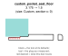

Before: 3.175. After: 1.5. Context: `size` = Custom. Section at x = 0 mm. Moves: seat.

`custom_pocket_floor`: Plug recess floor thickness

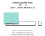

Before: 3.81. After: 2. Context: `size` = Custom. Section at x = 0 mm. Moves: pocket, seat.

`custom_pocket_side_angle`: Pocket side taper

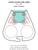

Before: 0. After: 10. Context: `size` = Custom. Moves: pocket, wing openings.

### Finger Holes (Custom size only)

`custom_enable_finger_holes`: Finger holes on or off

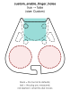

Before: true. After: false. Context: `size` = Custom. Moves: body edge, finger holes.

`custom_finger_hole_diameter`: Finger hole diameter

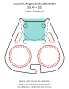

Before: 25.4. After: 22. Context: `size` = Custom. Moves: finger holes, wing openings.

`custom_finger_hole_spacing`: Finger hole spacing

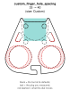

Before: 33. After: 40. Context: `size` = Custom. Moves: finger holes, wing openings.

`custom_finger_hole_y_position`: Finger hole position

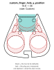

Before: 19.8. After: 26. Context: `size` = Custom. Moves: finger holes, pocket.

### T Hook (Custom size only)

`custom_enable_t_hook`: Cord hook on or off

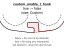

Before: true. After: false. Context: `size` = Custom. Moves: hook.

`custom_t_hook_base_gap`: Hook slot width

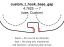

Before: 4.7625. After: 7. Context: `size` = Custom. Moves: hook.

`custom_t_hook_length`: Hook length

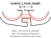

Before: 10.16. After: 15. Context: `size` = Custom. Moves: finger holes, hook, pocket, wing openings, zip-tie holes.

`custom_t_hook_holder_width`: Hook crossbar width

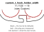

Before: 11.1125. After: 16. Context: `size` = Custom. Moves: finger holes, hook, wing openings, zip-tie holes.

`custom_t_hook_holder_length`: Hook crossbar height

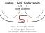

Before: 5.08. After: 8. Context: `size` = Custom. Moves: hook.

`custom_t_hook_gap_offset`: Hook slot inset

This dial changes no shape. Changes no shape: the J-hook cord catch is drawn without this dial; it only appears in the Cutouts Only 2D debug overlay.

`custom_t_hook_leg_offset`: Hook stem side offset

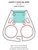

Before: 0. After: 3. Context: `size` = Custom. Moves: finger holes, wing openings, zip-tie holes.

`custom_t_hook_stem_offset`: Hook stem offset

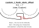

Before: 4.5. After: 7. Context: `size` = Custom. Moves: hook.

`custom_t_hook_catch_reach`: Hook catch reach

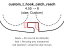

Before: 4.55. After: 8. Context: `size` = Custom. Moves: hook.

`custom_t_hook_tip_drop`: Hook tip drop

This dial changes no shape. Only acts when size is Custom. Changes no shape: the hook slot's mouth already opens through the cord end (the body ends at Y = 0), so sagging the mouth farther below that edge cuts only air; measured at 1.98, 4 and 0.

### Plug Wall Notch (Custom size only)

`custom_enable_plug_wall_notch`: Wall notch on or off

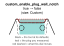

Before: true. After: false. Context: `size` = Custom. Moves: wall notch.

`custom_plug_wall_notch_width`: Wall notch width

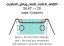

Before: 26.67. After: 20. Context: `size` = Custom. Moves: wall notch.

`custom_plug_wall_notch_height`: Wall notch depth

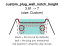

Before: 3.81. After: 7. Context: `size` = Custom. Moves: wall notch, wing openings, zip-tie holes.

`custom_plug_wall_notch_rounding`: Wall notch corner rounding

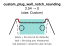

Before: 2.54. After: 0. Context: `size` = Custom. Moves: wall notch.

### Zip Tie Holes (Custom size only)

`custom_zip_tie_hole_diameter`: Zip-tie hole diameter

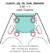

Before: 5.08. After: 7. Context: `size` = Custom. Moves: wing openings, zip-tie holes.

`custom_zip_tie_height_spacing`: Zip-tie row spacing

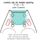

Before: 17.78. After: 12. Context: `size` = Custom. Moves: wing openings, zip-tie holes.

`custom_zip_tie_width_spacing`: Zip-tie column spacing

This dial changes no shape. Changes no shape of its own: the zip-tie columns sit zip_edge_offset inside the pocket wall; this dial only feeds the auto-fit finger keep-out, which trimmed the row spacing by 0.05 mm at the Custom defaults.

`custom_zip_tie_distance_from_notch`: Zip-tie distance from the notch

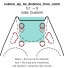

Before: 5.1. After: 9. Context: `size` = Custom. Moves: wing openings, zip-tie holes.

`custom_zip_tie_countersink`: Zip-tie countersink

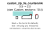

Before: 0.9. After: 2.5. Context: `size` = Custom. Section at x = 10.4 mm. Moves: pocket, zip-tie holes.

### Velcro / Wing Strap Holes (Custom size only)

`custom_velcro_hole_length`: Strap slot length

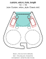

Before: 12. After: 18. Context: `size` = Custom, `velcro_style` = Classic slot. Moves: classic slots.

`custom_velcro_hole_width`: Strap slot width

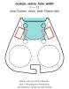

Before: 7. After: 11. Context: `size` = Custom, `velcro_style` = Classic slot. Moves: classic slots.

`custom_velcro_hole_x_center`: Strap slot distance from the centerline

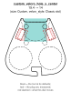

Before: 19.4. After: 14. Context: `size` = Custom, `velcro_style` = Classic slot. Moves: classic slots.

`custom_velcro_hole_y_center`: Strap slot position along the body

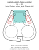

Before: 46. After: 38. Context: `size` = Custom, `velcro_style` = Classic slot. Moves: classic slots.

`custom_velcro_hole_rotation`: Strap slot lean

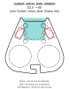

Before: 23.5. After: 60. Context: `size` = Custom, `velcro_style` = Classic slot. Moves: classic slots.

### Edge Rounding (Custom size only)

`custom_body_side_rounding`: Body side rounding

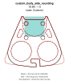

Before: 15.85. After: 5. Context: `size` = Custom. Moves: body edge.

`custom_body_top_rounding`: Top edge rounding

Before: 2.54. After: 0. Context: `size` = Custom. Section at y = 35 mm. Moves: body edge.

`custom_body_bottom_rounding`: Bottom edge rounding

Before: 0. After: 2. Context: `size` = Custom. Section at y = 35 mm. Moves: body edge.

`custom_velcro_side_rounding`: Strap slot corner rounding

Before: 0. After: 2.5. Context: `size` = Custom, `velcro_style` = Classic slot. Moves: classic slots.

`custom_velcro_top_bottom_rounding`: Strap opening edge rounding

Before: 0. After: 1.5. Context: `size` = Custom. Section at y = 46 mm. Moves: pocket, wing openings.

`custom_finger_hole_rounding`: Finger hole rim rounding

Before: 2.5. After: 0. Context: `size` = Custom. Section at y = 19.8 mm. Moves: finger holes.

`custom_t_hook_holder_side_rounding`: Hook crossbar corner rounding

Before: 1.27. After: 0. Context: `size` = Custom. Moves: hook.

`custom_t_hook_gap_side_rounding`: Hook slot corner rounding

This dial changes no shape. Changes no shape: the J-hook cord catch is drawn without this dial; it only appears in the Cutouts Only 2D debug overlay.

`custom_t_hook_top_bottom_rounding`: Hook edge rounding

Before: 0. After: 2. Context: `size` = Custom. Section at x = 4.5 mm. Moves: hook.

## Two-sided puller

### Step 1 - Your Plug

`plug_preset`: Plug preset

Before: Measure my plug. After: Heavy-duty extension cord - NEMA 5-15. Moves: arms, finger lobes, plate edge, zip stations.

`measure_plug_length`: Plug length

Before: 25.5. After: 40. Moves: arms.

`measure_plug_width_prong_end`: Plug width at the prong end

Before: 20. After: 28. Moves: arms, cord channel, finger lobes, zip stations.

`measure_plug_width_cord_end`: Plug width at the cord end

Before: 20. After: 12. Moves: arms, teeth, zip stations.

`measure_cord_thickness`: Cord thickness

Before: 4. After: 9. Moves: arms, cord channel, finger lobes, zip stations.

`plug_sides`: Plug sides

Before: Rounded sides. After: Flat sides. Section at y = 45 mm. Moves: arms, teeth.

`show_plug_preview`: Show the see-through plug

This dial changes no shape. Changes no shape: the see-through plug is a preview aid and is never exported.

### Step 2 - Size

`size`: Hand size

Before: Medium. After: Large. Moves: arms, finger lobes, zip stations.

`measure_finger_width`: Finger width

Before: 20. After: 26. Context: `size` = Measure my hand. Moves: arms, finger lobes, plate edge, zip stations.

### Step 3 - Attachment

`attachment`: Attachment

Before: Zip ties + Velcro strap. After: Zip ties. Context: `measure_plug_length` = 40. Moves: arms, strap slot, zip stations.

`strap_width`: Strap width

Before: 15. After: 25. Context: `measure_plug_length` = 40. Moves: arms, strap slot, zip stations.

### Step 4 - Print Layout

`print_layout`: Print layout

Before: Both plates. After: One plate. Moves: arms, finger lobes, plate edge, zip stations.

### Advanced - Two-Sided Puller

`plate_wall_boost`: Extra wall on the plate

Before: 0. After: 2. Moves: arms, finger lobes, zip stations.

`plate_thickness`: Plate thickness

Before: 4. After: 6. Section at y = 3 mm. Moves: cord channel, finger lobes, zip stations.

`plate_grip_bite`: Grip bite

Before: -1. After: -2. Context: `plug_sides` = Flat sides. Section at y = 45 mm. Moves: arms, teeth.

`plate_cradle_depth`: Cradle depth

Before: 2.5. After: 0. Context: `plug_sides` = Rounded sides. Section at y = 45 mm. Moves: arms, teeth.

`plate_grip_clearance`: Grip clearance

Before: 0.5. After: 2. Context: `plug_sides` = Rounded sides. Section at y = 45 mm. Moves: arms, teeth.

`plate_cable_clearance`: Cord channel clearance

Before: 0.8. After: 3. Moves: arms, cord channel, finger lobes, zip stations.

`plate_finger_fit`: Finger hole fit

Before: 1. After: 4. Moves: arms, finger lobes, zip stations.

`plate_finger_wall`: Finger lobe wall

Before: 5. After: 9. Moves: arms, finger lobes, zip stations.

`plate_finger_inner_wall`: Wall beside the cord channel

Before: 3. After: 6. Moves: arms, finger lobes, zip stations.

`plate_tooth_diameter`: Tooth size

Before: 2. After: 4. Moves: teeth.

`plate_tooth_pitch`: Tooth spacing

Before: 2.8. After: 4.5. Moves: teeth.

`plate_tooth_depth`: Tooth depth

Before: 1. After: 0.3. Moves: teeth.

`plate_grip_zone_start`: Toothed zone start

Before: 4. After: 15. Moves: arms, teeth, zip stations.

`plate_grip_zone_length`: Toothed zone length

Before: 0. After: 12. Moves: arms, zip stations.

`plate_tip_flare`: Tip flare

Before: 0.7. After: 3. Moves: arms, cord channel, finger lobes, zip stations.

`plate_arm_tip_width`: Arm tip width

Before: 11. After: 16. Moves: arms, zip stations.

`plate_edge_rounding`: Outer edge rounding

Before: 1.2. After: 0. Section at y = 3 mm. Moves: finger lobes.

`plate_strip_thickness`: Cable strip thickness

Before: 1. After: 0. Section at y = 3 mm. Moves: cord channel.

`plate_zip_hole_diameter`: Zip-tie hole diameter

Before: 4. After: 6. Moves: arms, finger lobes, strap slot, zip stations.

`plate_zip_placement`: Zip-tie station placement

Before: Auto. After: Manual. Context: `measure_plug_length` = 40. Moves: arms, strap slot, zip stations.

`plate_zip_pos_1`: Zip-tie station 1 position

Before: 4. After: 27. Context: `measure_plug_length` = 40, `plate_zip_placement` = Manual. Moves: finger lobes, zip stations.

`plate_zip_pos_2`: Zip-tie station 2 position

Before: 32. After: 36. Context: `measure_plug_length` = 40, `plate_zip_placement` = Manual. Moves: strap slot, zip stations.

`plate_zip_pos_3`: Zip-tie station 3 position

Before: 63. After: 58. Context: `measure_plug_length` = 40, `plate_zip_placement` = Manual. Moves: arms, strap slot, zip stations.

`plate_slot_inner_wall`: Wall between the teeth and the slot

Before: 2.2. After: 5. Context: `measure_plug_length` = 40. Moves: arms, strap slot, zip stations.

`plate_velcro_slot_width`: Strap slot width

Before: 9.3. After: 14. Context: `measure_plug_length` = 40. Moves: arms, strap slot, zip stations.

`plate_velcro_slot_length`: Strap slot length

Before: 28. After: 15. Context: `measure_plug_length` = 40. Moves: arms, strap slot, zip stations.

### Advanced - Render Quality

`quality`: Render quality

This dial changes no shape. Changes no shape: it only sets the number of segments in every circle and arc.
