# Dial diagrams

Every dial of the one-sided puller and the two-sided puller has a picture here: the tool at the dial's default on the left with the plug in teal, an arrow with the two values, and the tool after the dial moved on the right, drawn once in black with the edges that moved in red dashes; the numbered dots on those edges match the key beside the picture.

The pictures are cut from the same OpenSCAD files you print from, at 1 unit = 1 mm. Under each picture: the long form of its text alternative, then the two values and the parts that moved.

black = the tool; teal = your plug; red dashed = the edges this dial moved; the numbers match the key beside the picture.

## One-sided puller

### The four steps

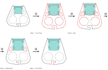

Five stages of the one-sided puller, left to right, the top row first, the plug end at the top; red dashes mark the edges each step moved. 1, the defaults: the tool as the file opens, with a 25 mm wide plug in teal. 2, Step 1 - Your Plug: plug length, plug width at the prong end, plug width at the cord end, and 4 more; red on the body edge, the finger holes, the seat, the wall notch and the wing openings. 3, Step 2 - Size: hand size, finger width, hand width; red on the body edge, the finger holes, the pocket, the wall notch, the wing openings and the zip-tie holes. 4, Step 3 - Attachment: attachment; the wing openings removed, drawn in red from the old outline. 5, Step 4 - Cord Hook: hook side; red on the hook.

### Step 1 - Your Plug

`plug_preset`: Plug preset

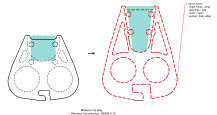

Two top views of the one-sided puller, before left and after right, the plug end at the top. Left: the defaults, a 25 mm wide plug in teal. Right: plug preset set to Standard 3-prong plug - NEMA 5-15. Marked in red: 1, the zip-tie holes, the wing openings, the wall notch, the seat, the pocket and the body edge.

Before: Measure my plug. After: Standard 3-prong plug - NEMA 5-15. Moves: body edge, pocket, seat, wall notch, wing openings, zip-tie holes.

`measure_plug_length`: Plug length

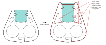

Two top views of the one-sided puller, before left and after right, the plug end at the top. Left: the defaults, a 25 mm wide plug in teal. Right: plug length at 40 mm. Marked in red: 1, the zip-tie holes: the four small holes beside the pocket. 2, the zip-tie holes and the wing openings. 3, the wall notch, the seat and the body edge.

Before: 25.5. After: 40. Moves: body edge, seat, wall notch, wing openings, zip-tie holes.

`measure_plug_width_prong_end`: Plug width at the prong end

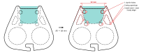

Two top views of the one-sided puller, before left and after right, the plug end at the top. Left: the defaults, a 25 mm wide plug in teal. Right: plug width at the prong end at 32 mm. Marked in red: 1, the zip-tie holes: the four small holes beside the pocket. 2, the wing openings: the two openings beside the pocket. 3, the wall notch, the seat and the body edge: the notch in the top edge; the round recess at the plug end; the outer outline.

Before: 25. After: 32. Moves: body edge, seat, wall notch, wing openings, zip-tie holes.

`measure_plug_width_cord_end`: Plug width at the cord end

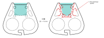

Two top views of the one-sided puller, before left and after right, the plug end at the top. Left: the defaults, a 25 mm wide plug in teal. Right: plug width at the cord end at 15 mm: tilts the pocket's side walls to match the plug's taper, and the zip-tie holes and wing openings lean in with them. Marked in red: 1, the wing openings and the pocket: the two openings beside the pocket; the plug recess on the centerline.

Before: 25. After: 15. Moves: pocket, wing openings.

`measure_plug_thickness_prong_end`: Plug thickness at the prong end

Two vertical slices of the one-sided puller at x = 0 mm, before left and after right, the top face up. Left: the defaults, the plug in teal in the cut. Right: plug thickness at the prong end at 23.5 mm: deepens or shallows the two pocket floors, the round seat and the plug recess, to suit the fatter of the two thickness numbers. Marked in red: 1, the seat and the pocket: the round recess at the plug end; the plug recess on the centerline.

Before: 20. After: 23.5. Section at x = 0 mm. Moves: pocket, seat.

`measure_plug_thickness_cord_end`: Plug thickness at the cord end

Two vertical slices of the one-sided puller at x = 0 mm, before left and after right, the top face up. Left: the defaults, the plug in teal in the cut. Right: plug thickness at the cord end at 23.5 mm: deepens or shallows the two pocket floors, the round seat and the plug recess, when this end is the fatter end of the plug. Marked in red: 1, the seat and the pocket: the round recess at the plug end; the plug recess on the centerline.

Before: 20. After: 23.5. Section at x = 0 mm. Moves: pocket, seat.

`measure_cord_thickness`: Cord thickness

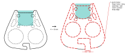

Two top views of the one-sided puller, before left and after right, the plug end at the top. Left: the defaults, a 25 mm wide plug in teal. Right: cord thickness at 8 mm. Marked in red: 1, the zip-tie holes, the finger holes, the wing openings, the wall notch, the pocket and the body edge.

Before: 4. After: 8. Moves: body edge, finger holes, pocket, wall notch, wing openings, zip-tie holes.

`measure_wall_plate_style`: Outlet cover plate style

Two top views of the one-sided puller, before left and after right, the plug end at the top. Left: the defaults, a 25 mm wide plug in teal. Right: outlet cover plate style set to Oversized / Jumbo. Marked in red: 1, the wall notch and the body edge: the notch in the top edge; the outer outline. 2, the zip-tie holes: the four small holes beside the pocket. 3, the pocket: the plug recess on the centerline. 4, the wing openings: the two openings beside the pocket.

Before: Standard flat plate. After: Oversized / Jumbo. Moves: body edge, pocket, wall notch, wing openings, zip-tie holes.

`show_plug_preview`: Show the see-through plug

This dial changes no shape: the see-through plug is a preview aid and is never exported.

This dial changes no shape. Changes no shape: the see-through plug is a preview aid and is never exported.

### Step 2 - Size

`size`: Hand size

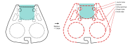

Two top views of the one-sided puller, before left and after right, the plug end at the top. Left: the defaults, a 25 mm wide plug in teal. Right: hand size set to Large. Marked in red: 1, the zip-tie holes: the four small holes beside the pocket. 2, the pocket: the plug recess on the centerline. 3, the wing openings: the two openings beside the pocket. 4, the finger holes: the two large holes in the lower half. 5, the body edge: the outer outline.

Before: Medium. After: Large. Moves: body edge, finger holes, pocket, wing openings, zip-tie holes.

`measure_finger_width`: Finger width

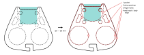

Two top views of the one-sided puller, before left and after right, the plug end at the top. Left: the defaults with hand size set to Measure my hand, a 25 mm wide plug in teal. Right: finger width at 26 mm. Marked in red: 1, the pocket: the plug recess on the centerline. 2, the wing openings: the two openings beside the pocket. 3, the finger holes: the two large holes in the lower half. 4, the wall notch and the body edge.

Before: 20. After: 26. Context: `size` = Measure my hand. Moves: body edge, finger holes, pocket, wall notch, wing openings.

`measure_hand_width`: Hand width

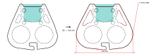

Two top views of the one-sided puller, before left and after right, the plug end at the top. Left: the defaults with hand size set to Measure my hand, a 25 mm wide plug in teal. Right: hand width at 100 mm: widens the whole body outline and thickens the slab in step with the hand. Marked in red: 1, the body edge: the outer outline. Everything else follows the outline.

Before: 85. After: 100. Context: `size` = Measure my hand. Moves: body edge.

### Step 3 - Attachment

`attachment`: Attachment

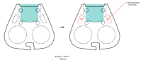

Two top views of the one-sided puller, before left and after right, the plug end at the top. Left: the defaults, a 25 mm wide plug in teal. Right: attachment set to Zip ties: adds or removes the zip-tie holes and the wing or slot openings for the strap. Marked in red: 1, the wing openings: the two openings beside the pocket, removed. The body edge, the pocket, the seat and the wall notch stay where they were.

Before: Zip ties + Velcro. After: Zip ties. Moves: wing openings.

`velcro_style`: Strap opening style

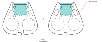

Two top views of the one-sided puller, before left and after right, the plug end at the top. Left: the defaults, a 25 mm wide plug in teal. Right: strap opening style set to Classic slot: swaps the curved wing openings for a pair of plain rectangular slots that lean along the body's sides. Marked in red: 1, the wing openings: the two openings beside the pocket. The body edge, the pocket, the seat and the wall notch stay where they were.

Before: Wing. After: Classic slot. Moves: wing openings.

`strap_width`: Strap width

This dial changes no shape: it only sets the width the W-14 check compares the wing opening against.

This dial changes no shape. Changes no shape: it only sets the width the W-14 check compares the wing opening against.

### Step 4 - Cord Hook

`hook_hand`: Hook side

Two top views of the one-sided puller, before left and after right, the plug end at the top. Left: the defaults, a 25 mm wide plug in teal. Right: hook side set to Left: mirrors the cord hook at the cord end so its catch faces the other side, and nothing else moves. Marked in red: 1, the hook: the cord hook slot in the bottom edge. The body edge, the pocket, the seat and the wall notch stay where they were.

Before: Right. After: Left. Moves: hook.

### Advanced - Zip Tie Placement

`zip_placement`: Zip-tie hole placement

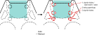

Two top views of the one-sided puller, before left and after right, the plug end at the top. Left: the defaults, a 25 mm wide plug in teal. Right: zip-tie hole placement set to Manual. Marked in red: 1, the zip-tie holes, the wall notch and the seat: the four small holes beside the pocket; the notch in the top edge; the round recess at the plug end. 2, the wing openings: the two openings beside the pocket. 3, the zip-tie holes: the four small holes beside the pocket.

Before: Auto. After: Manual. Moves: seat, wall notch, wing openings, zip-tie holes.

`zip_row_count`: Number of zip-tie rows

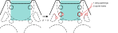

Two top views of the one-sided puller, before left and after right, the plug end at the top. Left: the defaults, a 25 mm wide plug in teal. Right: number of zip-tie rows at 3: adds or removes a pair of zip-tie holes, and the rows squeeze together when the body has no room for another. Marked in red: 1, the wing openings: the two openings beside the pocket. 2, the zip-tie holes: the four small holes beside the pocket.

Before: 2. After: 3. Moves: wing openings, zip-tie holes.

`zip_pos_1`: Zip-tie pair 1 position

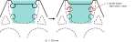

Two top views of the one-sided puller, before left and after right, the plug end at the top. Left: the defaults with zip-tie hole placement set to Manual, a 25 mm wide plug in teal. Right: zip-tie pair 1 position at 10 mm. Marked in red: 1, the zip-tie holes, the wall notch and the seat: the four small holes beside the pocket; the notch in the top edge; the round recess at the plug end.

Before: 6. After: 10. Context: `zip_placement` = Manual. Moves: seat, wall notch, zip-tie holes.

`zip_pos_2`: Zip-tie pair 2 position

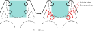

Two top views of the one-sided puller, before left and after right, the plug end at the top. Left: the defaults with zip-tie hole placement set to Manual, a 25 mm wide plug in teal. Right: zip-tie pair 2 position at 26 mm: slides the second pair of zip-tie holes along the plug's side, measured from the plug end. Marked in red: 1, the zip-tie holes: the four small holes beside the pocket. 2, the wing openings: the two openings beside the pocket.

Before: 18. After: 26. Context: `zip_placement` = Manual. Moves: wing openings, zip-tie holes.

`zip_pos_3`: Zip-tie pair 3 position

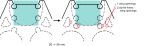

Two top views of the one-sided puller, before left and after right, the plug end at the top. Left: the defaults with zip-tie hole placement set to Manual and number of zip-tie rows set to 3, a 25 mm wide plug in teal. Right: zip-tie pair 3 position at 26 mm. Marked in red: 1, the wing openings: the two openings beside the pocket. 2, the zip-tie holes and the wing openings: the four small holes beside the pocket; the two openings beside the pocket.

Before: 30. After: 26. Context: `zip_placement` = Manual, `zip_row_count` = 3. Moves: wing openings, zip-tie holes.

`zip_edge_offset`: Zip-tie hole distance from the pocket wall

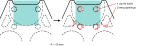

Two top views of the one-sided puller, before left and after right, the plug end at the top. Left: the defaults, a 25 mm wide plug in teal. Right: zip-tie hole distance from the pocket wall at 8 mm: moves every zip-tie hole farther from or closer to the pocket wall, and the wing openings reshape around them. Marked in red: 1, the zip-tie holes: the four small holes beside the pocket. 2, the wing openings: the two openings beside the pocket.

Before: 4. After: 8. Moves: wing openings, zip-tie holes.

### Advanced - Velcro Placement

`velcro_placement`: Strap slot placement

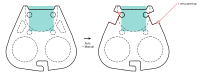

Two top views of the one-sided puller, before left and after right, the plug end at the top. Left: the defaults, a 25 mm wide plug in teal. Right: strap slot placement set to Manual: switches the strap openings to a pair of plain slots that the position dial slides along the plug's side, whatever the opening style. Marked in red: 1, the wing openings: the two openings beside the pocket. The body edge, the pocket, the seat and the wall notch stay where they were.

Before: Auto. After: Manual. Moves: wing openings.

`velcro_pos`: Strap slot position

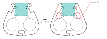

Two top views of the one-sided puller, before left and after right, the plug end at the top. Left: the defaults with strap opening style set to Classic slot and strap slot placement set to Manual, a 25 mm wide plug in teal. Right: strap slot position at 25 mm: slides the pair of strap slots along the plug's side, measured from the plug end. Marked in red: 1, the classic slots: the two slots beside the pocket.

Before: 12. After: 25. Context: `velcro_style` = Classic slot, `velcro_placement` = Manual. Moves: classic slots.

### Advanced - Render Quality

`quality`: Render quality

This dial changes no shape: it only sets the number of segments in every circle and arc.

This dial changes no shape. Changes no shape: it only sets the number of segments in every circle and arc.

### Custom Mode

`reset_custom_to_medium`: Reset Custom to the Medium reference

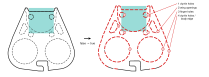

Two top views of the one-sided puller, before left and after right, the plug end at the top. Left: the defaults with hand size set to Custom, a 25 mm wide plug in teal. Right: reset Custom to the Medium reference set to true. Marked in red: 1, the zip-tie holes: the four small holes beside the pocket. 2, the wing openings: the two openings beside the pocket. 3, the finger holes: the two large holes in the lower half. 4, the body edge: the outer outline.

Before: false. After: true. Context: `size` = Custom. Moves: body edge, finger holes, wing openings, zip-tie holes.

`custom_enable_auto_fit`: Auto-fit

This dial changes no shape. Changes no shape at the Custom defaults: it only clamps sliders that leave their safe range, and every clamp is reported in the console.

This dial changes no shape. Changes no shape at the Custom defaults: it only clamps sliders that leave their safe range, and every clamp is reported in the console.

### Body Shape (Custom size only)

`custom_puller_length`: Body length

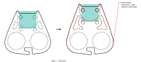

Two top views of the one-sided puller, before left and after right, the plug end at the top. Left: the defaults with hand size set to Custom, a 25 mm wide plug in teal. Right: body length at 73.5 mm. Marked in red: 1, the zip-tie holes, the wall notch, the seat, the pocket and the body edge: the four small holes beside the pocket; the notch in the top edge; the round recess at the plug end; the plug recess on the centerline; the outer outline.

Before: 63.5. After: 73.5. Context: `size` = Custom. Moves: body edge, pocket, seat, wall notch, zip-tie holes.

`custom_puller_bottom_width`: Body width at the widest point

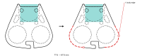

Two top views of the one-sided puller, before left and after right, the plug end at the top. Left: the defaults with hand size set to Custom, a 25 mm wide plug in teal. Right: body width at the widest point at 87.6 mm: widens the body at its widest point, just above the cord end, before the side rounding is applied. Marked in red: 1, the body edge: the outer outline. Everything else follows the outline.

Before: 77.6. After: 87.6. Context: `size` = Custom. Moves: body edge.

`custom_puller_bottom_corners`: Cord-end corner width

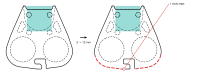

Two top views of the one-sided puller, before left and after right, the plug end at the top. Left: the defaults with hand size set to Custom, a 25 mm wide plug in teal. Right: cord-end corner width at 13 mm: widens the flat at the cord end where the two lower corners of the body outline sit. Marked in red: 1, the body edge: the outer outline. Everything else follows the outline.

Before: 3. After: 13. Context: `size` = Custom. Moves: body edge.

`custom_puller_top_width`: Body width at the plug end

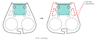

Two top views of the one-sided puller, before left and after right, the plug end at the top. Left: the defaults with hand size set to Custom, a 25 mm wide plug in teal. Right: body width at the plug end at 41.75 mm: widens the plug end of the body, where the wall notch and the pocket seat sit. Marked in red: 1, the body edge: the outer outline. 2, the wing openings: the two openings beside the pocket. Everything else follows the outline.

Before: 31.75. After: 41.75. Context: `size` = Custom. Moves: body edge, wing openings.

`custom_puller_middle_width`: Body width at the middle

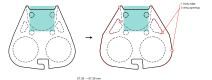

Two top views of the one-sided puller, before left and after right, the plug end at the top. Left: the defaults with hand size set to Custom, a 25 mm wide plug in teal. Right: body width at the middle at 67.35 mm: widens the body at the middle control point, bulging or straightening the side edges between the widest point and the plug end. Marked in red: 1, the body edge: the outer outline. 2, the wing openings: the two openings beside the pocket. Everything else follows the outline.

Before: 57.35. After: 67.35. Context: `size` = Custom. Moves: body edge, wing openings.

`custom_puller_side_corner`: Side corner position

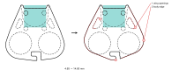

Two top views of the one-sided puller, before left and after right, the plug end at the top. Left: the defaults with hand size set to Custom, a 25 mm wide plug in teal. Right: side corner position at 14.65 mm: moves the two widest corners of the body outline up toward the plug end or down toward the cord end. Marked in red: 1, the wing openings: the two openings beside the pocket. 2, the body edge: the outer outline. Everything else follows the outline.

Before: 4.65. After: 14.65. Context: `size` = Custom. Moves: body edge, wing openings.

`custom_body_thickness`: Body thickness

Two vertical slices of the one-sided puller at y = 35 mm, before left and after right, the top face up. Left: the defaults with hand size set to Custom, the plug in teal in the cut. Right: body thickness at 9 mm: thickens the whole slab, so every hole and the pocket get deeper walls. Marked in red: 1, the body edge: the outer outline. Everything else follows the outline.

Before: 6.35. After: 9. Context: `size` = Custom. Section at y = 35 mm. Moves: body edge.

`custom_body_round_bottom_only`: Round the cord half only

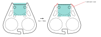

Two top views of the one-sided puller, before left and after right, the plug end at the top. Left: the defaults with hand size set to Custom, a 25 mm wide plug in teal. Right: round the cord half only set to false: rounds the whole outline instead of only the cord half, so the plug end loses its crisp corners. Marked in red: 1, the wall notch and the seat: the notch in the top edge; the round recess at the plug end.

Before: true. After: false. Context: `size` = Custom. Moves: body edge, hook, seat, wall notch.

### Plug Pocket (Custom size only)

`custom_pocket_seat_diameter`: Pocket seat diameter

Two top views of the one-sided puller, before left and after right, the plug end at the top. Left: the defaults with hand size set to Custom, a 25 mm wide plug in teal. Right: pocket seat diameter at 28 mm: widens the round seat cut into the plug end of the pocket. Marked in red: 1, the seat: the round recess at the plug end. The body edge, the pocket, the wall notch and the wing openings stay where they were.

Before: 31.75. After: 28. Context: `size` = Custom. Moves: seat.

`custom_pocket_width`: Pocket width

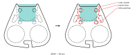

Two top views of the one-sided puller, before left and after right, the plug end at the top. Left: the defaults with hand size set to Custom, a 25 mm wide plug in teal. Right: pocket width at 34 mm. Marked in red: 1, the seat and the pocket: the round recess at the plug end; the plug recess on the centerline. 2, the zip-tie holes: the four small holes beside the pocket. 3, the wing openings: the two openings beside the pocket.

Before: 28.85. After: 34. Context: `size` = Custom. Moves: pocket, seat, wing openings, zip-tie holes.

`custom_pocket_depth`: Pocket depth

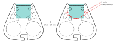

Two top views of the one-sided puller, before left and after right, the plug end at the top. Left: the defaults with hand size set to Custom, a 25 mm wide plug in teal. Right: pocket depth at 34 mm: runs the plug recess farther from the plug end toward the finger holes. Marked in red: 1, the pocket: the plug recess on the centerline. 2, the wing openings: the two openings beside the pocket.

Before: 24.5. After: 34. Context: `size` = Custom. Moves: pocket, wing openings.

`custom_pocket_dome_drop`: Pocket reference drop

This dial changes no shape: the recess is a rounded-nose shape whose width at the plug end is the pocket width and whose walls follow the side taper, so this reference point cancels out; measured with straight and with tapered walls.

This dial changes no shape. Changes no shape: the recess is a rounded-nose shape whose width at the plug end is the pocket width and whose walls follow the side taper, so this reference point cancels out; measured with straight and with tapered walls.

`custom_pocket_seat_floor`: Pocket seat floor thickness

Two vertical slices of the one-sided puller at x = 0 mm, before left and after right, the top face up. Left: the defaults with hand size set to Custom, the plug in teal in the cut. Right: pocket seat floor thickness at 1.5 mm: thins or thickens the floor left under the round seat, so the seat is cut deeper or shallower. Marked in red: 1, the seat: the round recess at the plug end.

Before: 3.175. After: 1.5. Context: `size` = Custom. Section at x = 0 mm. Moves: seat.

`custom_pocket_floor`: Plug recess floor thickness

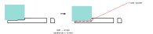

Two vertical slices of the one-sided puller at x = 0 mm, before left and after right, the top face up. Left: the defaults with hand size set to Custom, the plug in teal in the cut. Right: plug recess floor thickness at 2 mm: thins or thickens the floor left under the plug recess, so the recess is cut deeper or shallower. Marked in red: 1, the seat and the pocket: the round recess at the plug end; the plug recess on the centerline.

Before: 3.81. After: 2. Context: `size` = Custom. Section at x = 0 mm. Moves: pocket, seat.

`custom_pocket_side_angle`: Pocket side taper

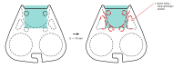

Two top views of the one-sided puller, before left and after right, the plug end at the top. Left: the defaults with hand size set to Custom, a 25 mm wide plug in teal. Right: pocket side taper at 10 mm: tilts the pocket's side walls inward toward the cord end, and the zip-tie holes and strap slots lean in along the same line. Marked in red: 1, the wing openings and the pocket: the two openings beside the pocket; the plug recess on the centerline.

Before: 0. After: 10. Context: `size` = Custom. Moves: pocket, wing openings.

### Finger Holes (Custom size only)

`custom_enable_finger_holes`: Finger holes on or off

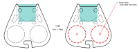

Two top views of the one-sided puller, before left and after right, the plug end at the top. Left: the defaults with hand size set to Custom, a 25 mm wide plug in teal. Right: finger holes on or off set to false: cuts or leaves out both finger holes. Marked in red: 1, the finger holes and the body edge: the two large holes in the lower half; the outer outline, removed. Everything else follows the outline.

Before: true. After: false. Context: `size` = Custom. Moves: body edge, finger holes.

`custom_finger_hole_diameter`: Finger hole diameter

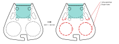

Two top views of the one-sided puller, before left and after right, the plug end at the top. Left: the defaults with hand size set to Custom, a 25 mm wide plug in teal. Right: finger hole diameter at 22 mm: widens both finger holes. Marked in red: 1, the wing openings: the two openings beside the pocket. 2, the finger holes: the two large holes in the lower half. The body edge, the pocket, the seat and the wall notch stay where they were.

Before: 25.4. After: 22. Context: `size` = Custom. Moves: finger holes, wing openings.

`custom_finger_hole_spacing`: Finger hole spacing

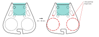

Two top views of the one-sided puller, before left and after right, the plug end at the top. Left: the defaults with hand size set to Custom, a 25 mm wide plug in teal. Right: finger hole spacing at 40 mm: moves the two finger holes farther apart or closer together. Marked in red: 1, the wing openings: the two openings beside the pocket. 2, the finger holes: the two large holes in the lower half.

Before: 33. After: 40. Context: `size` = Custom. Moves: finger holes, wing openings.

`custom_finger_hole_y_position`: Finger hole position

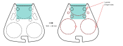

Two top views of the one-sided puller, before left and after right, the plug end at the top. Left: the defaults with hand size set to Custom, a 25 mm wide plug in teal. Right: finger hole position at 26 mm: slides both finger holes up toward the pocket or down toward the cord hook. Marked in red: 1, the pocket: the plug recess on the centerline. 2, the finger holes: the two large holes in the lower half.

Before: 19.8. After: 26. Context: `size` = Custom. Moves: finger holes, pocket.

### T Hook (Custom size only)

`custom_enable_t_hook`: Cord hook on or off

Two top views of the one-sided puller, before left and after right, the plug end at the top. Left: the defaults with hand size set to Custom, a 25 mm wide plug in teal. Right: cord hook on or off set to false: cuts or leaves out the cord hook at the cord end. Marked in red: 1, the hook: the cord hook slot in the bottom edge. The body edge, the pocket, the seat and the wall notch stay where they were.

Before: true. After: false. Context: `size` = Custom. Moves: hook.

`custom_t_hook_base_gap`: Hook slot width

Two top views of the one-sided puller, before left and after right, the plug end at the top. Left: the defaults with hand size set to Custom, a 25 mm wide plug in teal. Right: hook slot width at 7 mm: widens the slot the cord slides into at the cord end. Marked in red: 1, the hook: the cord hook slot in the bottom edge. The body edge, the pocket, the seat and the wall notch stay where they were.

Before: 4.7625. After: 7. Context: `size` = Custom. Moves: hook.

`custom_t_hook_length`: Hook length

Two top views of the one-sided puller, before left and after right, the plug end at the top. Left: the defaults with hand size set to Custom, a 25 mm wide plug in teal. Right: hook length at 15 mm: runs the cord hook farther into the body from the cord end. Marked in red: 1, the finger holes: the two large holes in the lower half. 2, the finger holes and the hook: the two large holes in the lower half; the cord hook slot in the bottom edge.

Before: 10.16. After: 15. Context: `size` = Custom. Moves: finger holes, hook, pocket, wing openings, zip-tie holes.

`custom_t_hook_holder_width`: Hook crossbar width

Two top views of the one-sided puller, before left and after right, the plug end at the top. Left: the defaults with hand size set to Custom, a 25 mm wide plug in teal. Right: hook crossbar width at 16 mm. Marked in red: 1, the finger holes and the hook: the two large holes in the lower half; the cord hook slot in the bottom edge. 2, the finger holes: the two large holes in the lower half.

Before: 11.1125. After: 16. Context: `size` = Custom. Moves: finger holes, hook, wing openings, zip-tie holes.

`custom_t_hook_holder_length`: Hook crossbar height

Two top views of the one-sided puller, before left and after right, the plug end at the top. Left: the defaults with hand size set to Custom, a 25 mm wide plug in teal. Right: hook crossbar height at 8 mm: makes the crossbar opening taller or shorter along the body. Marked in red: 1, the hook: the cord hook slot in the bottom edge. The body edge, the pocket, the seat and the wall notch stay where they were.

Before: 5.08. After: 8. Context: `size` = Custom. Moves: hook.

`custom_t_hook_gap_offset`: Hook slot inset

This dial changes no shape: the J-hook cord catch is drawn without this dial; it only appears in the Cutouts Only 2D debug overlay.

This dial changes no shape. Changes no shape: the J-hook cord catch is drawn without this dial; it only appears in the Cutouts Only 2D debug overlay.

`custom_t_hook_leg_offset`: Hook stem side offset

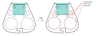

Two top views of the one-sided puller, before left and after right, the plug end at the top. Left: the defaults with hand size set to Custom, a 25 mm wide plug in teal. Right: hook stem side offset at 3 mm. Marked in red: 1, the wing openings: the two openings beside the pocket. 2, the zip-tie holes: the four small holes beside the pocket. 3, the finger holes: the two large holes in the lower half.

Before: 0. After: 3. Context: `size` = Custom. Moves: finger holes, wing openings, zip-tie holes.

`custom_t_hook_stem_offset`: Hook stem offset

Two top views of the one-sided puller, before left and after right, the plug end at the top. Left: the defaults with hand size set to Custom, a 25 mm wide plug in teal. Right: hook stem offset at 7 mm: shifts the cord slot sideways along the crossbar, making the J of the hook deeper or shallower. Marked in red: 1, the hook: the cord hook slot in the bottom edge. The body edge, the pocket, the seat and the wall notch stay where they were.

Before: 4.5. After: 7. Context: `size` = Custom. Moves: hook.

`custom_t_hook_catch_reach`: Hook catch reach

Two top views of the one-sided puller, before left and after right, the plug end at the top. Left: the defaults with hand size set to Custom, a 25 mm wide plug in teal. Right: hook catch reach at 8 mm: extends the crossbar past the slot on the catch side, lengthening the lip the cord hooks under. Marked in red: 1, the hook: the cord hook slot in the bottom edge. The body edge, the pocket, the seat and the wall notch stay where they were.

Before: 4.55. After: 8. Context: `size` = Custom. Moves: hook.

`custom_t_hook_tip_drop`: Hook tip drop

This dial changes no shape. Only acts when size is Custom. Changes no shape: the hook slot's mouth already opens through the cord end (the body ends at Y = 0), so sagging the mouth farther below that edge cuts only air; measured at 1.98, 4 and 0.

This dial changes no shape. Only acts when size is Custom. Changes no shape: the hook slot's mouth already opens through the cord end (the body ends at Y = 0), so sagging the mouth farther below that edge cuts only air; measured at 1.98, 4 and 0.

### Plug Wall Notch (Custom size only)

`custom_enable_plug_wall_notch`: Wall notch on or off

Two top views of the one-sided puller, before left and after right, the plug end at the top. Left: the defaults with hand size set to Custom, a 25 mm wide plug in teal. Right: wall notch on or off set to false: cuts or leaves out the notch at the plug end that straddles the outlet's cover plate. Marked in red: 1, the wall notch: the notch in the top edge. The body edge, the pocket, the seat and the wing openings stay where they were.

Before: true. After: false. Context: `size` = Custom. Moves: wall notch.

`custom_plug_wall_notch_width`: Wall notch width

Two top views of the one-sided puller, before left and after right, the plug end at the top. Left: the defaults with hand size set to Custom, a 25 mm wide plug in teal. Right: wall notch width at 20 mm: widens or narrows the notch at the plug end. Marked in red: 1, the wall notch: the notch in the top edge. The body edge, the pocket, the seat and the wing openings stay where they were.

Before: 26.67. After: 20. Context: `size` = Custom. Moves: wall notch.

`custom_plug_wall_notch_height`: Wall notch depth

Two top views of the one-sided puller, before left and after right, the plug end at the top. Left: the defaults with hand size set to Custom, a 25 mm wide plug in teal. Right: wall notch depth at 7 mm: cuts the notch deeper or shallower into the plug end. Marked in red: 1, the zip-tie holes and the wall notch: the four small holes beside the pocket; the notch in the top edge. The body edge, the pocket, the seat and the wing openings stay where they were.

Before: 3.81. After: 7. Context: `size` = Custom. Moves: wall notch, wing openings, zip-tie holes.

`custom_plug_wall_notch_rounding`: Wall notch corner rounding

Two top views of the one-sided puller, before left and after right, the plug end at the top. Left: the defaults with hand size set to Custom, a 25 mm wide plug in teal. Right: wall notch corner rounding at 0 mm: rounds or squares the notch's two inner corners. Marked in red: 1, the wall notch: the notch in the top edge. The body edge, the pocket, the seat and the wing openings stay where they were.

Before: 2.54. After: 0. Context: `size` = Custom. Moves: wall notch.

### Zip Tie Holes (Custom size only)

`custom_zip_tie_hole_diameter`: Zip-tie hole diameter

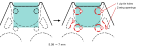

Two top views of the one-sided puller, before left and after right, the plug end at the top. Left: the defaults with hand size set to Custom, a 25 mm wide plug in teal. Right: zip-tie hole diameter at 7 mm: widens every zip-tie hole. Marked in red: 1, the zip-tie holes: the four small holes beside the pocket. 2, the wing openings: the two openings beside the pocket. The body edge, the pocket, the seat and the wall notch stay where they were.

Before: 5.08. After: 7. Context: `size` = Custom. Moves: wing openings, zip-tie holes.

`custom_zip_tie_height_spacing`: Zip-tie row spacing

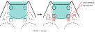

Two top views of the one-sided puller, before left and after right, the plug end at the top. Left: the defaults with hand size set to Custom, a 25 mm wide plug in teal. Right: zip-tie row spacing at 12 mm: moves the second row of zip-tie holes closer to or farther from the first. Marked in red: 1, the wing openings: the two openings beside the pocket. 2, the zip-tie holes: the four small holes beside the pocket.

Before: 17.78. After: 12. Context: `size` = Custom. Moves: wing openings, zip-tie holes.

`custom_zip_tie_width_spacing`: Zip-tie column spacing

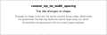

This dial changes no shape. Changes no shape of its own: the zip-tie columns sit zip_edge_offset inside the pocket wall; this dial only feeds the auto-fit finger keep-out, which trimmed the row spacing by 0.05 mm at the Custom defaults.

This dial changes no shape. Changes no shape of its own: the zip-tie columns sit zip_edge_offset inside the pocket wall; this dial only feeds the auto-fit finger keep-out, which trimmed the row spacing by 0.05 mm at the Custom defaults.

`custom_zip_tie_distance_from_notch`: Zip-tie distance from the notch

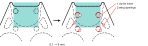

Two top views of the one-sided puller, before left and after right, the plug end at the top. Left: the defaults with hand size set to Custom, a 25 mm wide plug in teal. Right: zip-tie distance from the notch at 9 mm: moves the first row of zip-tie holes farther from the wall notch, and the second row follows. Marked in red: 1, the zip-tie holes: the four small holes beside the pocket. 2, the wing openings: the two openings beside the pocket.

Before: 5.1. After: 9. Context: `size` = Custom. Moves: wing openings, zip-tie holes.

`custom_zip_tie_countersink`: Zip-tie countersink

Two vertical slices of the one-sided puller at x = 10.4 mm, before left and after right, the top face up. Left: the defaults with hand size set to Custom, the plug in teal in the cut. Right: zip-tie countersink at 2.5 mm. Marked in red: 1, the zip-tie holes: the four small holes beside the pocket. 2, the zip-tie holes and the pocket: the four small holes beside the pocket; the plug recess on the centerline.

Before: 0.9. After: 2.5. Context: `size` = Custom. Section at x = 10.4 mm. Moves: pocket, zip-tie holes.

### Velcro / Wing Strap Holes (Custom size only)

`custom_velcro_hole_length`: Strap slot length

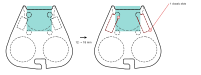

Two top views of the one-sided puller, before left and after right, the plug end at the top. Left: the defaults with hand size set to Custom and strap opening style set to Classic slot, a 25 mm wide plug in teal. Right: strap slot length at 18 mm: lengthens each plain strap slot along its lean. Marked in red: 1, the classic slots: the two slots beside the pocket. The body edge, the pocket, the seat and the wall notch stay where they were.

Before: 12. After: 18. Context: `size` = Custom, `velcro_style` = Classic slot. Moves: classic slots.

`custom_velcro_hole_width`: Strap slot width

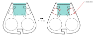

Two top views of the one-sided puller, before left and after right, the plug end at the top. Left: the defaults with hand size set to Custom and strap opening style set to Classic slot, a 25 mm wide plug in teal. Right: strap slot width at 11 mm: widens each plain strap slot. Marked in red: 1, the classic slots: the two slots beside the pocket. The body edge, the pocket, the seat and the wall notch stay where they were.

Before: 7. After: 11. Context: `size` = Custom, `velcro_style` = Classic slot. Moves: classic slots.

`custom_velcro_hole_x_center`: Strap slot distance from the centerline

Two top views of the one-sided puller, before left and after right, the plug end at the top. Left: the defaults with hand size set to Custom and strap opening style set to Classic slot, a 25 mm wide plug in teal. Right: strap slot distance from the centerline at 14 mm: moves the two plain strap slots closer to or farther from the centerline. Marked in red: 1, the classic slots: the two slots beside the pocket.

Before: 19.4. After: 14. Context: `size` = Custom, `velcro_style` = Classic slot. Moves: classic slots.

`custom_velcro_hole_y_center`: Strap slot position along the body

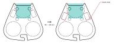

Two top views of the one-sided puller, before left and after right, the plug end at the top. Left: the defaults with hand size set to Custom and strap opening style set to Classic slot, a 25 mm wide plug in teal. Right: strap slot position along the body at 38 mm: slides the two plain strap slots toward the cord end or the plug end. Marked in red: 1, the classic slots: the two slots beside the pocket.

Before: 46. After: 38. Context: `size` = Custom, `velcro_style` = Classic slot. Moves: classic slots.

`custom_velcro_hole_rotation`: Strap slot lean

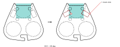

Two top views of the one-sided puller, before left and after right, the plug end at the top. Left: the defaults with hand size set to Custom and strap opening style set to Classic slot, a 25 mm wide plug in teal. Right: strap slot lean at 60 deg: leans the two plain strap slots more or less steeply, mirrored on the two sides. Marked in red: 1, the classic slots: the two slots beside the pocket.

Before: 23.5. After: 60. Context: `size` = Custom, `velcro_style` = Classic slot. Moves: classic slots.

### Edge Rounding (Custom size only)

`custom_body_side_rounding`: Body side rounding

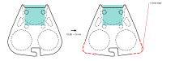

Two top views of the one-sided puller, before left and after right, the plug end at the top. Left: the defaults with hand size set to Custom, a 25 mm wide plug in teal. Right: body side rounding at 5 mm: rounds the body outline's corners more or less, down to the plain octagon at 0. Marked in red: 1, the body edge: the outer outline. Everything else follows the outline.

Before: 15.85. After: 5. Context: `size` = Custom. Moves: body edge.

`custom_body_top_rounding`: Top edge rounding

Two vertical slices of the one-sided puller at y = 35 mm, before left and after right, the top face up. Left: the defaults with hand size set to Custom, the plug in teal in the cut. Right: top edge rounding at 0 mm: rounds or squares the edge where the body's top face meets its sides. Marked in red: 1, the body edge: the outer outline. Everything else follows the outline.

Before: 2.54. After: 0. Context: `size` = Custom. Section at y = 35 mm. Moves: body edge.

`custom_body_bottom_rounding`: Bottom edge rounding

Two vertical slices of the one-sided puller at y = 35 mm, before left and after right, the top face up. Left: the defaults with hand size set to Custom, the plug in teal in the cut. Right: bottom edge rounding at 2 mm: rounds or squares the edge where the body's bottom face meets its sides. Marked in red: 1, the body edge: the outer outline. Everything else follows the outline.

Before: 0. After: 2. Context: `size` = Custom. Section at y = 35 mm. Moves: body edge.

`custom_velcro_side_rounding`: Strap slot corner rounding

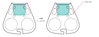

Two top views of the one-sided puller, before left and after right, the plug end at the top. Left: the defaults with hand size set to Custom and strap opening style set to Classic slot, a 25 mm wide plug in teal. Right: strap slot corner rounding at 2.5 mm: rounds the four corners of each plain strap slot. Marked in red: 1, the classic slots: the two slots beside the pocket. The body edge, the pocket, the seat and the wall notch stay where they were.

Before: 0. After: 2.5. Context: `size` = Custom, `velcro_style` = Classic slot. Moves: classic slots.

`custom_velcro_top_bottom_rounding`: Strap opening edge rounding

Two vertical slices of the one-sided puller at y = 46 mm, before left and after right, the top face up. Left: the defaults with hand size set to Custom, the plug in teal in the cut. Right: strap opening edge rounding at 1.5 mm. Marked in red: 1, the wing openings: the two openings beside the pocket. 2, the wing openings and the pocket: the two openings beside the pocket; the plug recess on the centerline.

Before: 0. After: 1.5. Context: `size` = Custom. Section at y = 46 mm. Moves: pocket, wing openings.

`custom_finger_hole_rounding`: Finger hole rim rounding

Two vertical slices of the one-sided puller at y = 19.8 mm, before left and after right, the top face up. Left: the defaults with hand size set to Custom, the plug in teal in the cut. Right: finger hole rim rounding at 0 mm: rounds or squares the rims of both finger holes on both faces. Marked in red: 1, the finger holes: the two large holes in the lower half. The body edge, the pocket, the seat and the wall notch stay where they were.

Before: 2.5. After: 0. Context: `size` = Custom. Section at y = 19.8 mm. Moves: finger holes.

`custom_t_hook_holder_side_rounding`: Hook crossbar corner rounding

Two top views of the one-sided puller, before left and after right, the plug end at the top. Left: the defaults with hand size set to Custom, a 25 mm wide plug in teal. Right: hook crossbar corner rounding at 0 mm: rounds or squares the top corners of the hook's crossbar. Marked in red: 1, the hook: the cord hook slot in the bottom edge. The body edge, the pocket, the seat and the wall notch stay where they were.

Before: 1.27. After: 0. Context: `size` = Custom. Moves: hook.

`custom_t_hook_gap_side_rounding`: Hook slot corner rounding

This dial changes no shape: the J-hook cord catch is drawn without this dial; it only appears in the Cutouts Only 2D debug overlay.

This dial changes no shape. Changes no shape: the J-hook cord catch is drawn without this dial; it only appears in the Cutouts Only 2D debug overlay.

`custom_t_hook_top_bottom_rounding`: Hook edge rounding

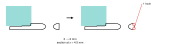

Two vertical slices of the one-sided puller at x = 4.5 mm, before left and after right, the top face up. Left: the defaults with hand size set to Custom, the plug in teal in the cut. Right: hook edge rounding at 2 mm: flares the top and bottom edges of the cord hook's slot and crossbar. Marked in red: 1, the hook: the cord hook slot in the bottom edge. The body edge, the pocket, the seat and the wall notch stay where they were.

Before: 0. After: 2. Context: `size` = Custom. Section at x = 4.5 mm. Moves: hook.

## Two-sided puller

### The four steps

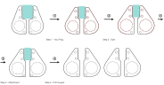

Five stages of the two-sided puller, left to right, the top row first, the plug end at the top; red dashes mark the edges each step moved. 1, the defaults: the tool as the file opens, with a 20 mm wide plug in teal. 2, Step 1 - Your Plug: plug length 23 mm, plug width at the prong end 13 mm, plug width at the cord end 13 mm, cord thickness 7 mm, plug sides Rounded sides; red on the arms, the finger lobes and the zip stations. 3, Step 2 - Size: hand size Large; red on the arms, the finger lobes and the zip stations. 4, Step 3 - Attachment: attachment Zip ties; no strap slot on a plug this short, so nothing moved. 5, Step 4 - Print Layout: both plates side by side in one file, what you print; nothing marked.

### Step 1 - Your Plug

`plug_preset`: Plug preset

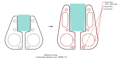

Two top views of one plate of the two-sided puller, before left and after right, the plug end at the top. Left: the defaults, a 20 mm wide plug in teal. Right: plug preset set to Heavy-duty extension cord - NEMA 5-15. Marked in red: 1, the finger lobes, the arms and the plate edge. 2, the finger lobes: the two rounded lobes in the lower half. 3, the zip stations: the three small holes along each arm.

Before: Measure my plug. After: Heavy-duty extension cord - NEMA 5-15. Moves: arms, finger lobes, plate edge, zip stations.

`measure_plug_length`: Plug length

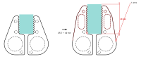

Two top views of one plate of the two-sided puller, before left and after right, the plug end at the top. Left: the defaults, a 20 mm wide plug in teal. Right: plug length at 40 mm: lengthens both arms so the teeth cover the whole plug body, and moves the zip-tie stations and the strap slot with them. Marked in red: 1, the arms: the two toothed arms in the upper half. The plate edge, the teeth, the finger lobes and the cord channel stay where they were.

Before: 25.5. After: 40. Moves: arms.

`measure_plug_width_prong_end`: Plug width at the prong end

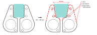

Two top views of one plate of the two-sided puller, before left and after right, the plug end at the top. Left: the defaults, a 20 mm wide plug in teal. Right: plug width at the prong end at 28 mm. Marked in red: 1, the arms: the two toothed arms in the upper half. 2, the zip stations: the three small holes along each arm. 3, the finger lobes and the cord channel: the two rounded lobes in the lower half; the gap between the lobes at the bottom.

Before: 20. After: 28. Moves: arms, cord channel, finger lobes, zip stations.

`measure_plug_width_cord_end`: Plug width at the cord end

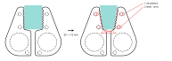

Two top views of one plate of the two-sided puller, before left and after right, the plug end at the top. Left: the defaults, a 20 mm wide plug in teal. Right: plug width at the cord end at 12 mm. Marked in red: 1, the zip stations: the three small holes along each arm. 2, the teeth and the arms: the serrated inner edges of the arms; the two toothed arms in the upper half.

Before: 20. After: 12. Moves: arms, teeth, zip stations.

`measure_cord_thickness`: Cord thickness

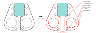

Two top views of one plate of the two-sided puller, before left and after right, the plug end at the top. Left: the defaults, a 20 mm wide plug in teal. Right: cord thickness at 9 mm. Marked in red: 1, the finger lobes and the cord channel. 2, the finger lobes: the two rounded lobes in the lower half. 3, the finger lobes and the arms. 4, the zip stations: the three small holes along each arm.

Before: 4. After: 9. Moves: arms, cord channel, finger lobes, zip stations.

`plug_sides`: Plug sides

Two vertical slices of the two-sided puller at y = 45 mm, before left and after right, the top face up. Left: the defaults, the plug in teal in the cut. Right: plug sides set to Flat sides. Marked in red: 1, the teeth and the arms: the serrated inner edges of the arms; the two toothed arms in the upper half. 2, the arms: the two toothed arms in the upper half.

Before: Rounded sides. After: Flat sides. Section at y = 45 mm. Moves: arms, teeth.

`show_plug_preview`: Show the see-through plug

This dial changes no shape: the see-through plug is a preview aid and is never exported.

This dial changes no shape. Changes no shape: the see-through plug is a preview aid and is never exported.

### Step 2 - Size

`size`: Hand size

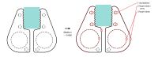

Two top views of one plate of the two-sided puller, before left and after right, the plug end at the top. Left: the defaults, a 20 mm wide plug in teal. Right: hand size set to Large. Marked in red: 1, the zip stations: the three small holes along each arm. 2, the finger lobes and the arms: the two rounded lobes in the lower half; the two toothed arms in the upper half. 3, the finger lobes: the two rounded lobes in the lower half.

Before: Medium. After: Large. Moves: arms, finger lobes, zip stations.

`measure_finger_width`: Finger width

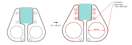

Two top views of one plate of the two-sided puller, before left and after right, the plug end at the top. Left: the defaults with hand size set to Measure my hand, a 20 mm wide plug in teal. Right: finger width at 26 mm. Marked in red: 1, the zip stations: the three small holes along each arm. 2, the finger lobes, the arms and the plate edge: the two rounded lobes in the lower half; the two toothed arms in the upper half; the outer outline.

Before: 20. After: 26. Context: `size` = Measure my hand. Moves: arms, finger lobes, plate edge, zip stations.

### Step 3 - Attachment

`attachment`: Attachment

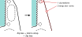

Two top views of one plate of the two-sided puller, before left and after right, the plug end at the top. Left: the defaults with plug length set to 40, a 20 mm wide plug in teal. Right: attachment set to Zip ties. Marked in red: 1, the zip stations: the three small holes along each arm. 2, the strap slot and the arms: the long slot in each arm; the two toothed arms in the upper half.

Before: Zip ties + Velcro strap. After: Zip ties. Context: `measure_plug_length` = 40. Moves: arms, strap slot, zip stations.

`strap_width`: Strap width

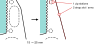

Two top views of one plate of the two-sided puller, before left and after right, the plug end at the top. Left: the defaults with plug length set to 40, a 20 mm wide plug in teal. Right: strap width at 25 mm. Marked in red: 1, the zip stations: the three small holes along each arm. 2, the strap slot and the arms: the long slot in each arm; the two toothed arms in the upper half.

Before: 15. After: 25. Context: `measure_plug_length` = 40. Moves: arms, strap slot, zip stations.

### Step 4 - Print Layout

`print_layout`: Print layout

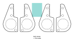

One top view of the two-sided puller with both plates side by side, the plug end at the top: what the file prints at Both plates. At One plate it prints one plate. Nothing is marked in red: this dial changes the layout, not the plate.

Before: Both plates. After: One plate. Moves: arms, finger lobes, plate edge, zip stations.

### Advanced - Two-Sided Puller

`plate_wall_boost`: Extra wall on the plate

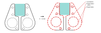

Two top views of one plate of the two-sided puller, before left and after right, the plug end at the top. Left: the defaults, a 20 mm wide plug in teal. Right: extra wall on the plate at 2 mm. Marked in red: 1, the zip stations: the three small holes along each arm. 2, the finger lobes and the arms: the two rounded lobes in the lower half; the two toothed arms in the upper half. 3, the finger lobes: the two rounded lobes in the lower half.

Before: 0. After: 2. Moves: arms, finger lobes, zip stations.

`plate_thickness`: Plate thickness

Two vertical slices of the two-sided puller at y = 3 mm, before left and after right, the top face up. Left: the defaults, the plug in teal in the cut. Right: plate thickness at 6 mm. Marked in red: 1, the finger lobes: the two rounded lobes in the lower half. 2, the zip stations, the finger lobes and the cord channel: the three small holes along each arm; the two rounded lobes in the lower half; the gap between the lobes at the bottom.

Before: 4. After: 6. Section at y = 3 mm. Moves: cord channel, finger lobes, zip stations.

`plate_grip_bite`: Grip bite

Two vertical slices of the two-sided puller at y = 45 mm, before left and after right, the top face up. Left: the defaults with plug sides set to Flat sides, the plug in teal in the cut. Right: grip bite at -2 mm. Marked in red: 1, the arms: the two toothed arms in the upper half. 2, the teeth and the arms: the serrated inner edges of the arms; the two toothed arms in the upper half.

Before: -1. After: -2. Context: `plug_sides` = Flat sides. Section at y = 45 mm. Moves: arms, teeth.

`plate_cradle_depth`: Cradle depth

Two vertical slices of the two-sided puller at y = 45 mm, before left and after right, the top face up. Left: the defaults with plug sides set to Rounded sides, the plug in teal in the cut. Right: cradle depth at 0 mm. Marked in red: 1, the arms: the two toothed arms in the upper half. 2, the teeth and the arms: the serrated inner edges of the arms; the two toothed arms in the upper half.

Before: 2.5. After: 0. Context: `plug_sides` = Rounded sides. Section at y = 45 mm. Moves: arms, teeth.

`plate_grip_clearance`: Grip clearance

Two vertical slices of the two-sided puller at y = 45 mm, before left and after right, the top face up. Left: the defaults with plug sides set to Rounded sides, the plug in teal in the cut. Right: grip clearance at 2 mm. Marked in red: 1, the teeth and the arms: the serrated inner edges of the arms; the two toothed arms in the upper half. 2, the arms: the two toothed arms in the upper half.

Before: 0.5. After: 2. Context: `plug_sides` = Rounded sides. Section at y = 45 mm. Moves: arms, teeth.

`plate_cable_clearance`: Cord channel clearance

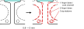

Two top views of one plate of the two-sided puller, before left and after right, the plug end at the top. Left: the defaults, a 20 mm wide plug in teal. Right: cord channel clearance at 3 mm. Marked in red: 1, the finger lobes and the cord channel: the two rounded lobes in the lower half; the gap between the lobes at the bottom. 2, the finger lobes: the two rounded lobes in the lower half. 3, the zip stations: the three small holes along each arm.

Before: 0.8. After: 3. Moves: arms, cord channel, finger lobes, zip stations.

`plate_finger_fit`: Finger hole fit

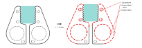

Two top views of one plate of the two-sided puller, before left and after right, the plug end at the top. Left: the defaults, a 20 mm wide plug in teal. Right: finger hole fit at 4 mm. Marked in red: 1, the zip stations: the three small holes along each arm. 2, the finger lobes and the arms: the two rounded lobes in the lower half; the two toothed arms in the upper half. 3, the finger lobes: the two rounded lobes in the lower half.

Before: 1. After: 4. Moves: arms, finger lobes, zip stations.

`plate_finger_wall`: Finger lobe wall

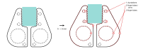

Two top views of one plate of the two-sided puller, before left and after right, the plug end at the top. Left: the defaults, a 20 mm wide plug in teal. Right: finger lobe wall at 9 mm. Marked in red: 1, the zip stations: the three small holes along each arm. 2, the finger lobes and the arms: the two rounded lobes in the lower half; the two toothed arms in the upper half. 3, the finger lobes: the two rounded lobes in the lower half.

Before: 5. After: 9. Moves: arms, finger lobes, zip stations.

`plate_finger_inner_wall`: Wall beside the cord channel

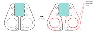

Two top views of one plate of the two-sided puller, before left and after right, the plug end at the top. Left: the defaults, a 20 mm wide plug in teal. Right: wall beside the cord channel at 6 mm. Marked in red: 1, the finger lobes: the two rounded lobes in the lower half. 2, the finger lobes and the arms: the two rounded lobes in the lower half; the two toothed arms in the upper half.

Before: 3. After: 6. Moves: arms, finger lobes, zip stations.

`plate_tooth_diameter`: Tooth size

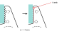

Two top views of one plate of the two-sided puller, before left and after right, the plug end at the top. Left: the defaults, a 20 mm wide plug in teal. Right: tooth size at 4 mm: cuts bigger or smaller scallops into the arms' gripping edges. Marked in red: 1, the teeth: the serrated inner edges of the arms. The plate edge, the arms, the finger lobes and the cord channel stay where they were.

Before: 2. After: 4. Moves: teeth.

`plate_tooth_pitch`: Tooth spacing

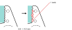

Two top views of one plate of the two-sided puller, before left and after right, the plug end at the top. Left: the defaults, a 20 mm wide plug in teal. Right: tooth spacing at 4.5 mm: spaces the teeth farther apart or closer together along the gripping edges. Marked in red: 1, the teeth: the serrated inner edges of the arms. The plate edge, the arms, the finger lobes and the cord channel stay where they were.

Before: 2.8. After: 4.5. Moves: teeth.

`plate_tooth_depth`: Tooth depth

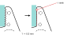

Two top views of one plate of the two-sided puller, before left and after right, the plug end at the top. Left: the defaults, a 20 mm wide plug in teal. Right: tooth depth at 0.3 mm: cuts each tooth deeper or shallower into the gripping edge. Marked in red: 1, the teeth: the serrated inner edges of the arms. The plate edge, the arms, the finger lobes and the cord channel stay where they were.

Before: 1. After: 0.3. Moves: teeth.

`plate_grip_zone_start`: Toothed zone start

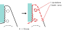

Two top views of one plate of the two-sided puller, before left and after right, the plug end at the top. Left: the defaults, a 20 mm wide plug in teal. Right: toothed zone start at 15 mm. Marked in red: 1, the zip stations: the three small holes along each arm. 2, the teeth and the arms: the serrated inner edges of the arms; the two toothed arms in the upper half.

Before: 4. After: 15. Moves: arms, teeth, zip stations.

`plate_grip_zone_length`: Toothed zone length

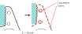

Two top views of one plate of the two-sided puller, before left and after right, the plug end at the top. Left: the defaults, a 20 mm wide plug in teal. Right: toothed zone length at 12 mm: sets how far the teeth run along each arm instead of covering the whole plug body. Marked in red: 1, the zip stations: the three small holes along each arm. 2, the arms: the two toothed arms in the upper half.

Before: 0. After: 12. Moves: arms, zip stations.

`plate_tip_flare`: Tip flare

Two top views of one plate of the two-sided puller, before left and after right, the plug end at the top. Left: the defaults, a 20 mm wide plug in teal. Right: tip flare at 3 mm: opens the gap wider right at the arm tips so the plug head can enter before the teeth bite. Marked in red: 1, the arms: the two toothed arms in the upper half. 2, the zip stations: the three small holes along each arm.

Before: 0.7. After: 3. Moves: arms, cord channel, finger lobes, zip stations.

`plate_arm_tip_width`: Arm tip width

Two top views of one plate of the two-sided puller, before left and after right, the plug end at the top. Left: the defaults, a 20 mm wide plug in teal. Right: arm tip width at 16 mm: widens the rounded tip of each arm, so the arms taper less. Marked in red: 1, the arms: the two toothed arms in the upper half. 2, the zip stations: the three small holes along each arm.

Before: 11. After: 16. Moves: arms, zip stations.

`plate_edge_rounding`: Outer edge rounding

Two vertical slices of the two-sided puller at y = 3 mm, before left and after right, the top face up. Left: the defaults, the plug in teal in the cut. Right: outer edge rounding at 0 mm: rounds or squares the outer face's edge all around the plate, while the plug-contact face stays square. Marked in red: 1, the finger lobes: the two rounded lobes in the lower half. The plate edge, the arms, the teeth and the cord channel stay where they were.

Before: 1.2. After: 0. Section at y = 3 mm. Moves: finger lobes.

`plate_strip_thickness`: Cable strip thickness

Two vertical slices of the two-sided puller at y = 3 mm, before left and after right, the top face up. Left: the defaults, the plug in teal in the cut. Right: cable strip thickness at 0 mm: thickens or removes the thin strip that bridges the cord channel on the outer face and ties the two arms together. Marked in red: 1, the cord channel: the gap between the lobes at the bottom. The plate edge, the arms, the teeth and the finger lobes stay where they were.

Before: 1. After: 0. Section at y = 3 mm. Moves: cord channel.

`plate_zip_hole_diameter`: Zip-tie hole diameter

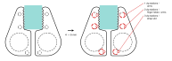

Two top views of one plate of the two-sided puller, before left and after right, the plug end at the top. Left: the defaults, a 20 mm wide plug in teal. Right: zip-tie hole diameter at 6 mm. Marked in red: 1, the zip stations and the arms. 2, the zip stations, the finger lobes and the arms. 3, the zip stations and the strap slot.

Before: 4. After: 6. Moves: arms, finger lobes, strap slot, zip stations.

`plate_zip_placement`: Zip-tie station placement

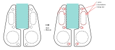

Two top views of one plate of the two-sided puller, before left and after right, the plug end at the top. Left: the defaults with plug length set to 40, a 20 mm wide plug in teal. Right: zip-tie station placement set to Manual. Marked in red: 1, the arms: the two toothed arms in the upper half. 2, the zip stations: the three small holes along each arm. 3, the strap slot: the long slot in each arm.

Before: Auto. After: Manual. Context: `measure_plug_length` = 40. Moves: arms, strap slot, zip stations.

`plate_zip_pos_1`: Zip-tie station 1 position

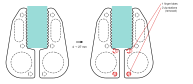

Two top views of one plate of the two-sided puller, before left and after right, the plug end at the top. Left: the defaults with plug length set to 40 and zip-tie station placement set to Manual, a 20 mm wide plug in teal. Right: zip-tie station 1 position at 27 mm. Marked in red: 1, the finger lobes: the two rounded lobes in the lower half. 2, the zip stations: the three small holes along each arm, removed.

Before: 4. After: 27. Context: `measure_plug_length` = 40, `plate_zip_placement` = Manual. Moves: finger lobes, zip stations.

`plate_zip_pos_2`: Zip-tie station 2 position

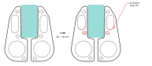

Two top views of one plate of the two-sided puller, before left and after right, the plug end at the top. Left: the defaults with plug length set to 40 and zip-tie station placement set to Manual, a 20 mm wide plug in teal. Right: zip-tie station 2 position at 36 mm. Marked in red: 1, the zip stations and the strap slot: the three small holes along each arm; the long slot in each arm.

Before: 32. After: 36. Context: `measure_plug_length` = 40, `plate_zip_placement` = Manual. Moves: strap slot, zip stations.

`plate_zip_pos_3`: Zip-tie station 3 position

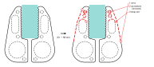

Two top views of one plate of the two-sided puller, before left and after right, the plug end at the top. Left: the defaults with plug length set to 40 and zip-tie station placement set to Manual, a 20 mm wide plug in teal. Right: zip-tie station 3 position at 58 mm. Marked in red: 1, the arms: the two toothed arms in the upper half. 2, the zip stations: the three small holes along each arm, removed. 3, the strap slot: the long slot in each arm.

Before: 63. After: 58. Context: `measure_plug_length` = 40, `plate_zip_placement` = Manual. Moves: arms, strap slot, zip stations.

`plate_slot_inner_wall`: Wall between the teeth and the slot

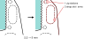

Two top views of one plate of the two-sided puller, before left and after right, the plug end at the top. Left: the defaults with plug length set to 40, a 20 mm wide plug in teal. Right: wall between the teeth and the slot at 5 mm. Marked in red: 1, the zip stations: the three small holes along each arm. 2, the strap slot and the arms: the long slot in each arm; the two toothed arms in the upper half.

Before: 2.2. After: 5. Context: `measure_plug_length` = 40. Moves: arms, strap slot, zip stations.

`plate_velcro_slot_width`: Strap slot width

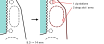

Two top views of one plate of the two-sided puller, before left and after right, the plug end at the top. Left: the defaults with plug length set to 40, a 20 mm wide plug in teal. Right: strap slot width at 14 mm. Marked in red: 1, the zip stations: the three small holes along each arm. 2, the strap slot and the arms: the long slot in each arm; the two toothed arms in the upper half.

Before: 9.3. After: 14. Context: `measure_plug_length` = 40. Moves: arms, strap slot, zip stations.

`plate_velcro_slot_length`: Strap slot length

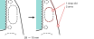

Two top views of one plate of the two-sided puller, before left and after right, the plug end at the top. Left: the defaults with plug length set to 40, a 20 mm wide plug in teal. Right: strap slot length at 15 mm: lengthens or shortens the strap slot along each arm, within the window between the zip-tie stations. Marked in red: 1, the strap slot: the long slot in each arm. 2, the arms: the two toothed arms in the upper half.

Before: 28. After: 15. Context: `measure_plug_length` = 40. Moves: arms, strap slot, zip stations.

### Advanced - Render Quality

`quality`: Render quality

This dial changes no shape: it only sets the number of segments in every circle and arc.

This dial changes no shape. Changes no shape: it only sets the number of segments in every circle and arc.
