# Plug Puller Dial Quick Start

The dials of the four Customizer steps of both pullers, one per page: which file to open, then what each step's dial moves.

Model version 0.12.0. The printable twin is `docs/Plug_Puller_Dial_Quick_Start.pdf`; every dial of both files is in `docs/guides/dial-reference.md`. The dial names are written exactly as the Customizer shows them.

## Which file to open

Measure your plug's thickness. Up to 24 mm: open the one-sided puller, src/Plug_Puller_Parametric.scad. Thicker than 24 mm, or a plug you want held from both sides such as a USB-C tip or a round extension-cord plug: open the two-sided puller, src/Plug_Puller_Two_Sided.scad.

Each file has four steps at the top of its Customizer: your plug, your size, the attachment, and one last choice (the hook hand in the one-sided file; the print layout in the two-sided file). The dials on the next pages are those steps and nothing else.

If red text appears beside the part in the preview, read it: it names the measurement to fix, and the part will not fit until it is gone.

In every picture: black = the tool at its defaults; teal = the plug you measured; red dashed = what this dial moves.

## One-sided puller

### Step 1 - Your Plug

#### `plug_preset`

Plug preset

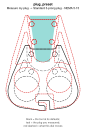

Fills in all six plug numbers from a measured reference plug, so the pocket, the wall notch, the cord hook and the zip-tie and wing positions all take that plug's shape at once.

| Default | Range | Step | Unit |
|---|---|---|---|
| Measure my plug | 5 options | — | — |

Options: Measure my plug, Flat 2-prong lamp plug - NEMA 1-15, Standard 3-prong plug - NEMA 5-15, Heavy-duty extension cord - NEMA 5-15, Wide 2-prong appliance plug - NEMA 1-15.

Before: Measure my plug. After: Standard 3-prong plug - NEMA 5-15.

Moves: body edge, pocket, seat, wall notch, wing openings, zip-tie holes.

#### `measure_plug_length`

Plug length

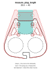

Runs the pocket farther toward the finger holes and stretches the whole body to keep the finger holes and zip-tie rows clear of it.

| Default | Range | Step | Unit |
|---|---|---|---|
| 25.5 | 12 to 85 | 0.5 | mm |

Before: 25.5. After: 40.

Moves: body edge, seat, wall notch, wing openings, zip-tie holes.

#### `measure_plug_width_prong_end`

Plug width at the prong end

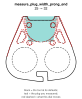

Widens or narrows the pocket, its seat and the wall notch at the plug end, and moves the zip-tie holes and wing openings with them.

| Default | Range | Step | Unit |
|---|---|---|---|
| 25 | 8 to 38 | 0.5 | mm |

Before: 25. After: 32.

Moves: seat, wall notch, wing openings, zip-tie holes.

#### `measure_plug_width_cord_end`

Plug width at the cord end

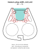

Tilts the pocket's side walls to match the plug's taper, and the zip-tie holes and wing openings lean in with them.

| Default | Range | Step | Unit |
|---|---|---|---|
| 25 | 8 to 38 | 0.5 | mm |

Before: 25. After: 15.

Moves: pocket, wing openings.

#### `measure_plug_thickness_prong_end`

Plug thickness at the prong end

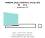

Deepens or shallows the two pocket floors, the round seat and the plug recess, to suit the fatter of the two thickness numbers.

| Default | Range | Step | Unit |
|---|---|---|---|
| 20 | 4 to 40 | 0.5 | mm |

Before: 20. After: 23.5. Section at x = 0 mm.

The fatter of the two thickness numbers sets the floors, so lowering one alone changes nothing; 24 mm or more sends you to the two-sided puller.

Moves: pocket, seat.

#### `measure_plug_thickness_cord_end`

Plug thickness at the cord end

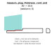

Deepens or shallows the two pocket floors, the round seat and the plug recess, when this end is the fatter end of the plug.

| Default | Range | Step | Unit |
|---|---|---|---|
| 20 | 4 to 40 | 0.5 | mm |

Before: 20. After: 23.5. Section at x = 0 mm.

The fatter of the two thickness numbers sets the floors, so lowering one alone changes nothing; 24 mm or more sends you to the two-sided puller.

Moves: pocket, seat.

#### `measure_cord_thickness`

Cord thickness

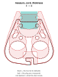

Widens the cord hook's slot and crossbar to fit the cord, and moves the finger holes and the whole body up to make room.

| Default | Range | Step | Unit |
|---|---|---|---|
| 4 | 1.5 to 9 | 0.5 | mm |

Before: 4. After: 8.

Moves: body edge, finger holes, pocket, wall notch, wing openings, zip-tie holes.

#### `measure_wall_plate_style`

Outlet cover plate style

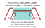

Cuts the wall notch at the plug end deeper or shallower to suit the cover plate, and the zip-tie rows shift down with it.

| Default | Range | Step | Unit |
|---|---|---|---|
| Standard flat plate | 4 options | — | — |

Options: Standard flat plate, Rocker / Decora, Oversized / Jumbo, No plate / flush.

Before: Standard flat plate. After: Oversized / Jumbo.

Moves: body edge, pocket, wall notch, wing openings, zip-tie holes.

#### `show_plug_preview`

Show the see-through plug

Shows or hides the see-through plug in the preview and changes nothing in the printed tool.

| Default | Range | Step | Unit |
|---|---|---|---|
| true | true / false | — | — |

This dial changes no shape. Changes no shape: the see-through plug is a preview aid and is never exported.

### Step 2 - Size

#### `size`

Hand size

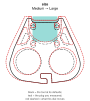

Scales the whole body, both finger holes, the wing openings and the zip-tie grid to the chosen hand size.

| Default | Range | Step | Unit |
|---|---|---|---|
| Medium | 5 options | — | — |

Options: Small, Medium, Large, Measure my hand, Custom.

Before: Medium. After: Large.

Moves: body edge, finger holes, pocket, wing openings, zip-tie holes.

#### `measure_finger_width`

Finger width

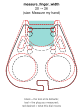

Widens both finger holes, spaces them farther apart and pushes them and the body up to keep the walls printable.

| Default | Range | Step | Unit |
|---|---|---|---|
| 20 | 14 to 32 | 0.5 | mm |

Before: 20. After: 26. Context: `size` = Measure my hand.

Only acts when size is Measure my hand.

Moves: finger holes, pocket, wall notch, wing openings.

#### `measure_hand_width`

Hand width

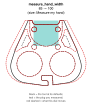

Widens the whole body outline and thickens the slab in step with the hand.

| Default | Range | Step | Unit |
|---|---|---|---|
| 85 | 60 to 110 | 1 | mm |

Before: 85. After: 100. Context: `size` = Measure my hand.

Only acts when size is Measure my hand.

Moves: wing openings.

### Step 3 - Attachment

#### `attachment`

Attachment

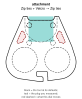

Adds or removes the zip-tie holes and the wing or slot openings for the strap.

| Default | Range | Step | Unit |
|---|---|---|---|
| Zip ties + Velcro | 4 options | — | — |

Options: Zip ties, Velcro strap, Zip ties + Velcro, None.

Before: Zip ties + Velcro. After: Zip ties.

Moves: wing openings.

#### `velcro_style`

Strap opening style

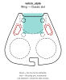

Swaps the curved wing openings for a pair of plain rectangular slots that lean along the body's sides.

| Default | Range | Step | Unit |
|---|---|---|---|
| Wing | 2 options | — | — |

Options: Wing, Classic slot.

Before: Wing. After: Classic slot.

Moves: wing openings.

Can trip: `WING OPENING SMALLER THAN STRAP WIDTH`.

#### `strap_width`

Strap width

Sets the strap width the wing opening is checked against and changes no shape.

| Default | Range | Step | Unit |
|---|---|---|---|
| 15 | 10 to 25 | 1 | mm |

This dial changes no shape. Changes no shape: it only sets the width the W-14 check compares the wing opening against.

Can trip: `WING OPENING SMALLER THAN STRAP WIDTH`; `WING WEB COLLAPSED - NO ROOM FOR STRAP`.

### Step 4 - Cord Hook

#### `hook_hand`

Hook side

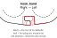

Mirrors the cord hook at the cord end so its catch faces the other side, and nothing else moves.

| Default | Range | Step | Unit |
|---|---|---|---|
| Right | 2 options | — | — |

Options: Right, Left.

Before: Right. After: Left.

Moves: hook.

## Two-sided puller

### Step 1 - Your Plug

#### `plug_preset`

Plug preset

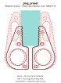

Fills in the plug's length, both widths and the cord from the measured heavy-duty cord plug, so the arms, the grip gap, the cord channel and the plate length all take that plug's shape at once.

| Default | Range | Step | Unit |
|---|---|---|---|
| Measure my plug | 5 options | — | — |

Options: Measure my plug, Heavy-duty extension cord - NEMA 5-15, USB-C laptop tip, Flat 2-prong lamp plug - NEMA 1-15, Standard 3-prong plug - NEMA 5-15.

Before: Measure my plug. After: Heavy-duty extension cord - NEMA 5-15.

Moves: arms, finger lobes, plate edge, zip stations.

#### `measure_plug_length`

Plug length

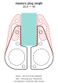

Lengthens both arms so the teeth cover the whole plug body, and moves the zip-tie stations and the strap slot with them.

| Default | Range | Step | Unit |
|---|---|---|---|
| 25.5 | 12 to 85 | 0.5 | mm |

Before: 25.5. After: 40.

Moves: arms.

#### `measure_plug_width_prong_end`

Plug width at the prong end

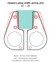

Opens or closes the gap between the arms at their tips, where the plug's prong end sits.

| Default | Range | Step | Unit |
|---|---|---|---|
| 20 | 5 to 40 | 0.5 | mm |

Before: 20. After: 28.

Moves: arms, cord channel, finger lobes, zip stations.

#### `measure_plug_width_cord_end`

Plug width at the cord end

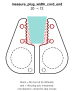

Opens or closes the gap between the arms at the plug's back end, so the arms taper to match the plug.

| Default | Range | Step | Unit |
|---|---|---|---|
| 20 | 5 to 40 | 0.5 | mm |

Before: 20. After: 12.

Moves: arms, teeth, zip stations.

#### `measure_cord_thickness`

Cord thickness

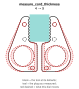

Widens the cord channel between the finger holes, and the finger lobes move outward with it.

| Default | Range | Step | Unit |
|---|---|---|---|
| 4 | 1.5 to 12 | 0.5 | mm |

Before: 4. After: 9.

Moves: arms, cord channel, finger lobes, zip stations.

#### `plug_sides`

Plug sides

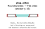

Removes the sloped cradle from the arms' gripping edges so the teeth bite straight along a flat-sided plug.

| Default | Range | Step | Unit |
|---|---|---|---|
| Rounded sides | 2 options | — | — |

Options: Rounded sides, Flat sides.

Before: Rounded sides. After: Flat sides. Section at y = 45 mm.

Moves: arms, teeth.

#### `show_plug_preview`

Show the see-through plug

Shows or hides the see-through plug in the preview and changes nothing in the printed plates.

| Default | Range | Step | Unit |
|---|---|---|---|
| true | true / false | — | — |

This dial changes no shape. Changes no shape: the see-through plug is a preview aid and is never exported.

### Step 2 - Size

#### `size`

Hand size

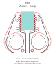

Widens both finger holes and their lobes, so the whole plate grows around them.

| Default | Range | Step | Unit |
|---|---|---|---|
| Medium | 4 options | — | — |

Options: Small, Medium, Large, Measure my hand.

Before: Medium. After: Large.

Moves: arms, finger lobes, zip stations.

#### `measure_finger_width`

Finger width

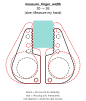

Widens both finger holes and their lobes.

| Default | Range | Step | Unit |
|---|---|---|---|
| 20 | 14 to 32 | 0.5 | mm |

Before: 20. After: 26. Context: `size` = Measure my hand.

Only acts when size is Measure my hand.

Moves: arms, finger lobes, plate edge, zip stations.

### Step 3 - Attachment

#### `attachment`

Attachment

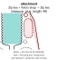

Removes the strap slot from each arm, while the zip-tie stations stay because they hold the plates together.

| Default | Range | Step | Unit |
|---|---|---|---|
| Zip ties + Velcro strap | 2 options | — | — |

Options: Zip ties + Velcro strap, Zip ties.

Before: Zip ties + Velcro strap. After: Zip ties. Context: `measure_plug_length` = 40.

Drawn on a 40 mm plug: on the default 25.5 mm plug the arms are too short for a strap slot.

Moves: arms, strap slot, zip stations.

#### `strap_width`

Strap width

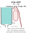

Sets the strap the arm slot must clear, and when the slot's window between the zip-tie stations is shorter than the strap plus 1.5 mm the slot is left out.

| Default | Range | Step | Unit |
|---|---|---|---|
| 15 | 10 to 25 | 1 | mm |

Before: 15. After: 25. Context: `measure_plug_length` = 40.

Drawn on a 40 mm plug: on the default 25.5 mm plug the arms are too short for a strap slot.

Moves: arms, strap slot, zip stations.

Can trip: `STRAP WIDER THAN ARM SLOT WINDOW - NARROW THE STRAP`.

### Step 4 - Print Layout

#### `print_layout`

Print layout

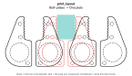

Puts both identical plates side by side in one file, or just one plate.

| Default | Range | Step | Unit |
|---|---|---|---|
| Both plates | 2 options | — | — |

Options: Both plates, One plate.

Before: Both plates. After: One plate.

Moves: arms, finger lobes, plate edge, zip stations.
