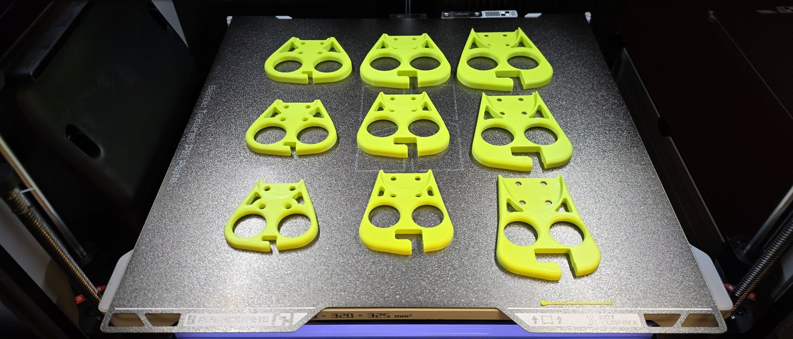
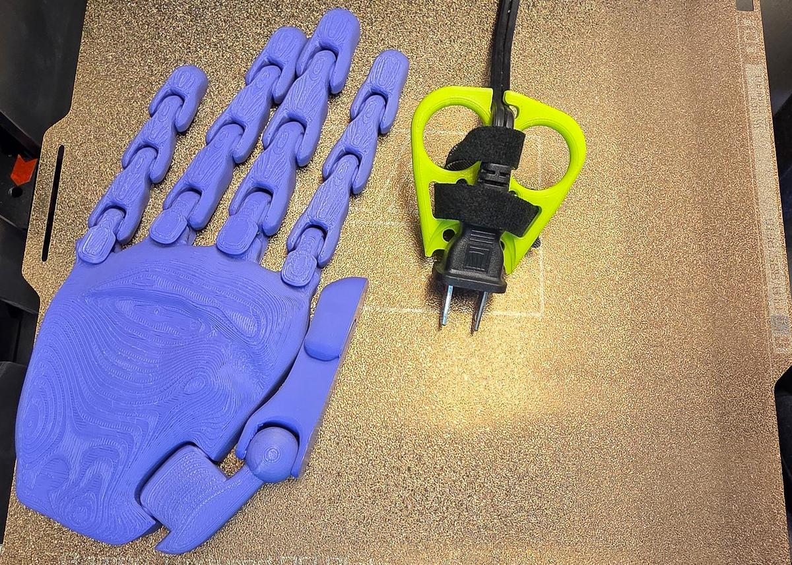
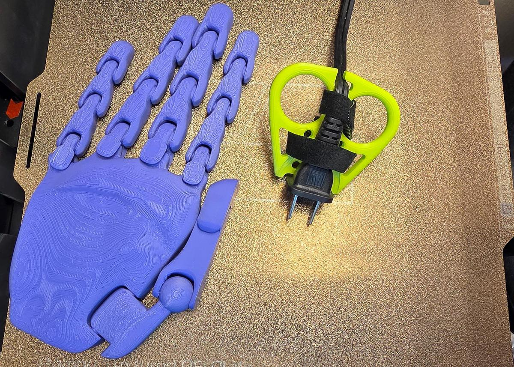
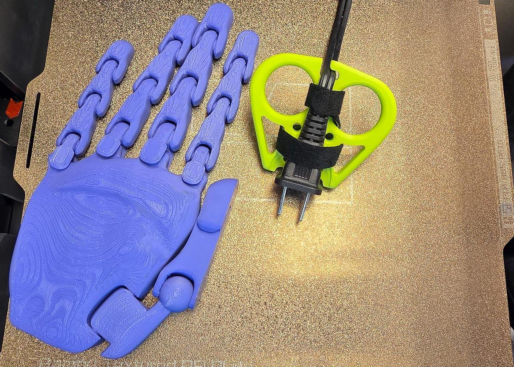
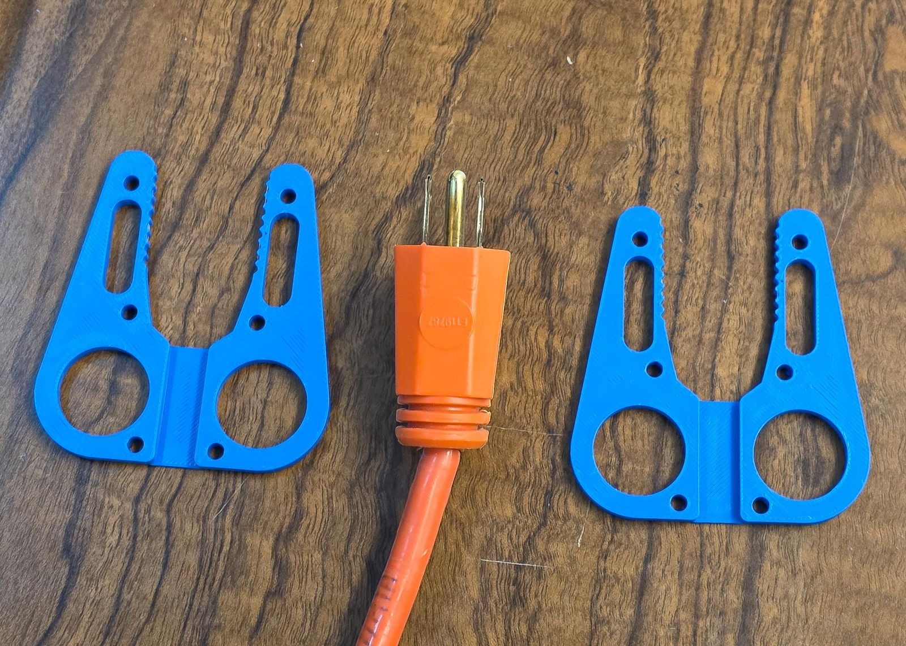
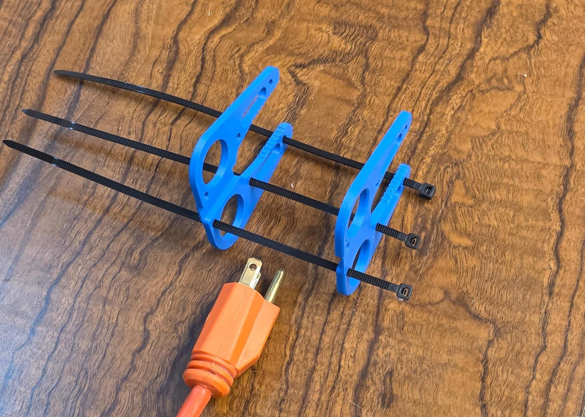
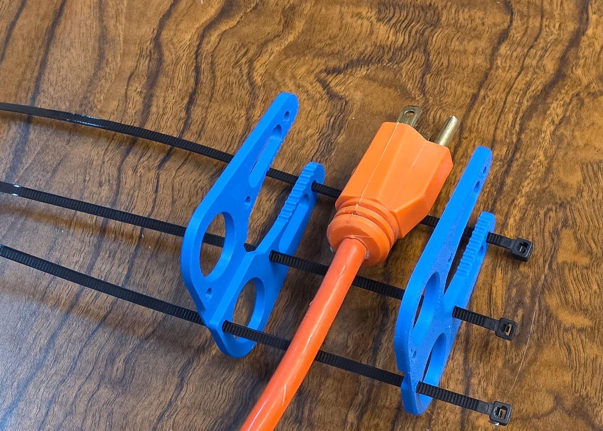
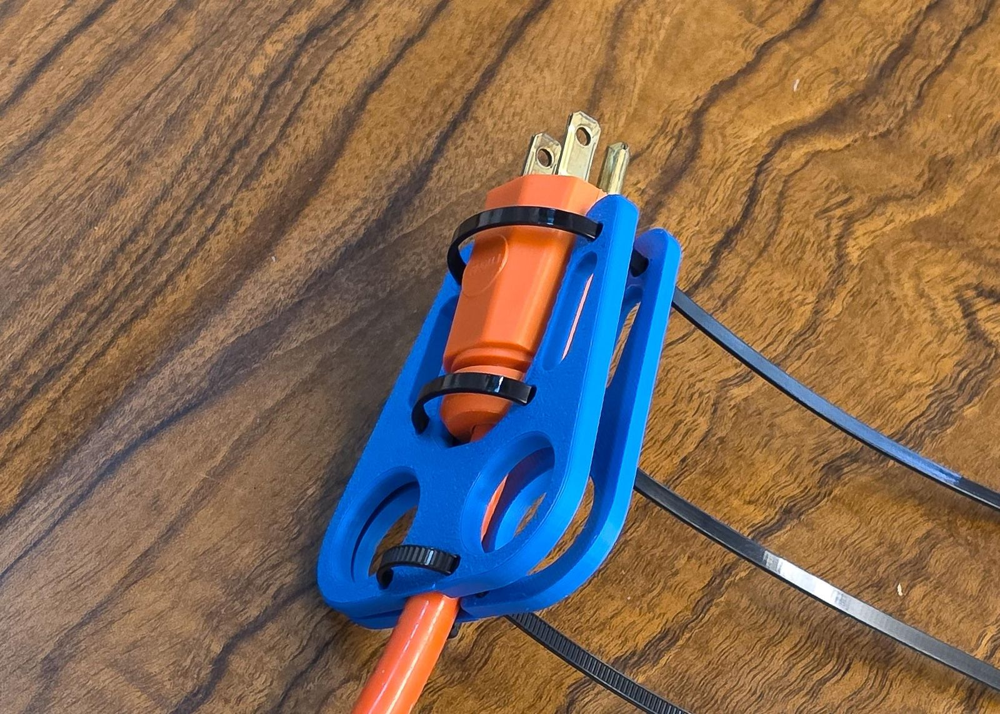
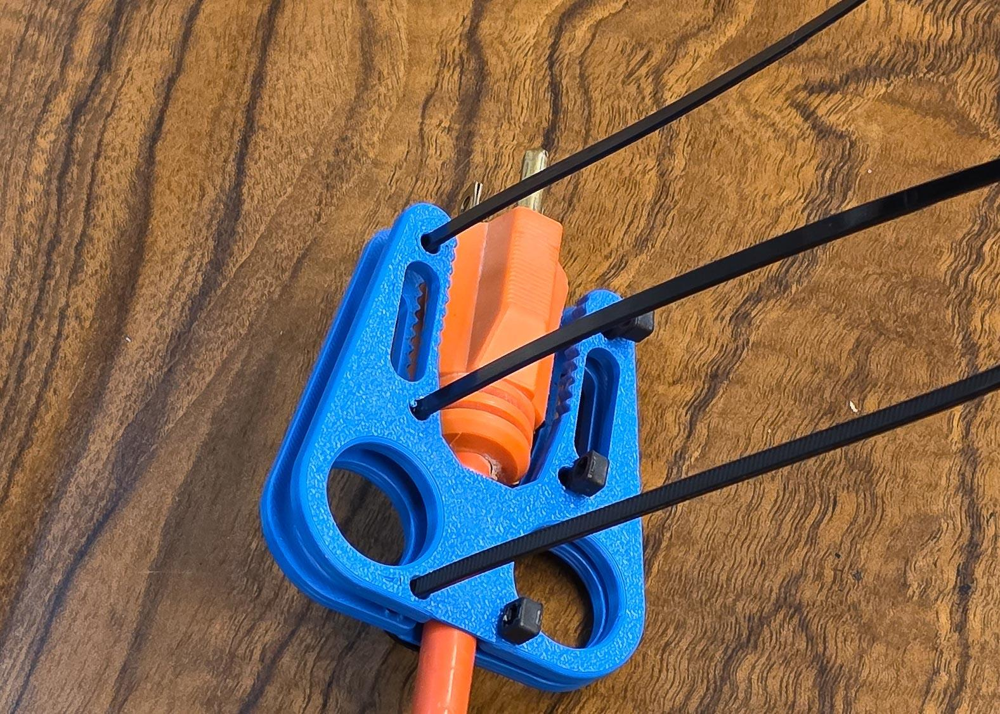
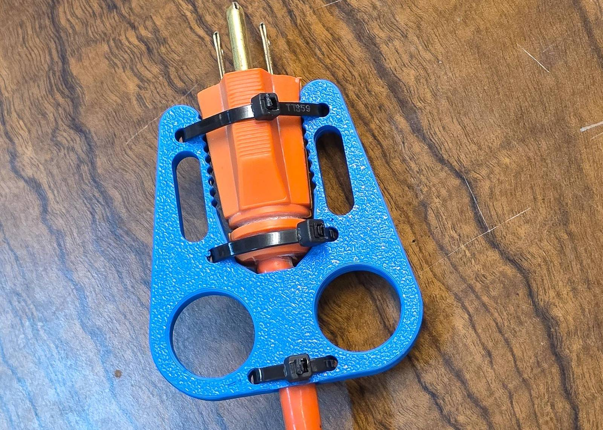

# Maker Guide

This guide takes you from a plug that is hard to pull to a printed tool that fits that plug and your hand. You choose a file, get six numbers or match a card, fill in four Customizer steps, print, and strap the tool onto the plug.

## 1. Choose your tool

There are two tools in two files. Measure your plug's thickness first.

- **Up to 24 mm thick:** the **one-sided puller**, `src/Plug_Puller_Parametric.scad`. One printed part with a pocket for the plug, two finger holes and a cord hook.
- **Thicker than 24 mm, or a plug you want held from both sides:** the **two-sided puller**, `src/Plug_Puller_Two_Sided.scad`. Two identical plates that zip-tie face to face around the plug. Pick it for a USB-C laptop tip, a round extension-cord plug, and a charger cube once a preset exists for it.

If you give the one-sided file a plug 24 mm thick or more, it prints a red tag beside the part that says `PLUG THICKER THAN 24MM - USE THE TWO-SIDED PULLER FILE`. That is the file telling you to switch, not a fault.

## 2. Measure or match

You need six numbers for the one-sided puller (four for the two-sided) and, if you want the tool sized to your hand, one or two hand numbers. Two ways to get them:

- **Match a card.** Print the measuring stencil (`stl/Measuring-Stencil/`) and hold your plug in the plug cards: **P1** the flat 2-prong lamp plug, **P2** the standard 3-prong plug, **P3** the heavy-duty extension cord, **P4** the wide 2-prong appliance plug. If a card fits, you will pick that preset in Step 1 and type nothing. The **C1** cord gauge slides onto an installed cord, the **R1** ruler measures anything else, and the **F1** and **F2** cards find your finger size.
- **Measure with a ruler.** The [Measuring Guide](measuring-guide.md) shows every measurement with a picture and a worksheet. The dials are named exactly as the numbers: `measure_plug_length`, `measure_plug_width_prong_end`, `measure_plug_width_cord_end`, `measure_plug_thickness_prong_end`, `measure_plug_thickness_cord_end`, `measure_cord_thickness`, and for your hand `measure_finger_width` and `measure_hand_width`.

Every number is in millimeters. Typing inches is the most common mistake, and the file catches it with a red tag.

## 3. Customize

Open the file in OpenSCAD (or in the browser: [Web Customizer Guide](web-customizer.md)) and show the Customizer panel. Each file has four steps at the top; fill them in top to bottom. What every dial moves is drawn in the [Dial Quick Start](dial-quick-start.md) (also a PDF: `docs/Plug_Puller_Dial_Quick_Start.pdf`), and every dial of both files is in the [Dial Reference](dial-reference.md).

The one-sided puller:

1. **Step 1 - Your Plug.** Pick a preset from `plug_preset` (`Flat 2-prong lamp plug - NEMA 1-15`, `Standard 3-prong plug - NEMA 5-15`, `Heavy-duty extension cord - NEMA 5-15`, `Wide 2-prong appliance plug - NEMA 1-15`), or leave `Measure my plug` and type the six numbers. Pick your outlet cover style in `measure_wall_plate_style`.
2. **Step 2 - Size.** `Small`, `Medium` or `Large`, or `Measure my hand` and type your finger and hand width.
3. **Step 3 - Attachment.** Zip ties, a strap through the wing openings, or both; set `strap_width` to the strap you bought.
4. **Step 4 - Cord Hook.** `Right` or `Left`, for the hand that will pull.

The two-sided puller:

1. **Step 1 - Your Plug.** Pick a preset from `plug_preset` (`Heavy-duty extension cord - NEMA 5-15`, `USB-C laptop tip`, `Flat 2-prong lamp plug - NEMA 1-15`, `Standard 3-prong plug - NEMA 5-15`), or type four numbers and choose `Rounded sides` or `Flat sides`.
2. **Step 2 - Size.** `Small`, `Medium` or `Large`, or `Measure my hand` with your finger width.
3. **Step 3 - Attachment.** `Zip ties + Velcro strap` or `Zip ties`; the zip ties are what hold the plates together.
4. **Step 4 - Print Layout.** Keep `Both plates`: one file prints the whole tool.

Press F6 to render, then export the STL. If red text lies beside the part in the preview, read it before you export: it names the number to fix.

## 4. Print

Load the STL into your slicer with these settings:

- **Material:** PETG. PLA works too; never a flexible filament, the tool has to stay stiff.
- **Layer height:** 0.2 mm.
- **Walls:** 3 to 4.
- **Infill:** 25 to 35 percent.
- **Supports:** none.
- **Orientation:** the one-sided puller flat face down, pocket up. The two-sided plates flat, exactly as the file lays them out.

The picture below shows nine one-sided pullers printed this way, in three sizes, all lying flat on the bed.

## 5. Assemble

### The one-sided puller

The tool goes onto the plug while the plug is in the outlet. You need two zip ties (see the [bill of materials](bom.md)), or a strap.

1. Seat the tool on the plugged-in plug: the plug sits in the pocket and the notch at the plug end straddles the outlet cover. <!-- photo: shot list item 1 -->
2. Press the cord into the hook at the cord end so it cannot slip out. <!-- photo: shot list item 1 -->
3. Push the first zip tie down through one of the zip-tie holes beside the pocket. <!-- photo: shot list item 3 -->
4. Pass the tie around the plug body and up through the hole on the other side of the pocket. <!-- photo: shot list item 4 -->
5. Pull the tie tight and cut off the tail. <!-- photo: shot list item 4 -->
6. Fit the second zip tie through the other pair of holes the same way.
7. Instead of the ties, or as well: thread the strap through the two wing openings and around the plug, and close it. <!-- photo: shot list item 5 -->

The pictures below show the finished one-sided puller strapped to a lamp plug at Small, Medium and Large, next to a printed hand for scale.

### The two-sided puller

You need three zip ties. The plates are identical; one is flipped over so the toothed arms face each other. The six steps below are the owner's own, in the owner's order.

1. Measure your plug, export the customized STL, and print both plates. The picture shows the two plates on a table with the plug between them.

   

2. Thread one end of each zip tie through the first plate, then through the second, so the ties lie between the plates. Make sure the cord channel of both plates faces the same way. The picture shows three ties through one plate, lying toward the other.

   

3. Place your plug between the two plates, its prongs toward the arms. The picture shows the plug lying on the first plate between the ties.

   

4. Thread the zip ties through the matching holes of the second plate. The picture shows the second plate over the plug with the ties through it and their tails loose.

   

5. Pull the zip ties tight enough to hold the plug between the plates. The picture shows the ties cinched with their tails still on.

   

6. Cut off the zip-tie tails. The picture shows the finished tool holding the plug.

   

## 6. Check the fit

Put the tool on the plug and pull once. The plug should sit flat in the pocket or between the plates, the cord should stay in the hook, and your two fingers should slide in and out of the holes without catching.

If anything is tight, loose or awkward, open the [Fit Troubleshooting guide](fit-troubleshooting.md): every fix is one number, and it says which one and by how much. If red text appears beside the part in the preview, read it: it names the measurement to fix, and the part will not fit until it is gone.

The owner's test prints of the presets added in this round (the USB-C laptop tip, the lamp and standard plugs in the two-sided puller, the wide appliance plug) have not been reported yet; when they are, their fit goes here, one line per preset.
