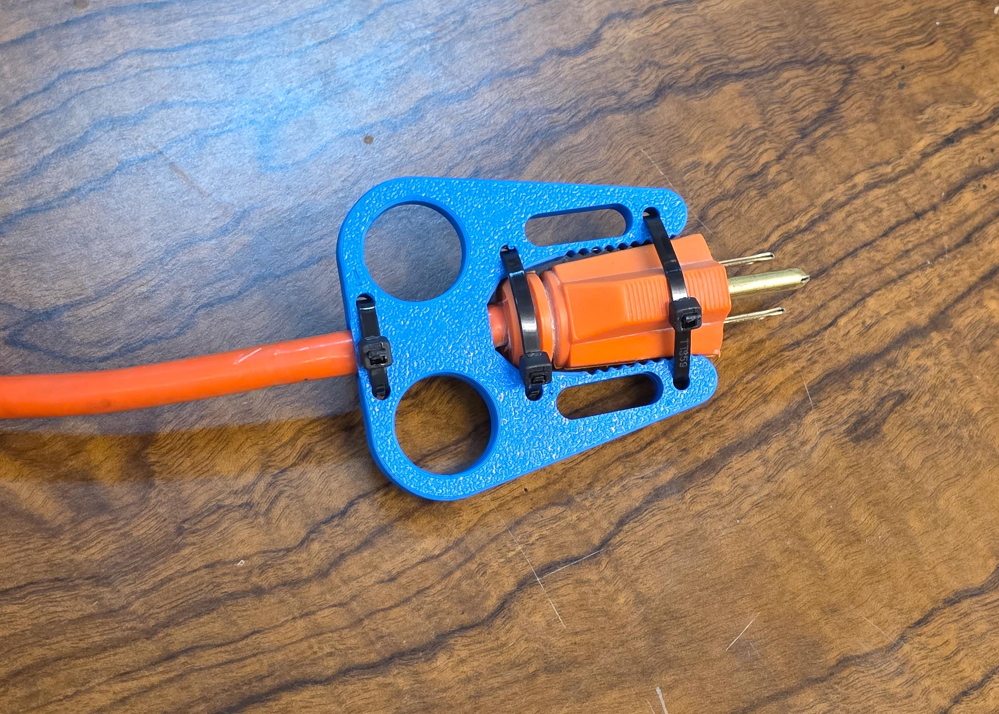
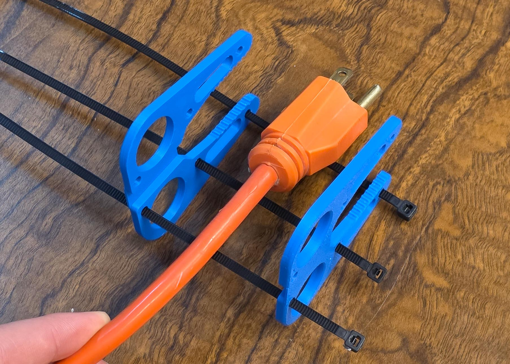

# Measuring Guide — The Numbers That Make Your Plug Puller Fit

Everything on this page is measured in **millimetres (mm)**.
If your ruler or caliper has two scales, **use the mm side** — a US
plug is about **25 mm** wide; if you wrote down "1" you measured in
inches.

You need:

- a **caliper** (a cheap digital one is ideal) *or* a ruler with mm
  markings,
- the **plug** you want to pull, plugged into its outlet,
- **your hand** — only if you plan to use the "Measure my hand" size
  instead of the built-in Small / Medium / Large.

There is also a **[printable measuring template](measuring-template.svg)**
with a mm ruler and finger-sizing circles — print it at 100 % scale
("actual size", no "fit to page") and check the calibration square
before trusting it. Prefer not to cut paper? Print the
**[measuring stencil](print-preview-outlines.md#the-measuring-stencil)**
([`stl/Measuring_Stencil.stl`](../../stl/Measuring_Stencil.stl))
instead — plug-preset silhouette cards (P1/P2/P3), a tactile mm ruler
(R1), a cord gauge (C1), and the 18 finger circles as real
through-holes (F1/F2). The [Starter Guide](starter-guide.md) maps each
card to the worksheet numbers below.

Write your numbers into the worksheet at the bottom as you go.

> **Shortcut:** the model's defaults reproduce the reference Plug Puller,
> which fits a typical 25 mm two-prong plug on a standard flat wall
> plate. If that describes your plug, you only need to pick a size and
> can skip the measuring entirely.
>
> **Even faster:** Step 1 starts with a **`plug_preset`** dropdown.
> Pick `Flat 2-prong lamp plug`, `Standard 3-prong plug`, or
> `Heavy-duty extension cord` and it fills in the plug numbers for
> you. Leave it on `Measure my plug` to type your own numbers below.
>
> **Two tools:** Step 0 `tool_style` is `Auto from plug` by default — it
> builds the flat tool for slim plugs and the **heavy-duty clamshell**
> (two serrated plates that zip-tie around the plug) for fat ones (plug
> thickness ≥ 24 mm). So measuring **plug thickness** accurately matters:
> it decides which tool you get. Force either tool with `tool_style` if
> you prefer.

This is the heavy-duty clamshell on the kind of fat round plug it is
measured for — the two thickness numbers below are what routes you to
it:

<!-- TODO(photos): still wanted — one close-up photo per measurement
     below: ruler from wall plate to the plug's back face, caliper
     across the plug body at the wall end and at the cord end, caliper
     on the cord, the four wall-plate styles side by side, caliper on a
     middle-finger knuckle, ruler across four knuckles. These need
     manual capture; the text descriptions stand alone until they land. -->

---

## Step 1 numbers — your plug and outlet (always used)

> If you picked a **`plug_preset`** other than `Measure my plug`, these
> six numbers are filled in for you and you can skip to Step 2. Type
> your own only when the preset is `Measure my plug`.

Most plugs are not the same size at both ends, so the width and the
thickness are each measured **twice**: once **near the wall** (just
behind the prong face) and once **near the cord** (at the far end of
the molded body, skipping any soft rubber cord boot). The two stations
tell the tool which end of your plug is fatter, and it shapes the
pocket — or the clamshell's gripping arms — to follow that taper in
the right direction.

### 1. Plug length

**With the plug in the outlet: ruler from the wall plate face to the
plug's back face** — how far the whole plug sticks out of the wall.
The tool's pocket (or the clamshell's arms) runs this full length.

- Typical range: 20–50 mm
- Example: ≈ 38 mm

### 2. Plug width near the wall

**Caliper straight across the plastic body just behind the prong
face, parallel to the wall.** Measure the body, not the metal prongs.
If the head flares (many plugs have a wider face plate), measure the
widest part of that first stretch.

- Typical range: 20–40 mm
- Example: a chunky vacuum plug ≈ 34 mm

### 3. Plug width near the cord

**Same direction, but at the far end of the molded body, just before
the cord.** Skip any soft rubber strain-relief boot — measure the last
part of the hard plug body you'd actually grip.

- Typical range: 10–35 mm (most plugs narrow toward the cord)
- Example: ≈ 13 mm on a typical lamp plug

### 4. Plug thickness near the wall

**Caliper across the plug body's THIN direction** — usually
top-to-bottom on a flat plug — **just behind the prong face**. The
clamshell grips across this direction, and the bigger of the two
thicknesses decides which tool `Auto from plug` builds, so measure
carefully.

- Typical range: 12–30 mm
- Example: a flat two-prong plug ≈ 16 mm

### 5. Plug thickness near the cord

**Same thin direction, at the cord end of the molded body** (again,
skip a soft boot). On round extension-cord plugs this can be as fat as
the wall end — that is exactly what these two numbers capture.

- Typical range: 8–30 mm
- Example: ≈ 9 mm on a lamp plug, 27 mm on a heavy-duty round plug

### 6. Cord thickness

**Caliper across the cord right behind the plug, on its thin side.**
Flat lamp cord: measure the narrow way. Round cord: the diameter.
The cord must slide sideways into the tool's hook slot, so measure
where the hook will actually grab — a few centimetres behind the plug.

- Typical range: 3–7 mm
- Example: ≈ 5 mm

### 7. Wall plate style (a picture quiz, not a measurement)

Look at the outlet cover plate and pick the closest match:

| Pick this | If your outlet cover looks like |
| --------- | ------------------------------- |
| **Standard flat plate** | The classic plate with two small **oval/round openings**, one per outlet |
| **Rocker / Decora** | One **big rectangular opening** per outlet (flat "designer" style, like a rocker light switch) |
| **Oversized / Jumbo** | Same idea but noticeably **bigger and thicker** than a normal plate (often used to hide wall damage) |
| **No plate / flush** | No cover plate, or the outlet sits **flush** with the wall surface |

This sets how deep the tool's end notch is, so the tool can straddle
the plate and sit flat against the wall.

> **Where did the side-taper angle go?** Earlier versions asked for a
> `measure_plug_side_angle` in degrees. That angle is now **computed
> for you** from the two width measurements and the plug length — no
> protractor required, and the tool automatically knows whether your
> plug gets wider or narrower toward the cord.

---

## Step 2 — pick a size (hand measurements optional)

The **Size** dropdown covers most hands with built-in values:

| Size | Finger width used | Hand width used | Who it fits |
| ---- | ----------------- | --------------- | ----------- |
| Small | 16.5 mm | 72 mm | smaller adult hands (≈ 5th %ile female) |
| **Medium** | 20 mm | 85 mm | **the reference Plug Puller** — most adults |
| Large | 23 mm | 96 mm | larger hands, gloved use (≈ 95th %ile male) |

(The Small / Large values come from ANSUR II 2012 hand-breadth
anthropometry, so the built-in sizes span most adult hands.)

Pick **Measure my hand** instead if you want the grip built from your
own two numbers:

### 8. Finger knuckle width

**Caliper across the widest knuckle of your middle finger** — the
finger that goes into the pull hole. Measure the widest point (usually
the middle knuckle), not the fingertip.

> **No caliper? Ring trick:** take a ring that fits that finger
> snugly, measure the ring's **inner** diameter in mm, and add
> **1.5 mm**.
>
> **Or use the template:** the
> [printable template](measuring-template.svg) has cut-out circles
> from Ø 15 to Ø 32 mm. Find the smallest circle your middle finger
> passes through comfortably, then **subtract 5** from its Ø number —
> that's your finger width. (Passes Ø 26 → enter 21.)
>
> **Or skip the scissors:** print
> [`stl/Measuring_Stencil.stl`](../../stl/Measuring_Stencil.stl)
> — its F1/F2 cards carry the same 18 circles as real through-holes,
> each labeled. Same rule: smallest comfortable hole, minus 5. See the
> [Try Before You Print guide](print-preview-outlines.md#the-measuring-stencil).

- Typical range: 16–24 mm
- Example: ≈ 22 mm

### 9. Hand width

**Caliper or ruler across the four knuckles of your flat hand** — no
thumb. Lay your hand flat, fingers together, and measure straight
across the knuckles at the widest point.

- Typical range: 70–100 mm
- Example: ≈ 88 mm

---

## Step 3 — pick an attachment (no measuring needed)

How the tool attaches to the plug so it stays put between uses. This
step shapes **both tools** — each choice does something on whichever
tool Step 0 resolves to:

| Pick this | Flat tool gets | Clamshell gets |
| --------- | -------------- | -------------- |
| **Zip ties** | The four small holes — thread two zip ties around the plug body | 3 zip-tie stations per arm — the ties cinch the two plates together |
| **Velcro strap** | Angled wing slots for a hook-and-loop strap | A strap slot through each arm |
| **Zip ties + Velcro** (default) | Both sets of openings (the v6 device is hybrid) | Both zip stations and arm slots |
| **None** | A clean body (hold the tool on the plug by hand) | Solid arms — **not recommended**: zip ties are what hold the two clamshell plates together, so the model warns you |

Two extra choices sit under Step 3:

- **`velcro_style`** — flat tool only: `Wing` (default: the v6 curved
  openings, bigger slot, less plastic) or `Classic slot` (the older
  rectangular slot). The clamshell's strap slot is always a plain
  rounded slot.
- **`strap_width`** — the width of the hook-and-loop strap you'll thread
  through (10–25 mm; ONE-WRAP comes in 10/13/16/20/25). Sizes the flat
  tool's wing opening AND the length of the clamshell's arm slot.

## Step 4 — cord hook (flat tool only)

| Setting | What it does |
| ------- | ------------ |
| `hook_hand` = **Right / Left** | Which way the flat tool's J-hook cord catch faces (Right = the reference). The clamshell has no cord hook, so it ignores this step |

> **Round / smooth plugs:** smooth-sided round cord ends (thick
> extension-cord plugs) can slip in the pocket. Thread a zip tie down
> one of the tool's zip-tie holes, around the plug barrel, and back up
> the opposite hole, then cinch it — the 2×2 hole grid doubles as a
> clamp anchor. (For the clamshell, the zip ties go plate-to-plate the
> same way:)
>
> 

> **Safety:** the tool touches only the plug's **sides and back** —
> never between the plug face and the wall. For extra grip on a slick
> round plug, wrap a turn of silicone tape or a wide rubber band around
> the ears before clamping.

---

## Worksheet

Print this page (or copy the table) and fill it in. These are the
exact names you will see in the form, in the same order.

| # | Form field | Your number / choice |
| - | ---------- | -------------------- |
| — | Plug preset | Measure my plug / Flat 2-prong / Standard 3-prong / Heavy-duty |
| 1 | Plug length (mm) | ________ |
| 2 | Plug width near the wall (mm) | ________ |
| 3 | Plug width near the cord (mm) | ________ |
| 4 | Plug thickness near the wall (mm) | ________ |
| 5 | Plug thickness near the cord (mm) | ________ |
| 6 | Cord thickness (mm) | ________ |
| 7 | Wall plate style | ________ |
| — | Size | Small / Medium / Large / Measure my hand |
| 8 | Finger knuckle width (mm, only for Measure my hand) | ________ |
| 9 | Hand width (mm, only for Measure my hand) | ________ |
| — | Attachment | Zip ties / Velcro strap / Zip ties + Velcro / None |
| — | Velcro style / strap width | Wing / Classic slot · ____ mm |
| — | Cord hook hand | Right / Left |

**Sanity check before you continue:** each plug width should be a
two-digit number (roughly 12–45), and the wall-end width is usually the
bigger one. Finger width should be roughly 14–32. If a number looks
like `1.3`, it's probably inches — re-measure with the mm side.

Next step: the **[Quick Start](quick-start-beginner.md)**, Step B.

### Example filled-in worksheets

Example measured devices ship as saved Customizer parameter sets in
[`presets/Plug_Puller_Parametric.json`](../../presets/Plug_Puller_Parametric.json)
(in OpenSCAD: Customizer panel → the preset-set dropdown above the
sections → pick a set):

| Set name | The values |
| -------- | ---------- |
| `Medium (v6 reference)` | all defaults — the v6 device, zip ties + wing velcro |
| `Flat 2-prong lamp plug (NEMA 1-15)` | the lamp preset (37 mm long, widths 25 → 11.2, thickness 18.6 → 8.6, cord 3.6) |
| `Standard 3-prong plug (NEMA 5-15)` | the standard preset (46.2 mm long, widths 26.6 → 13.4, thickness 18.9 → 15, cord 7) |
| `Heavy-duty round cord (NEMA 5-15)` | the heavy-duty preset (43.8 mm long, 27 mm thick at both ends → clamshell, cord 8.2) |
| `Measure my plug + hand (US vacuum plug)` | straight-sided plug 34 wide / 16 thick at both stations, 38 mm long, cord 5 mm, Rocker / Decora, finger 22 mm, hand 88 mm |
| `Left-handed + classic velcro slots` | `hook_hand = Left`, `velcro_style = Classic slot` |

Load one to see what a completed form looks like, then overwrite the
values with your own numbers.

---

### When you measure for someone else

If the person who will *use* the tool is not the person *measuring*
(a relative, a client of an occupational therapist), measure **their**
hand for numbers 8–9 and **their** outlet and plug for numbers 1–7.
Doubtful between two values? Round **up** — a slightly roomy fit still
works; a tight one doesn't.
