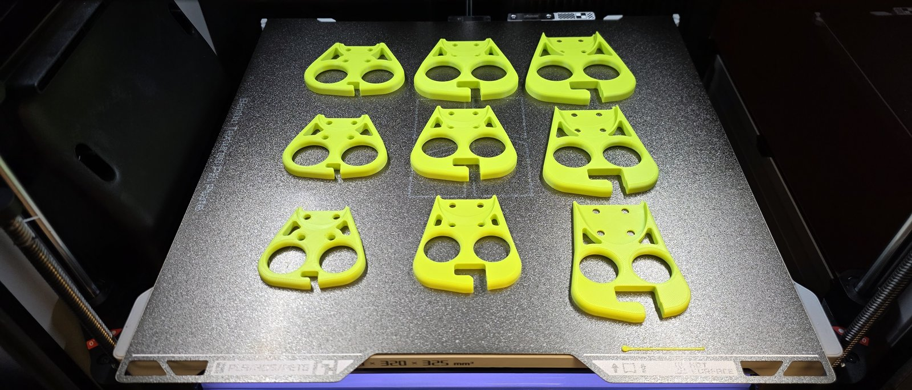
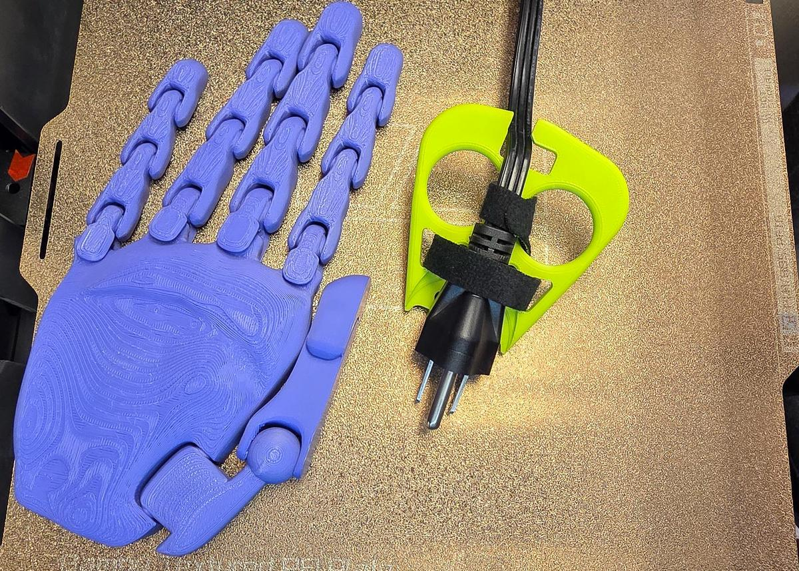
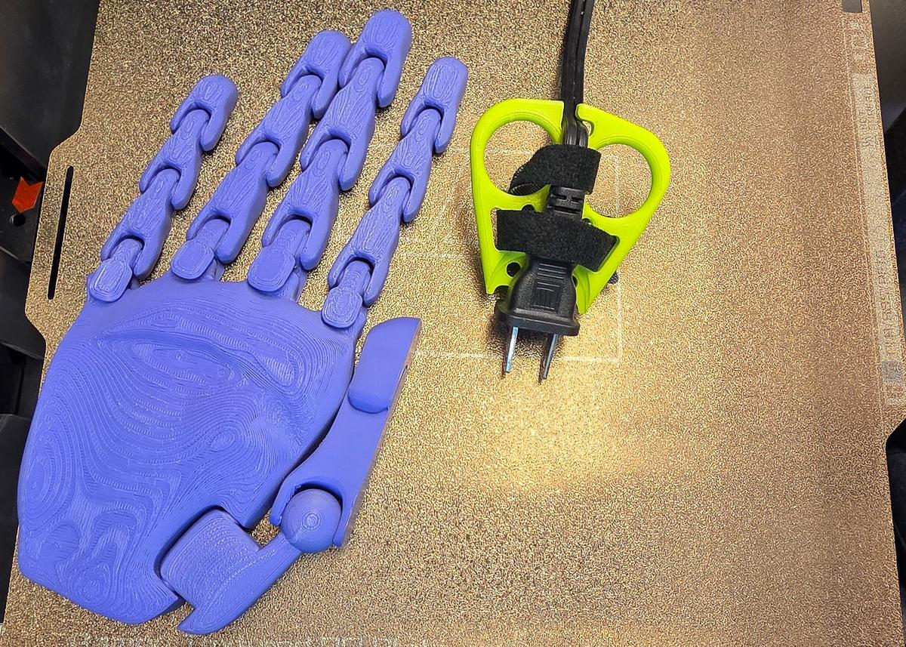
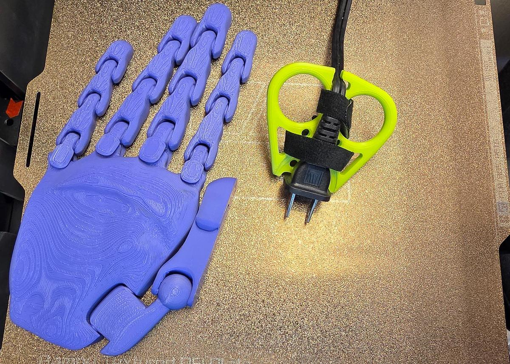
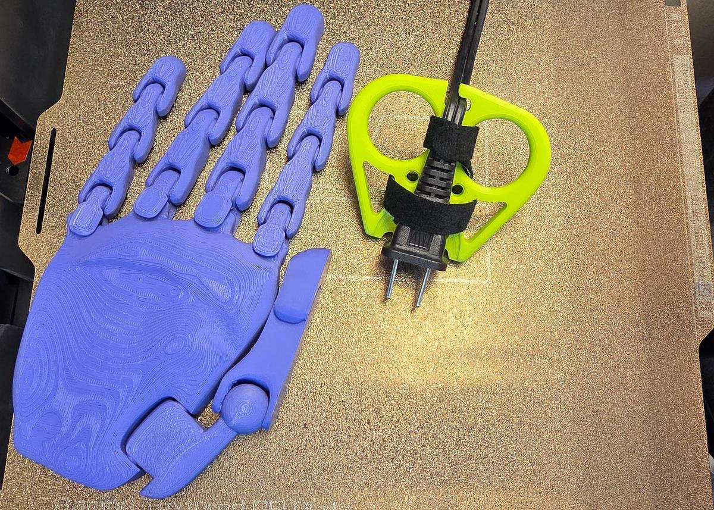

# Quick start, one-sided puller

The shortest path from a stuck plug to a printed one-sided puller that fits it and your hand: get the file, measure, fill in the four Customizer steps, print, assemble, use.

Model version 0.13.0. [The printable quick start](../../Plug_Puller_One_Sided_Quick_Start.pdf) has the same text, with the measuring form and the paper stencil sheets at true size as its last pages. The other document for this tool is [the full guide](full-guide.md). Each dial is headed by its plain name, with the name the Customizer shows on the line under it.

## Which tool this is

This guide is for the one-sided puller, src/Plug_Puller_Parametric.scad: the tool for a wall plug up to 24 mm thick, a pocket around the plug's back and sides with two finger holes below it, pulled with one hand. Measure your plug's thickness first. Thicker than 24 mm, or a plug you want held from both sides such as a USB-C tip or a round extension-cord plug, is the two-sided puller's job, and that tool has its own guide.

The Customizer's four steps are your plug, your size, the attachment and the hook's side. This quick start covers getting the file, measuring your plug and your hand or matching a card, each step's dials with a picture, then printing, assembly and use.

If red text appears beside the part in the preview, read it: it names the measurement to fix, and the part will not fit until it is gone.

In every picture: black = the tool; teal = your plug; red dashed = the edges this dial moved; the numbers match the key beside the picture.

Five stages of the one-sided puller, left to right, the top row first, the plug end at the top; red dashes mark the edges each step moved. 1, the defaults: the tool as the file opens, with a 25 mm wide plug in teal. 2, Step 1 - Your Plug: plug length, plug width at the prong end, plug width at the cord end, and 4 more; red on the body edge, the finger holes, the seat, the wall notch and the wing openings. 3, Step 2 - Size: hand size, finger width, hand width; red on the body edge, the finger holes, the pocket, the wall notch, the wing openings and the zip-tie holes. 4, Step 3 - Attachment: attachment; the wing openings removed, drawn in red from the old outline. 5, Step 4 - Cord Hook: hook side; red on the hook.

- Step 1: type your plug's numbers
- Step 2: pick your hand size
- Step 3: pick how it attaches
- Step 4: pick the hook's side

## Get the file

The one-sided puller is the file `src/Plug_Puller_Parametric.scad`. There are two ways to open it and fill in its form: in your web browser with nothing to install, or in the free OpenSCAD program on your computer. Both show the same form, called the Customizer.

### In your browser

The OpenSCAD Playground runs the whole Customizer in your browser, on a laptop or a phone. Nothing is uploaded: your numbers stay on your device.

1. Open [the one-sided puller in the OpenSCAD Playground](https://ochafik.com/openscad2/#url=https://raw.githubusercontent.com/BrennenJohnston/openscad-plug-puller/main/dist/Plug_Puller_SingleFile.scad). The first visit downloads the OpenSCAD engine (10 to 20 MB), then the model. You will see code on the left (ignore it) and a preview on the right.
2. Open the **Customize** panel: on a wide screen it is a panel or a tab beside the editor, on a phone a tab at the bottom.

If the link does not load the model, download the whole tool as one file, [`dist/Plug_Puller_SingleFile.scad`](../../../dist/Plug_Puller_SingleFile.scad), and drag it into <https://ochafik.com/openscad2/>.

### On your computer

OpenSCAD is the free program that turns your numbers into a printable file. You use one panel of it and never touch the code.

1. Download OpenSCAD from <https://openscad.org/downloads.html>: the **Development Snapshot** for your system. This project is tested with the snapshot of 2026-01-03; any recent snapshot works. The regular release works too, only slower.
2. Get the project: on its GitHub page press the green **Code** button, then **Download ZIP**, and unzip it anywhere. Or download only [`dist/Plug_Puller_SingleFile.scad`](../../../dist/Plug_Puller_SingleFile.scad), the whole tool in one file.
3. Open `src/Plug_Puller_Parametric.scad` (or the single file) in OpenSCAD: double-click it, or use **File ▸ Open**. A wall of code appears in an editor pane. Ignore it; you will not touch it.
4. Show the Customizer, the form you type into: in the **View** menu, make sure **Hide Customizer** is unchecked. In older versions it is **Window ▸ Customizer**.

The form's sections read top to bottom in the order you decide things: **Step 1 - Your Plug**, **Step 2 - Size**, **Step 3 - Attachment**, then **{step4}**. Everything below Step 4 is optional.

## Measure your plug and your hand

Everything here is in mm: a US plug is about 25 mm wide, so a 1 on your paper means you measured in inches. You need a caliper or a ruler with mm marks, the plug in its outlet, and your own hand only if you pick Measure my hand. Print the measuring form at 100 % and fill it in as you go: the sections below are the form's rows, in the same order, and the card names (R1, C1, F1 / F2) are the cards of the printed measuring stencil, described under Match a card instead of measuring.

### Plug length

Customizer name: `measure_plug_length`. Row 2 of the measuring form.

With the plug in the outlet, ruler from the wall plate face to the plug's back face. On a laptop or charger plug, measure from the device's edge.

Typical: 20 to 50 mm. Example: 38 mm.

With the stencil: card R1.

### Plug width at the prong end

Customizer name: `measure_plug_width_prong_end`. Row 3 of the measuring form.

Caliper straight across the plastic body just behind the prongs, the wide way, parallel to the wall. Measure the body, not the metal prongs; if the head flares, take the widest part of that first stretch.

Typical: 20 to 38 mm. Example: 34 mm.

With the stencil: card R1.

### Plug width at the cord end

Customizer name: `measure_plug_width_cord_end`. Row 4 of the measuring form.

The same wide direction, but where the cord leaves the plug body. Skip any soft rubber strain relief and measure the last part of the hard body you would grip.

Typical: 10 to 35 mm. Example: 13 mm.

With the stencil: card R1.

### Plug thickness at the prong end

Customizer name: `measure_plug_thickness_prong_end`. Row 5 of the measuring form.

Caliper across the plug body's thin direction, usually top to bottom on a flat plug, just behind the prongs. A plug 24 mm thick or more needs the two-sided puller, so measure carefully.

Typical: 12 to 30 mm. Example: 16 mm.

With the stencil: card R1.

### Plug thickness at the cord end

Customizer name: `measure_plug_thickness_cord_end`. Row 6 of the measuring form.

The same thin direction, where the cord leaves the plug body, skipping the soft strain relief. On a round extension-cord plug this can be as fat as the prong end.

Typical: 8 to 30 mm. Example: 9 mm.

With the stencil: card R1.

### Cord thickness

Customizer name: `measure_cord_thickness`. Row 7 of the measuring form.

Caliper across the cord just behind the plug, on its thin side: flat cord the narrow way, round cord the diameter. With the stencil, the smallest C1 slot that slips over the cord is this number.

Typical: 3 to 7 mm. Example: 5 mm.

With the stencil: card C1.

### Outlet cover plate style

Customizer name: `measure_wall_plate_style`. Row 8 of the measuring form.

Look at the outlet cover plate: two small oval openings is Standard flat plate; one big rectangle per outlet is Rocker / Decora; a bigger, thicker plate is Oversized / Jumbo; no plate or a flush outlet is No plate / flush.

The choices: Standard flat plate, Rocker / Decora, Oversized / Jumbo, No plate / flush.

### Finger width

Customizer name: `measure_finger_width`. Row 11 of the measuring form.

Caliper across the widest knuckle of your middle finger, the finger that goes into the pull hole. With the stencil, find the smallest F1 or F2 hole your finger passes through comfortably and subtract 5 from its number.

Typical: 16 to 24 mm. Example: 22 mm.

With the stencil: card F1 / F2.

No caliper? Take a ring that fits that finger snugly, measure the ring's inner diameter in mm and add 1.5 mm.

### Hand width

Customizer name: `measure_hand_width`. Row 12 of the measuring form.

Caliper or ruler straight across the four knuckles of your flat hand, fingers together, no thumb. Measure at the widest point.

Typical: 70 to 100 mm. Example: 88 mm.

With the stencil: card R1.

### Strap width

Customizer name: `strap_width`. Row 15 of the measuring form.

Read the width on the strap's packaging. ONE-WRAP comes in 10, 13, 16, 20 and 25 mm.

Typical: 10 to 25 mm. Example: 15 mm.

Sanity check: each plug width is a two-digit number, roughly 12 to 45, and the prong-end width is usually the bigger one; the finger width is roughly 14 to 32. A number like 1.3 is inches: measure again with the mm side.

When you measure for someone else, a relative or a client, measure their hand for the finger and hand rows and their outlet and plug for the plug rows. Doubtful between two values? Round up: a slightly roomy fit works, a tight one does not.

### Match a card instead of measuring

The measuring stencil is a set of thin printed cards. Each has a two-letter name raised on its face, so you can find it by touch. Hold your plug in the plug cards: if it fills one card's openings, snug with no big gaps, that card names the preset to pick in Step 1, and you type no numbers at all.

| Card | What it is | What it answers |
| ---- | ---------- | --------------- |
| P1 | The flat 2-prong lamp plug (NEMA 1-15) | the preset `Flat 2-prong lamp plug - NEMA 1-15` |
| P2 | The standard 3-prong plug (NEMA 5-15) | the preset `Standard 3-prong plug - NEMA 5-15` |
| P3 | The heavy-duty extension cord plug (NEMA 5-15) | the two-sided puller's preset `Heavy-duty extension cord - NEMA 5-15` |
| P4 | The wide 2-prong appliance plug (NEMA 1-15) | the one-sided puller's preset `Wide 2-prong appliance plug - NEMA 1-15` |
| R1 | A ruler: raised mm ticks, numbers every 10 mm, and a notch every 10 mm you can count by touch | the plug's length, widths and thicknesses |
| C1 | A cord gauge: open slots 3 to 9 mm wide along one edge, slid onto the cord from the side | the cord thickness: the smallest slot that slips over the cord |
| F1, F2 | Finger holes 15 to 25 mm across (F1) and 26 to 32 mm (F2) | your finger width: the smallest hole your middle finger passes through comfortably, minus 5 |

Each P card has three openings: W for the plug's width, T for its thickness, and an open slot that slides onto the cord. If no card fits, your plug is between presets: measure it instead. The measured tool fits better than any preset.

**Printing the cards.** Print [`stl/Measuring-Stencil/Visual/Measuring-Stencil_Visual_All-Cards.stl`](../../../stl/Measuring-Stencil/Visual/Measuring-Stencil_Visual_All-Cards.stl): 1.2 mm thick cards, no supports, any rigid filament. Or print one card at a time from [`stl/Measuring-Stencil/`](../../../stl/Measuring-Stencil). The cards pack onto sheets for a 200 by 200 mm bed. For a smaller bed, open [`Measuring_Stencil.scad`](../../../Measuring_Stencil.scad) in OpenSCAD, set `bed_width` and `bed_depth` to your bed, and export `part_index` 1, then 2, and so on, one sheet at a time. `part_index` 0 previews every sheet at once; do not print that one.

**The tactile version** ([`stl/Measuring-Stencil/Tactile/`](../../../stl/Measuring-Stencil/Tactile), or `label_mode` set to Tactile in the file) prints every label as a raised character at ADA size and adds a Grade 2 braille title flap to every card. The flap prints leaning back, held by thin fins. Snap the fins off, then fold the flap away from the card until it lies flat, so the braille lands face up beyond the card's edge. Fold once, gently; a PETG or PP hinge folds more reliably than PLA.

**No 3D printer yet?** The last pages of the printed quick start are paper versions of the cards at true size: the plug outlines, a 100 mm ruler and the finger circles. Print them at 100 % (actual size, never fit to page) and check the 50 by 50 mm square with a ruler before you trust them. On their own they are [`stencil-sheet.svg`](../stencil-sheet.svg) and [`stencil-sheet-2.svg`](../stencil-sheet-2.svg).

### The measuring form

The form is the sheet [measuring-form.svg](measuring-form.svg); the paper stencil sheets are [stencil-sheet.svg](../stencil-sheet.svg) and [stencil-sheet-2.svg](../stencil-sheet-2.svg). Print the form at 100 % (actual size, never fit to page) and check its 50 mm bar with a ruler before you trust it. Fill in the blanks top to bottom as you measure, then type the numbers into the Customizer in the same order.

| # | Customizer name | What you measure | Default | Yours |
|---|---|---|---|---|
| 1 | `plug_preset` | Plug preset: pick one | Measure my plug | ________ |
| 2 | `measure_plug_length` | With the plug in the outlet, ruler from the wall plate face to the plug's back face. | 25.5 mm | ________ |
| 3 | `measure_plug_width_prong_end` | Caliper straight across the plastic body just behind the prongs, the wide way, parallel to the wall. | 25 mm | ________ |
| 4 | `measure_plug_width_cord_end` | The same wide direction, but where the cord leaves the plug body. | 25 mm | ________ |
| 5 | `measure_plug_thickness_prong_end` | Caliper across the plug body's thin direction, usually top to bottom on a flat plug, just behind the prongs. | 20 mm | ________ |
| 6 | `measure_plug_thickness_cord_end` | The same thin direction, where the cord leaves the plug body, skipping the soft strain relief. | 20 mm | ________ |
| 7 | `measure_cord_thickness` | Caliper across the cord just behind the plug, on its thin side: flat cord the narrow way, round cord the diameter. | 4 mm | ________ |
| 8 | `measure_wall_plate_style` | Look at the outlet cover plate and pick the closest match. | Standard flat plate | ________ |
| 9 | `show_plug_preview` | Show the see-through plug: leave on | on | ________ |
| 10 | `size` | Hand size: pick one | Medium | ________ |
| 11 | `measure_finger_width` | Caliper across the widest knuckle of your middle finger, the finger that goes into the pull hole. | 20 mm | ________ |
| 12 | `measure_hand_width` | Caliper or ruler straight across the four knuckles of your flat hand, fingers together, no thumb. | 85 mm | ________ |
| 13 | `attachment` | Attachment: pick one | Zip ties + Velcro | ________ |
| 14 | `velcro_style` | Strap opening style: pick one | Wing | ________ |
| 15 | `strap_width` | Read the width on the strap's packaging. | 15 mm | ________ |
| 16 | `hook_hand` | Hook side: pick one | Right | ________ |

**What the sheet shows.** The left column is the numbered list above, one row per dial in the Customizer's Step order, each with the dial's name, its plain title and either a blank after the default or a tick box per choice with the default marked. The right half is a schematic plug in teal drawn from the one-sided puller's defaults at 1.5 to 1, a top view with the prong end at the left against a wall plate line, a side view standing with its prong end up, the cord's end as a small circle, a bar of four knuckles at 1:1 and a strap bar at 1:1. A straight black arrow runs from each measured row's blank to a red dimension line on the schematic, the row's number in a red circle at the line:

- Arrow 2 points to the plug's length on the top view, from the wall plate to the plug's back end.
- Arrow 3 points to the plug's width at the prong end, the left edge of the top view.
- Arrow 4 points to the plug's width at the cord end, the right edge of the top view where the cord leaves.
- Arrow 5 points to the plug's thickness at the prong end, the top of the side view.
- Arrow 6 points to the plug's thickness at the cord end, the bottom of the side view.
- Arrow 7 points to the cord's thickness on the small circle, the cord seen end on.
- Arrow 11 points to one knuckle of the knuckle bar, drawn 20 mm wide at 1:1.
- Arrow 12 points to the whole knuckle bar, four knuckles 85 mm across at 1:1.
- Arrow 15 points to the strap bar's width, a 40 by 15 mm bar at 1:1.

- Row 1, plug preset: 5 boxes, Measure my plug marked as the default; the choices are Measure my plug, Flat 2-prong lamp plug - NEMA 1-15, Standard 3-prong plug - NEMA 5-15, Heavy-duty extension cord - NEMA 5-15, Wide 2-prong appliance plug - NEMA 1-15.
- Row 8, outlet cover plate style: 4 boxes, Standard flat plate marked as the default; the choices are Standard flat plate, Rocker / Decora, Oversized / Jumbo, No plate / flush.
- Row 9, show the see-through plug: one box marked, leave on.
- Row 10, hand size: 5 boxes, Medium marked as the default; the choices are Small, Medium, Large, Measure my hand, Custom.
- Row 13, attachment: 4 boxes, Zip ties + Velcro marked as the default; the choices are Zip ties, Velcro strap, Zip ties + Velcro, None.
- Row 14, strap opening style: 2 boxes, Wing marked as the default; the choices are Wing, Classic slot.
- Row 16, hook side: 2 boxes, Right marked as the default; the choices are Right, Left.

Type them into the Customizer in this order.

## Step 1 - Your Plug

Pick a plug preset, or leave it on Measure my plug and type your plug's numbers.

### Plug preset

Customizer name: `plug_preset`

Fills in all six plug numbers from a measured reference plug, so the pocket, the wall notch, the cord hook and the zip-tie and wing positions all take that plug's shape at once.

Two top views of the one-sided puller, before left and after right, the plug end at the top. Left: the defaults, a 25 mm wide plug in teal. Right: plug preset set to Standard 3-prong plug - NEMA 5-15. Marked in red: 1, the zip-tie holes, the wing openings, the wall notch, the seat, the pocket and the body edge.

- Default: Measure my plug
- Choices: Measure my plug, Flat 2-prong lamp plug - NEMA 1-15, Standard 3-prong plug - NEMA 5-15, Heavy-duty extension cord - NEMA 5-15, Wide 2-prong appliance plug - NEMA 1-15
- Moves: body edge, pocket, seat, wall notch, wing openings, zip-tie holes

### Plug length

Customizer name: `measure_plug_length`

Runs the pocket farther toward the finger holes and stretches the whole body to keep the finger holes and zip-tie rows clear of it.

Two top views of the one-sided puller, before left and after right, the plug end at the top. Left: the defaults, a 25 mm wide plug in teal. Right: plug length at 40 mm. Marked in red: 1, the zip-tie holes: the four small holes beside the pocket. 2, the zip-tie holes and the wing openings. 3, the wall notch, the seat and the body edge.

- Default: 25.5 mm
- Range: 12 to 85 mm, in steps of 0.5 mm
- Moves: body edge, seat, wall notch, wing openings, zip-tie holes

### Plug width at the prong end

Customizer name: `measure_plug_width_prong_end`

Widens or narrows the pocket, its seat and the wall notch at the plug end, and moves the zip-tie holes and wing openings with them.

Two top views of the one-sided puller, before left and after right, the plug end at the top. Left: the defaults, a 25 mm wide plug in teal. Right: plug width at the prong end at 32 mm. Marked in red: 1, the zip-tie holes: the four small holes beside the pocket. 2, the wing openings: the two openings beside the pocket. 3, the wall notch, the seat and the body edge: the notch in the top edge; the round recess at the plug end; the outer outline.

- Default: 25 mm
- Range: 8 to 38 mm, in steps of 0.5 mm
- Moves: body edge, seat, wall notch, wing openings, zip-tie holes

### Plug width at the cord end

Customizer name: `measure_plug_width_cord_end`

Tilts the pocket's side walls to match the plug's taper, and the zip-tie holes and wing openings lean in with them.

Two top views of the one-sided puller, before left and after right, the plug end at the top. Left: the defaults, a 25 mm wide plug in teal. Right: plug width at the cord end at 15 mm. Marked in red: 1, the wing openings and the pocket: the two openings beside the pocket; the plug recess on the centerline.

- Default: 25 mm
- Range: 8 to 38 mm, in steps of 0.5 mm
- Moves: pocket, wing openings

### Plug thickness at the prong end

Customizer name: `measure_plug_thickness_prong_end`

Deepens or shallows the two pocket floors, the round seat and the plug recess, to suit the fatter of the two thickness numbers.

Two vertical slices of the one-sided puller at x = 0 mm, before left and after right, the top face up. Left: the defaults, the plug in teal in the cut. Right: plug thickness at the prong end at 23.5 mm. Marked in red: 1, the seat and the pocket: the round recess at the plug end; the plug recess on the centerline.

- Default: 20 mm
- Range: 4 to 40 mm, in steps of 0.5 mm
- Moves: pocket, seat

Note: The fatter of the two thickness numbers sets the floors, so lowering one alone changes nothing; 24 mm or more sends you to the two-sided puller.

### Plug thickness at the cord end

Customizer name: `measure_plug_thickness_cord_end`

Deepens or shallows the two pocket floors, the round seat and the plug recess, when this end is the fatter end of the plug.

Two vertical slices of the one-sided puller at x = 0 mm, before left and after right, the top face up. Left: the defaults, the plug in teal in the cut. Right: plug thickness at the cord end at 23.5 mm. Marked in red: 1, the seat and the pocket: the round recess at the plug end; the plug recess on the centerline.

- Default: 20 mm
- Range: 4 to 40 mm, in steps of 0.5 mm
- Moves: pocket, seat

Note: The fatter of the two thickness numbers sets the floors, so lowering one alone changes nothing; 24 mm or more sends you to the two-sided puller.

### Cord thickness

Customizer name: `measure_cord_thickness`

Widens the cord hook's slot and crossbar to fit the cord, and moves the finger holes and the whole body up to make room.

Two top views of the one-sided puller, before left and after right, the plug end at the top. Left: the defaults, a 25 mm wide plug in teal. Right: cord thickness at 8 mm. Marked in red: 1, the zip-tie holes, the finger holes, the wing openings, the wall notch, the pocket and the body edge.

- Default: 4 mm
- Range: 1.5 to 9 mm, in steps of 0.5 mm
- Moves: body edge, finger holes, pocket, wall notch, wing openings, zip-tie holes

### Outlet cover plate style

Customizer name: `measure_wall_plate_style`

Cuts the wall notch at the plug end deeper or shallower to suit the cover plate, and the zip-tie rows shift down with it.

Two top views of the one-sided puller, before left and after right, the plug end at the top. Left: the defaults, a 25 mm wide plug in teal. Right: outlet cover plate style set to Oversized / Jumbo. Marked in red: 1, the wall notch and the body edge: the notch in the top edge; the outer outline. 2, the zip-tie holes: the four small holes beside the pocket. 3, the pocket: the plug recess on the centerline. 4, the wing openings: the two openings beside the pocket.

- Default: Standard flat plate
- Choices: Standard flat plate, Rocker / Decora, Oversized / Jumbo, No plate / flush
- Moves: body edge, pocket, wall notch, wing openings, zip-tie holes

### Show the see-through plug

Customizer name: `show_plug_preview`

Shows or hides the see-through plug in the preview and changes nothing in the printed tool.

No picture. Changes no shape: the see-through plug is a preview aid and is never exported.

- Default: On
- Choices: On or off (a check box)

## Step 2 - Size

Pick your hand size, or pick Measure my hand and type your hand's numbers.

### Hand size

Customizer name: `size`

Scales the whole body, both finger holes, the wing openings and the zip-tie grid to the chosen hand size.

Two top views of the one-sided puller, before left and after right, the plug end at the top. Left: the defaults, a 25 mm wide plug in teal. Right: hand size set to Large. Marked in red: 1, the zip-tie holes: the four small holes beside the pocket. 2, the pocket: the plug recess on the centerline. 3, the wing openings: the two openings beside the pocket. 4, the finger holes: the two large holes in the lower half. 5, the body edge: the outer outline.

- Default: Medium
- Choices: Small, Medium, Large, Measure my hand, Custom
- Moves: body edge, finger holes, pocket, wing openings, zip-tie holes

### Finger width

Customizer name: `measure_finger_width`

Widens both finger holes, spaces them farther apart and pushes them and the body up to keep the walls printable.

Two top views of the one-sided puller, before left and after right, the plug end at the top. Left: the defaults with hand size set to Measure my hand, a 25 mm wide plug in teal. Right: finger width at 26 mm. Marked in red: 1, the pocket: the plug recess on the centerline. 2, the wing openings: the two openings beside the pocket. 3, the finger holes: the two large holes in the lower half. 4, the wall notch and the body edge.

- Default: 20 mm
- Range: 14 to 32 mm, in steps of 0.5 mm
- Moves: body edge, finger holes, pocket, wall notch, wing openings

Note: Only acts when size is Measure my hand.

### Hand width

Customizer name: `measure_hand_width`

Widens the whole body outline and thickens the slab in step with the hand.

Two top views of the one-sided puller, before left and after right, the plug end at the top. Left: the defaults with hand size set to Measure my hand, a 25 mm wide plug in teal. Right: hand width at 100 mm. Marked in red: 1, the body edge: the outer outline. Everything else follows the outline.

- Default: 85 mm
- Range: 60 to 110 mm, in steps of 1 mm
- Moves: body edge

Note: Only acts when size is Measure my hand.

## Step 3 - Attachment

Pick how the tool attaches.

### Attachment

Customizer name: `attachment`

Adds or removes the zip-tie holes and the wing or slot openings for the strap.

Two top views of the one-sided puller, before left and after right, the plug end at the top. Left: the defaults, a 25 mm wide plug in teal. Right: attachment set to Zip ties. Marked in red: 1, the wing openings: the two openings beside the pocket, removed. The body edge, the pocket, the seat and the wall notch stay where they were.

- Default: Zip ties + Velcro
- Choices: Zip ties, Velcro strap, Zip ties + Velcro, None
- Moves: wing openings

### Strap opening style

Customizer name: `velcro_style`

Swaps the curved wing openings for a pair of plain rectangular slots that lean along the body's sides.

Two top views of the one-sided puller, before left and after right, the plug end at the top. Left: the defaults, a 25 mm wide plug in teal. Right: strap opening style set to Classic slot. Marked in red: 1, the wing openings: the two openings beside the pocket. The body edge, the pocket, the seat and the wall notch stay where they were.

- Default: Wing
- Choices: Wing, Classic slot
- Moves: wing openings
- Red warnings: WING OPENING SMALLER THAN STRAP WIDTH

### Strap width

Customizer name: `strap_width`

Sets the strap width the wing opening is checked against and changes no shape.

No picture. Changes no shape: it only sets the width the W-14 check compares the wing opening against.

- Default: 15 mm
- Range: 10 to 25 mm, in steps of 1 mm
- Red warnings: WING OPENING SMALLER THAN STRAP WIDTH; WING WEB COLLAPSED - NO ROOM FOR STRAP

## Step 4 - Cord Hook

Pick the hook's side.

### Hook side

Customizer name: `hook_hand`

Mirrors the cord hook at the cord end so its catch faces the other side, and nothing else moves.

Two top views of the one-sided puller, before left and after right, the plug end at the top. Left: the defaults, a 25 mm wide plug in teal. Right: hook side set to Left. Marked in red: 1, the hook: the cord hook slot in the bottom edge. The body edge, the pocket, the seat and the wall notch stay where they were.

- Default: Right
- Choices: Right, Left
- Moves: hook

## Render, export and print

1. Press **F6** (or **Design ▸ Render**) and wait for the progress bar to finish. In the browser, press **Render**. A render takes from a few seconds to a minute on a computer, longer in a browser.
2. Look for red text beside the part. If there is any, read it: it names the measurement to fix, and the part will not fit until it is gone.
3. Save the file: **File ▸ Export ▸ Export as STL** on the computer, or the download button in the browser. If you export without rendering, OpenSCAD asks you to render first: press F6 and export again. The quick preview (F5) looks complete but cannot be exported.

Load the STL into your slicer with these settings:

| Setting | Value |
| ------- | ----- |
| Orientation | flat face down on the bed, the plug pocket facing up. No supports. |
| Layer height | 0.2 mm |
| Walls | 3 to 4: you pull hard on this part |
| Infill | 25 to 35 percent |
| Material | PETG. PLA, ABS and ASA work too. Never a flexible filament: the tool has to stay stiff. |

The picture shows nine one-sided pullers printed this way, in three sizes, all flat on the bed.

## Assemble

The tool goes onto the plug while the plug is in the outlet. You need two zip ties, or a strap; the sizes are in the [bill of materials](../bom.md).

1. Seat the tool on the plugged-in plug: the plug sits in the pocket, and the notch at the plug end straddles the outlet cover.
2. Press the cord into the hook at the cord end so it cannot slip out.
3. Push the first zip tie down through one of the zip-tie holes beside the pocket.
4. Pass the tie around the plug body and up through the hole on the other side of the pocket.
5. Pull the tie tight and cut off the tail.
6. Fit the second zip tie through the other pair of holes the same way.
7. Instead of the ties, or as well: thread the strap through the two wing openings and around the plug, and close it. The picture shows a strap holding the tool on a three-prong plug.

   

The tool can stay on the plug between uses. The pictures below show the finished one-sided puller strapped to a lamp plug at Small, Medium and Large, next to a printed hand for scale.

## Use it

The plug puller is for anyone who cannot grip a plug and pull it out of an outlet: arthritis, low grip strength, tremor, a small hand, one hand. Two finger holes take the pull, so your whole hand does the work instead of a fingertip pinch. The tool touches only the plug's sides and back, never the outlet.

1. Seat the tool on the plug while the plug is in the outlet: the plug in the pocket, the notch at the plug end over the outlet cover.
2. Press the cord into the hook at the cord end.
3. Put two fingers through the holes.
4. Pull straight back, away from the wall.

The tool can stay strapped to the plug between uses.

## Safety

- Nothing goes between the plug face and the outlet cover: the tool grips only the plug's sides and back.
- Pull straight out. Never lever the tool sideways or up and down.
- Do not use the tool on a damaged cord, a cracked plug, or a plug that is warm to the touch.
- Keep your fingers away from the prongs as the plug comes out.
- The tool has no conductive parts, but it is still plastic near electricity: if it cracks, stop using it.

## If it does not fit

Put the tool on the plug and pull once. The plug should sit flat in the pocket with the cord in the hook, and your two fingers should slide in and out of the holes without catching. If anything is tight, loose or awkward, the full guide names the one dial to change and by how much, decodes every red warning tag, and covers the advanced dials: [the one-sided puller's full guide](full-guide.md).
