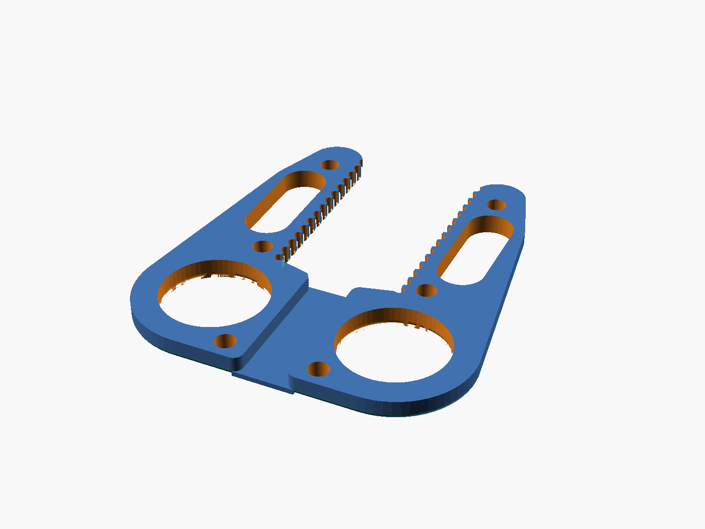
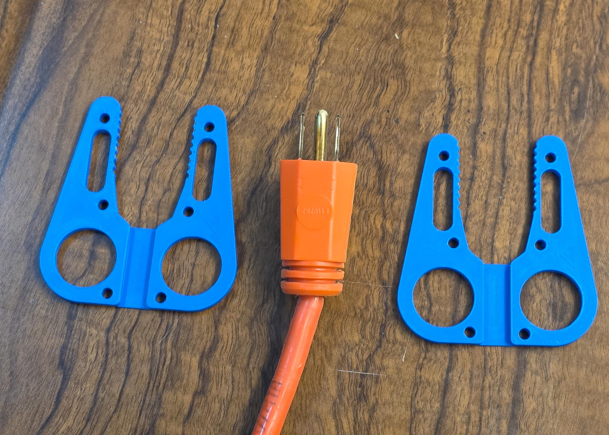
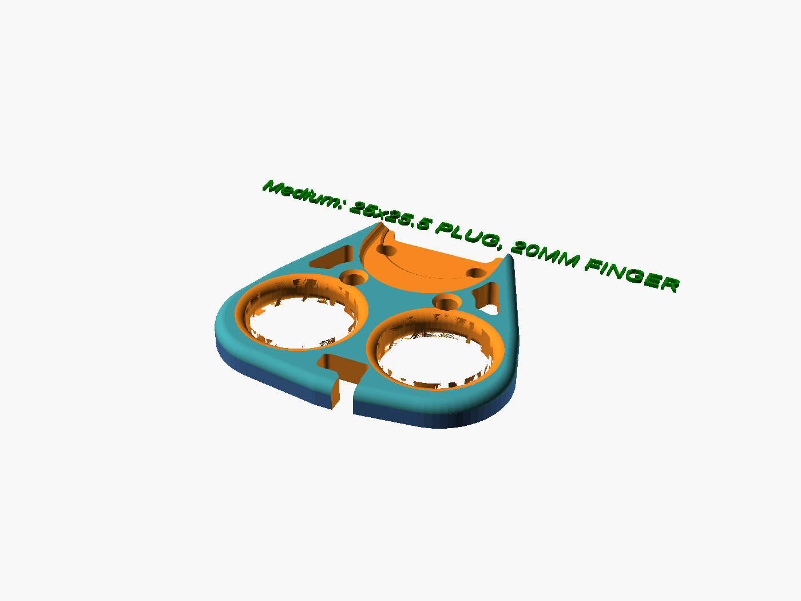

# Quick Start for Beginners — Measure, Type Numbers, Print

You do not need to know anything about 3D modeling or code to make a
Plug Puller that fits **your** outlet plug and **your** hand. The whole
process is:

> **1. Measure** your plug (about 5 minutes) →
> **2. Type** those numbers into a form and pick a size →
> **3. Print** the file it gives you.

The default settings reproduce the **reference Plug Puller** flat tool
(Medium size, zip ties + wing velcro) — if your plug is a typical
two-prong appliance plug, you can even skip the measuring and print the
default. In a hurry? Step 1 has a **plug preset** dropdown that fills in
the numbers for the three most common US plugs — and for a fat
extension-cord plug it switches you to the **heavy-duty clamshell**.

This guide walks you through every click. If a word looks technical,
keep reading — the next sentence tells you exactly what to press.

> **Want to test the fit before printing?** Every quick-select
> combination has a printable **[1:1 outline sheet](print-preview-outlines.md)**
> — cut out the tool's true-size silhouette, hold it against your plug
> on the wall, and try the finger holes on paper first. There is also a
> thin printable **finger-sizing stencil** if you'd rather not cut out
> the template's paper circles.

<!-- TODO(photos): still wanted — OpenSCAD GUI screenshots (per-OS
     installer, the Customizer panel location, the export dialog).
     These need manual capture; model renders and device photos are
     embedded below and the text stands alone without the rest. -->

---

## Step A — Get your measurements ready

Open the **[Measuring Guide](measuring-guide.md)** (it works well on a
phone) and write down your numbers on the worksheet at the bottom of
that guide. Everything is measured in **millimetres (mm)** — use the mm
side of your ruler or caliper.

You will end up with something like this:

| What | Example |
| ---- | ------- |
| Plug length (wall plate to the plug's back face) | 38 mm |
| Plug width near the wall | 34 mm |
| Plug width near the cord | 34 mm |
| Plug thickness near the wall | 16 mm |
| Plug thickness near the cord | 16 mm |
| Cord thickness (thin side) | 5 mm |
| Wall plate style | Rocker / Decora |
| Finger knuckle width (only if measuring your hand) | 22 mm |
| Hand width (only if measuring your hand) | 88 mm |

(Width and thickness are each measured **twice** — once near the wall,
once near the cord — so the tool knows which end of your plug is
fatter. On a straight-sided plug like this example the two stations are
simply the same number.)

## Step B — Install OpenSCAD

> **Don't want to install anything?** The whole flow also runs in your
> web browser (even on a phone) — see the
> **[Web Customizer Guide](web-customizer.md)**, then rejoin this guide
> at Step G to print.

OpenSCAD is the free program that turns your numbers into a printable
file. You only use one panel of it — you never touch code.

1. Go to <https://openscad.org/downloads.html>.
2. Download the **Development Snapshot** for your system (Windows,
   Mac, or Linux) and install it like any other program. This project
   is tested against snapshot `2026.01.03`; any recent snapshot works
   for personal use. (The regular "stable" release also works — renders
   are just slower.)

## Step C — Open the model

1. Download this project: on the GitHub page, click the green **Code**
   button → **Download ZIP**, then unzip it anywhere.
   (Alternative: download just the single file
   `dist/Plug_Puller_SingleFile.scad` — it is the whole model in one
   file.)
2. Double-click **`Plug_Puller.scad`** in the unzipped folder (or open
   it from inside OpenSCAD with `File ▸ Open`).
3. You may see a wall of code in an editor pane. **Ignore it.** You
   will not touch it.

## Step D — Find the Customizer panel

The Customizer is the form where you type your numbers.

- In the menu bar, open **View** and make sure **Hide Customizer** is
  **unchecked**. The Customizer panel appears on the right side.
- On older OpenSCAD builds the same panel lives under
  **Window ▸ Customizer** — tick it there instead.

## Step E — Fill in the steps

The form is organized top-to-bottom in the same order you decide
things:

0. **Step 0 - Tool Style** — leave `tool_style` on **Auto from plug**. It
   builds the flat tool for slim plugs and the **heavy-duty clamshell**
   for fat ones (one serrated plate — print it **twice**, flip one copy
   over, and zip-tie the pair around the plug). Force **Flat tool** or
   **Heavy-duty clamshell** only if you want to override.

   

   
1. **Step 1 - Your Plug** — pick a **plug preset** (or leave it on
   **Measure my plug** and type the numbers from your worksheet). Every
   field's tooltip repeats how to measure it. (These are always active —
   no mode to switch first.)
2. **Step 2 - Size** — keep **Medium** (the reference Plug Puller size), or
   pick **Small** / **Large** for smaller or bigger hands. If you
   measured your hand, pick **Measure my hand** and type the two hand
   numbers just below the dropdown.
3. **Step 3 - Attachment** — how the tool straps to the plug:
   **Zip ties + Velcro** (default), **Zip ties**, **Velcro strap**, or
   **None**. Leave `velcro_style` on **Wing** unless you prefer the old
   rectangular slot.
4. **Step 4 - Cord Hook** — leave `hook_hand` on **Right** (the
   reference device) or pick **Left** to mirror the cord catch.
5. **You're done — no need to scroll further.** Everything below Step 4
   is optional: the **`Advanced -`** sections are power dials (manual
   hole placement, clamshell tuning) and the **`(Custom size only)`**
   sections only take effect if you set Size to `Custom`. Curious? The
   [Power User Guide](power-user-guide.md) explains them all.
6. The 3D preview updates as you type.

> **One advanced slider worth knowing:** if you're building the
> heavy-duty clamshell and want a beefier print, `clam_wall_boost`
> (the first slider in **Advanced - Heavy Duty Clamshell**) thickens
> every wall of the plate at once — set it to 1–2 mm and everything
> else adjusts automatically.

**How to know it worked:** the preview shows a green tag reading
`MEDIUM: …` (or your size) next to the model — that is the model
confirming your numbers were applied:

If you instead see **red text**,
one of your numbers looks wrong (for example, inches instead of
millimetres). The red text names which measurement to re-check — fix it
before printing. The **[Fit Troubleshooting Guide](fit-troubleshooting.md)**
explains every message.

## Step F — Render and export the print file

1. Press **F6** (or `Design ▸ Render`). Wait for the progress bar to
   finish — this takes from a few seconds up to a minute.
2. Then `File ▸ Export ▸ Export as STL…` and save the file.

> **Call-out:** if you export without rendering first, OpenSCAD asks
> you to render — that's normal. Press F6 and try the export again.
> The quick preview (F5) *looks* complete but cannot be exported.

## Step G — Print it

Load the STL into your slicer with these settings (details in the
[README's 3D printing tips](../../README.md#3d-printing-tips)):

- **Orientation:** flat face down on the bed, plug pocket facing up.
  No supports needed.
- **Layer height:** 0.2 mm
- **Walls:** 3–4
- **Infill:** 25–35 %
- **Material:** PETG recommended (PLA works; avoid flexible filament)

## Step H — Try it, and fine-tune if needed

Attach the puller to your plug (zip ties or a Velcro strap through the
holes), hook the cord in the J-slot, put two fingers in the holes, and
pull.

For the heavy-duty clamshell: thread the zip ties through both plates'
slots, sandwich the plug between the serrated arms, and cinch —

If anything is snug, loose, or uncomfortable, open the
**[Fit Troubleshooting Guide](fit-troubleshooting.md)**. Every fix is a
one-number change: it tells you *which measurement* to nudge and *by
how much*, then you repeat steps E–G. Most fits are dialed in within
one reprint.

---

### Something not working?

| Problem | Fix |
| ------- | --- |
| I can't find the Customizer panel | Step D — `View ▸ Hide Customizer` must be unchecked (older builds: `Window ▸ Customizer`) |
| I type numbers but the model doesn't change | Make sure the `size` dropdown (Step 2) is **not** set to `Custom` — measurements are ignored in Custom mode. |
| The hand numbers do nothing | They apply only when Size is **Measure my hand**. The named sizes (Small / Medium / Large) use built-in hand values. |
| Red text appears in the preview | A measurement is implausible or conflicting. The text names it; see the [Fit Troubleshooting Guide](fit-troubleshooting.md). |
| The exported file is tiny / my slicer says it's empty | You exported after F5 (preview) instead of F6 (render). Press F6, wait, then export again. |
| A red text tag printed next to my part | That is the warning tag, printed on purpose so a bad file can't fail silently. Read what it says, fix that measurement, re-export, reprint. |
