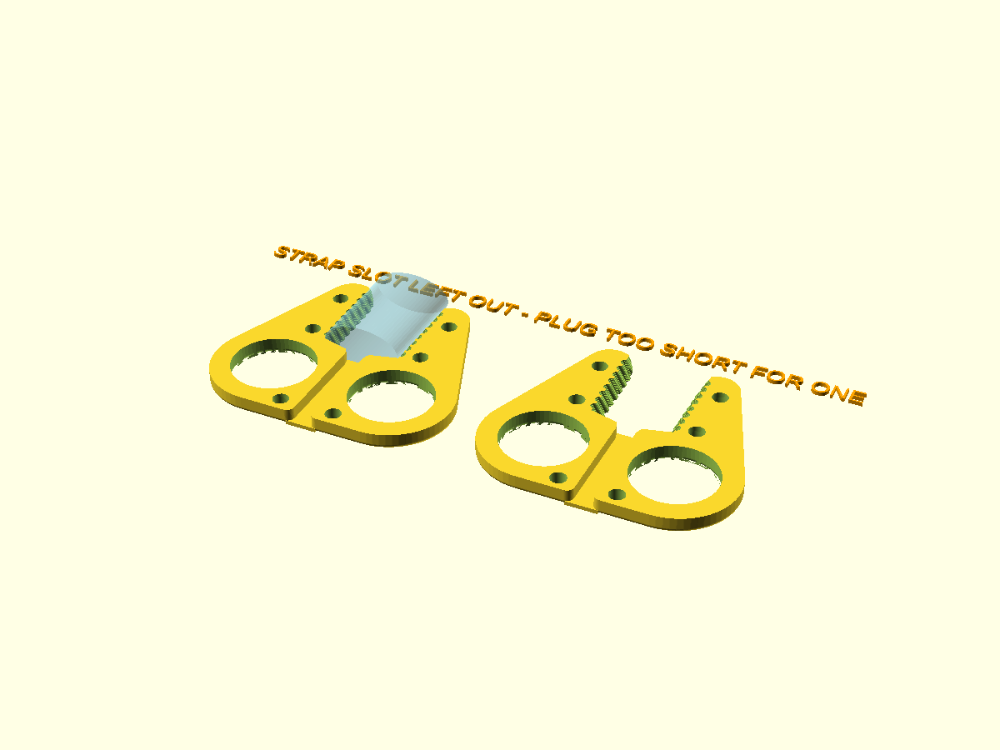
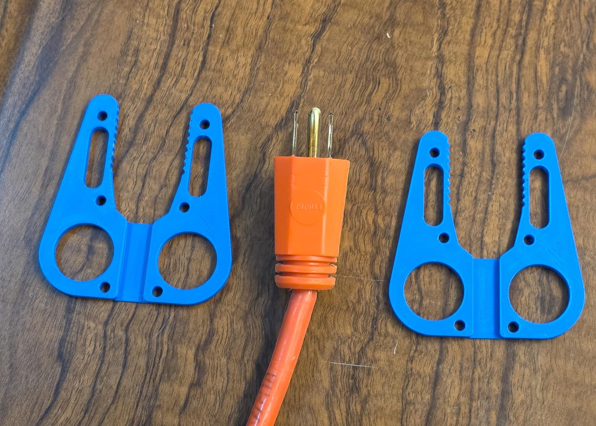
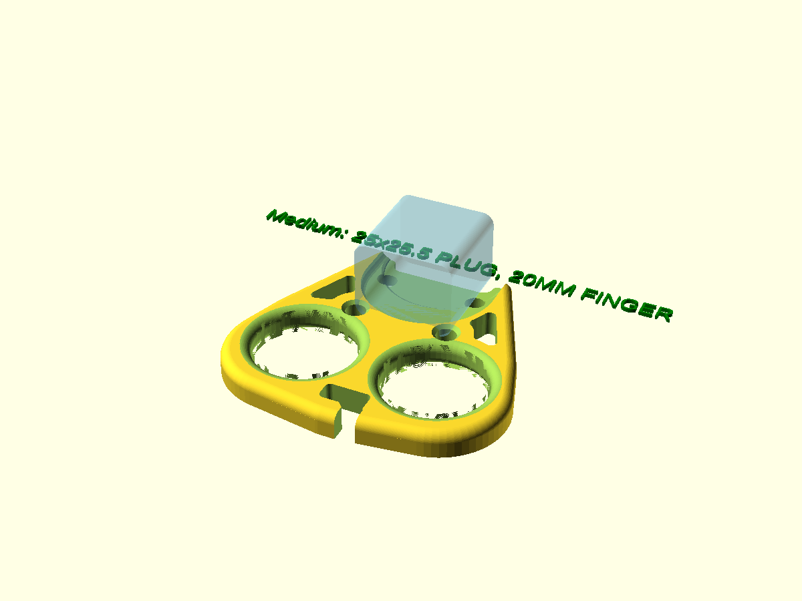
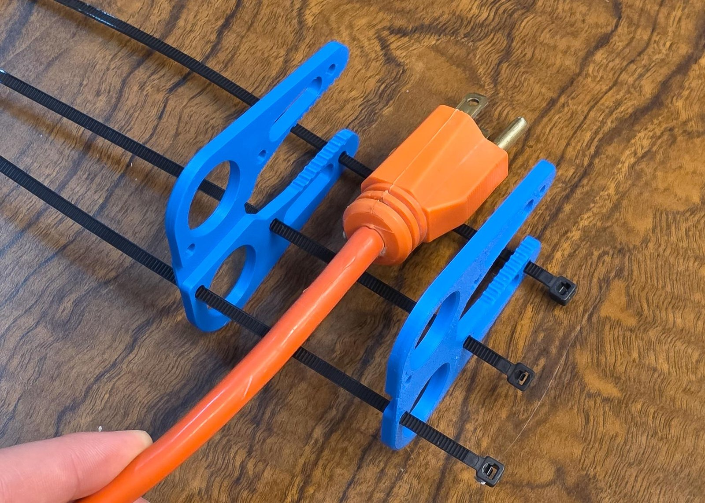
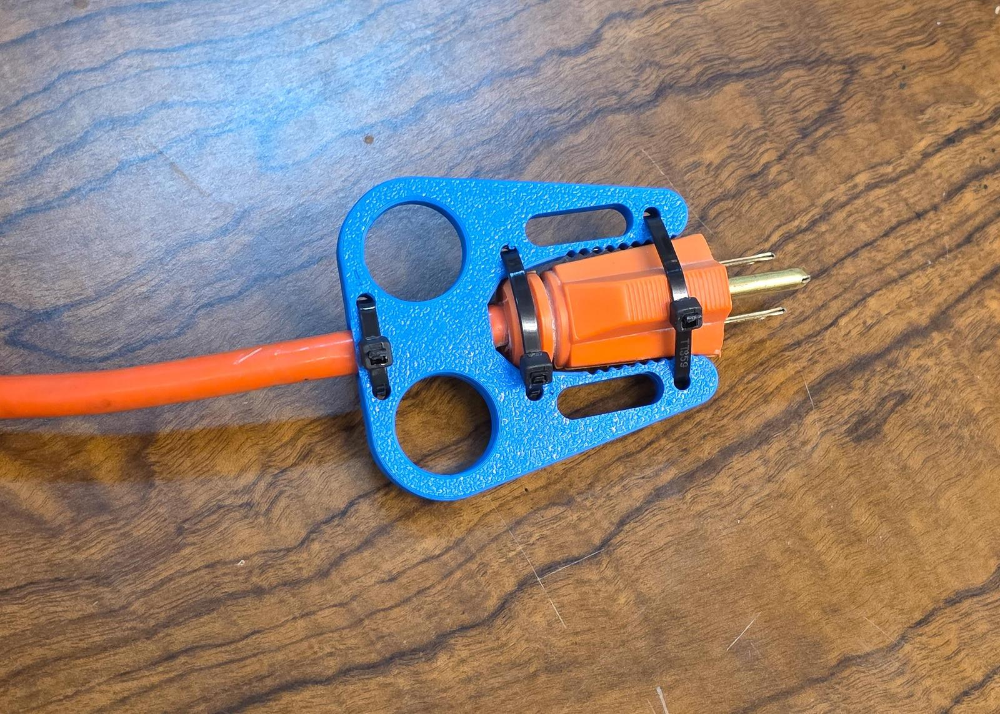

# Quick Start for Beginners — Measure, Type Numbers, Print

You do not need to know anything about 3D modeling or code to make a
Plug Puller that fits **your** outlet plug and **your** hand. The whole
process is:

> **1. Measure** your plug (about 5 minutes) →
> **2. Type** those numbers into a form and pick a size →
> **3. Print** the file it gives you.

The Plug Puller comes as two tools, each in its own file: the
**one-sided puller** for lamp plugs, standard 3-prong plugs and other
plugs thinner than 24 mm, and the **two-sided puller** — two plates
that zip-tie around the plug — for thick round extension-cord plugs,
USB-C tips and charger plugs. The one-sided file's default settings
reproduce the **reference Plug Puller** (Medium size, zip ties + wing
velcro) — if your plug is a typical two-prong appliance plug, you can
even skip the measuring and print the default. In a hurry? Step 1 has
a **plug preset** dropdown that fills in the numbers for common US
plugs.

This guide walks you through every click. If a word looks technical,
keep reading — the next sentence tells you exactly what to press.

> **Prefer the short version?** The **[Starter Guide](starter-guide.md)**
> is the whole path on one page — match your plug against the printed
> measuring stencil (or measure it), fill in the steps, print. It also
> ships as a printable PDF with a built-in 1:1 paper stencil sheet.

> **Want to test the fit before printing?** Every quick-select
> combination has a printable **[1:1 outline sheet](print-preview-outlines.md)**
> — cut out the tool's true-size silhouette, hold it against your plug
> on the wall, and try the finger holes on paper first. There is also a
> thin printable **measuring stencil** (plug silhouettes, mm ruler,
> cord gauge, finger holes) if you'd rather not cut out the template's
> paper circles — see the [Starter Guide](starter-guide.md).

<!-- TODO(photos): still wanted — OpenSCAD GUI screenshots (per-OS
     installer, the Customizer panel location, the export dialog).
     These need manual capture; model renders and device photos are
     embedded below and the text stands alone without the rest. -->

---

## Step A — Get your measurements ready

Open the **[Measuring Guide](measuring-guide.md)** (it works well on a
phone) and write down your numbers on the worksheet at the bottom of
that guide. Everything is measured in **millimeters (mm)** — use the mm
side of your ruler or caliper.

You will end up with something like this:

| What | Example |
| ---- | ------- |
| Plug length (wall plate to the plug's back face) | 38 mm |
| Plug width at the prong end | 34 mm |
| Plug width at the cord end | 34 mm |
| Plug thickness at the prong end | 16 mm |
| Plug thickness at the cord end | 16 mm |
| Cord thickness (thin side) | 5 mm |
| Wall plate style | Rocker / Decora |
| Finger knuckle width (only if measuring your hand) | 22 mm |
| Hand width (only if measuring your hand) | 88 mm |

(Width and thickness are each measured **twice** — once at the prong
end, once at the cord end — so the tool knows which end of your plug is
fatter. On a straight-sided plug like this example the two ends are
simply the same number. The two-sided puller needs only the length, the
two widths — the size its plates close across — and the cord.)

## Step B — Install OpenSCAD

> **Don't want to install anything?** The whole flow also runs in your
> web browser (even on a phone) — see the
> **[Web Customizer Guide](web-customizer.md)**, then rejoin this guide
> at Step G to print.

OpenSCAD is the free program that turns your numbers into a printable
file. You only use one panel of it — you never touch code.

1. Go to <https://openscad.org/downloads.html>.
2. Download the **Development Snapshot** for your system (Windows,
   Mac, or Linux) and install it like any other program. This project
   is tested against snapshot `2026.01.03`; any recent snapshot works
   for personal use. (The regular "stable" release also works — renders
   are just slower.)

## Step C — Open the model

1. Download this project: on the GitHub page, click the green **Code**
   button → **Download ZIP**, then unzip it anywhere.
   (Alternative: download just the single file of your tool,
   `dist/Plug_Puller_SingleFile.scad` or
   `dist/Plug_Puller_Two_Sided_SingleFile.scad` — each is a whole tool
   in one file.)
2. Open your tool's file from the unzipped folder (double-click it, or
   open it from inside OpenSCAD with `File ▸ Open`):
   **`src/Plug_Puller_Parametric.scad`** for the one-sided puller, or
   **`src/Plug_Puller_Two_Sided.scad`** for the two-sided puller. Not
   sure? Start with the one-sided puller: if your plug is 24 mm thick
   or more, it shows a red tag that sends you to the two-sided file.
3. You may see a wall of code in an editor pane. **Ignore it.** You
   will not touch it.

## Step D — Find the Customizer panel

The Customizer is the form where you type your numbers.

- In the menu bar, open **View** and make sure **Hide Customizer** is
  **unchecked**. The Customizer panel appears on the right side.
- On older OpenSCAD builds the same panel lives under
  **Window ▸ Customizer** — tick it there instead.

## Step E — Fill in the steps

The form is organized top-to-bottom in the same order you decide
things.

### One-sided puller

1. **Step 1 - Your Plug** — pick a **plug preset** (or leave it on
   **Measure my plug** and type the numbers from your worksheet). Every
   field's tooltip repeats how to measure it. (These are always active —
   no mode to switch first.)
2. **Step 2 - Size** — keep **Medium** (the reference Plug Puller size), or
   pick **Small** / **Large** for smaller or bigger hands. If you
   measured your hand, pick **Measure my hand** and type the two hand
   numbers just below the dropdown.
3. **Step 3 - Attachment** — how the tool attaches to the plug (its
   zip-tie hole grid and velcro wing slots): **Zip ties + Velcro**
   (default), **Zip ties**, **Velcro strap**, or **None**. Leave
   `velcro_style` on **Wing** unless you prefer the old rectangular
   slot.
4. **Step 4 - Cord Hook** — leave `hook_hand` on **Right** (the
   reference device) or pick **Left** to mirror the cord catch.
5. **You're done — no need to scroll further.** Everything below Step 4
   is optional: the **`Advanced -`** sections are power dials (manual
   hole placement) and the **`(Custom size only)`** sections only take
   effect if you set Size to `Custom`. Curious? The
   [Power User Guide](power-user-guide.md) explains them all.
6. The 3D preview updates as you type, with a see-through plug built
   from your numbers sitting in the pocket.

### Two-sided puller

1. **Step 1 - Your Plug** — pick **Heavy-duty extension cord - NEMA 5-15**,
   or leave **Measure my plug** and type four numbers: the plug length,
   its width at the prong end and at the cord end (the size the two
   plates close across), and the cord. Then set **plug_sides**:
   **Rounded sides** for a round plug, a USB-C or charger tip (the
   plates get a sloped cradle that centers the plug), or **Flat sides**
   for a boxy plug (the teeth bite along the whole side).
2. **Step 2 - Size** — keep **Medium**, or pick **Small** / **Large**.
   **Measure my hand** asks only for your finger width.
3. **Step 3 - Attachment** — **Zip ties + Velcro strap** (default) or
   **Zip ties**. The zip ties are what hold the two plates together.
4. **Step 4 - Print Layout** — keep **Both plates**: the file holds the
   whole tool, two identical plates side by side. Print both plates,
   flip one over, zip-tie the pair face to face around the plug.
5. **You're done.** The **`Advanced - Two-Sided Puller`** section below
   holds the plate dials; the [Power User Guide](power-user-guide.md)
   explains them.

   

   

> **One advanced slider worth knowing:** if you're building the
> two-sided puller and want a beefier print, `plate_wall_boost`
> (the first slider in **Advanced - Two-Sided Puller**) thickens
> every wall of the plate at once — set it to 1–2 mm and everything
> else adjusts automatically.

**How to know it worked:** in the one-sided file the preview shows a
green tag reading `Medium: …` (or your size) next to the model — that
is the model confirming your numbers were applied. In the two-sided
file, look at the see-through plug on the left plate: it is the plug
your numbers describe.

If you instead see **red text**,
one of your numbers looks wrong (for example, inches instead of
millimeters). The red text names which measurement to re-check — fix it
before printing. The **[Fit Troubleshooting Guide](fit-troubleshooting.md)**
explains every message.

## Step F — Render and export the print file

1. Press **F6** (or `Design ▸ Render`). Wait for the progress bar to
   finish — this takes from a few seconds up to a minute.
2. Then `File ▸ Export ▸ Export as STL…` and save the file.

> **Call-out:** if you export without rendering first, OpenSCAD asks
> you to render — that's normal. Press F6 and try the export again.
> The quick preview (F5) *looks* complete but cannot be exported.

## Step G — Print it

Load the STL into your slicer with these settings (details in the
[README's 3D printing tips](../../README.md#3d-printing-tips)):

- **Orientation:** flat face down on the bed, plug pocket facing up.
  No supports needed. The two-sided puller's plates print flat, just
  as the file lays them out.
- **Layer height:** 0.2 mm
- **Walls:** 3–4
- **Infill:** 25–35 %
- **Material:** PETG recommended (PLA works; avoid flexible filament)

## Step H — Try it, and fine-tune if needed

Attach the puller to your plug (zip ties or a Velcro strap through the
holes), hook the cord in the J-slot, put two fingers in the holes, and
pull.

For the two-sided puller: flip one plate over, thread the zip ties
through both plates' zip-tie holes, sandwich the plug between the
serrated arms, and cinch —

If anything is snug, loose, or uncomfortable, open the
**[Fit Troubleshooting Guide](fit-troubleshooting.md)**. Every fix is a
one-number change: it tells you *which measurement* to nudge and *by
how much*, then you repeat steps E–G. Most fits are dialed in within
one reprint.

---

### Something not working?

| Problem | Fix |
| ------- | --- |
| I can't find the Customizer panel | Step D — `View ▸ Hide Customizer` must be unchecked (older builds: `Window ▸ Customizer`) |
| I type numbers but the model doesn't change | Make sure the `size` dropdown (Step 2) is **not** set to `Custom` — measurements are ignored in Custom mode. |
| The hand numbers do nothing | They apply only when Size is **Measure my hand**. The named sizes (Small / Medium / Large) use built-in hand values. |
| Red text appears in the preview | A measurement is implausible or conflicting. The text names it; see the [Fit Troubleshooting Guide](fit-troubleshooting.md). |
| The red text says `PLUG THICKER THAN 24MM - USE THE TWO-SIDED PULLER FILE` | Your plug is too thick for the one-sided puller. Open `src/Plug_Puller_Two_Sided.scad` and fill in its Step 1. |
| The exported file is tiny / my slicer says it's empty | You exported after F5 (preview) instead of F6 (render). Press F6, wait, then export again. |
| A red text tag printed next to my part | That is the warning tag, printed on purpose so a bad file cannot fail silently. Read it, fix that measurement, re-export, reprint. |
