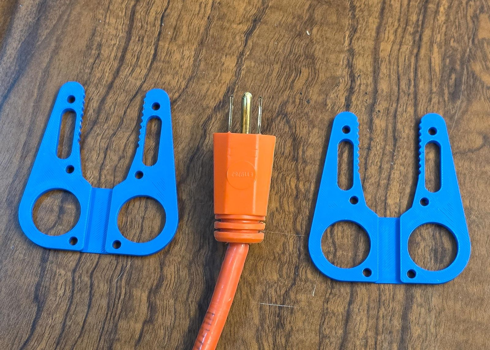
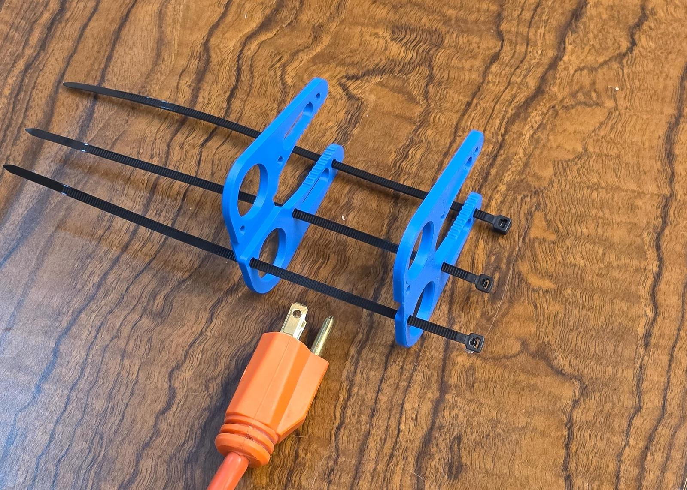
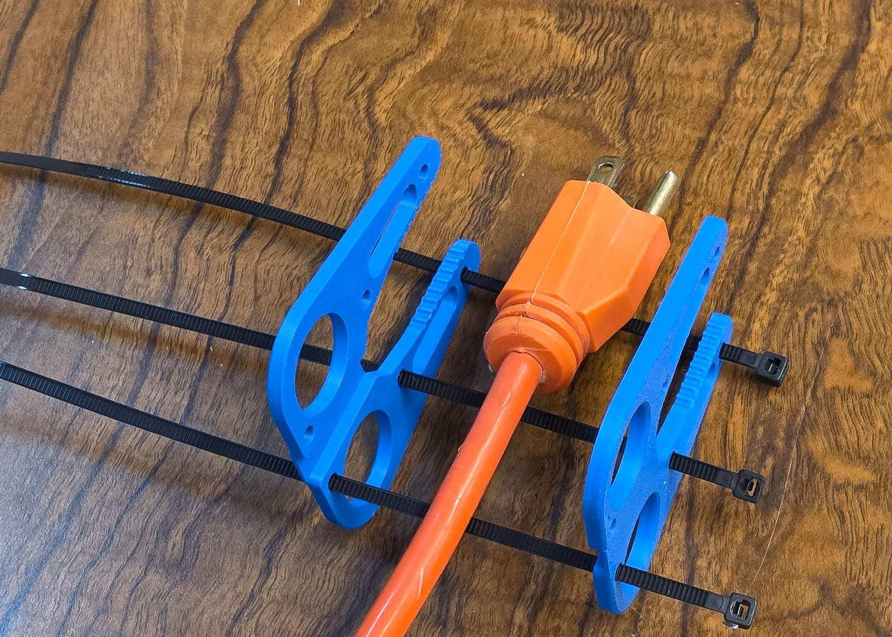
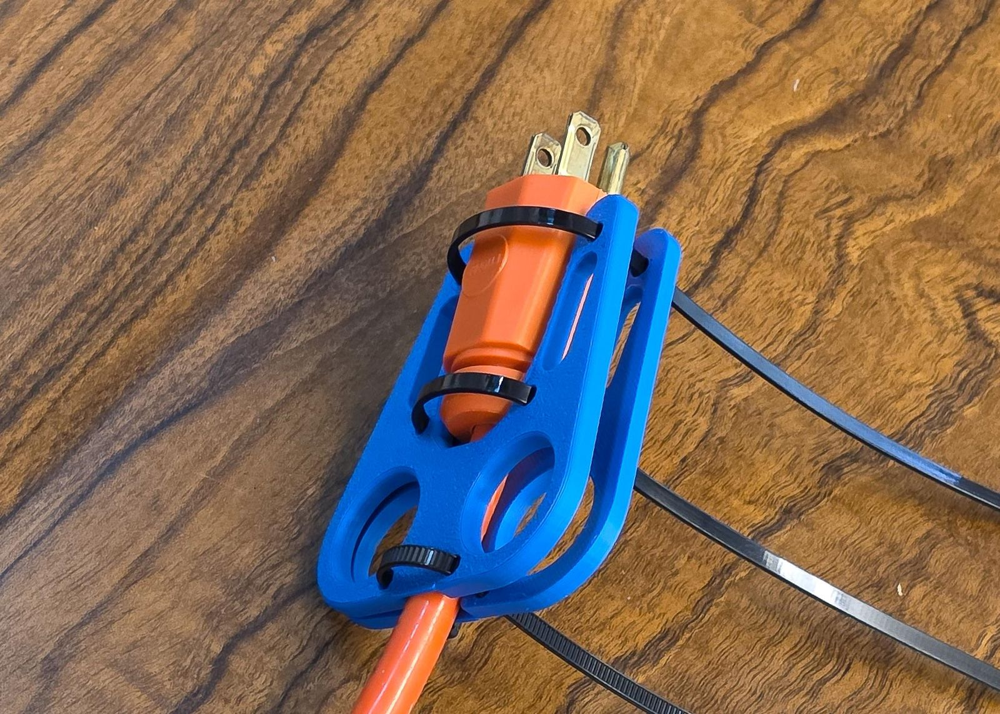
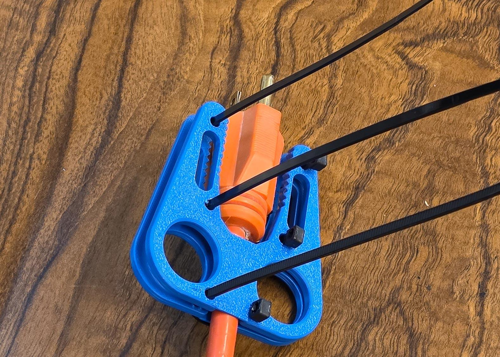
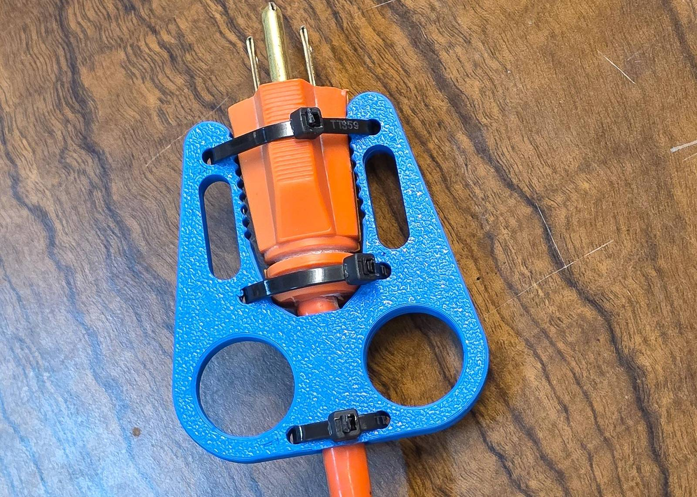
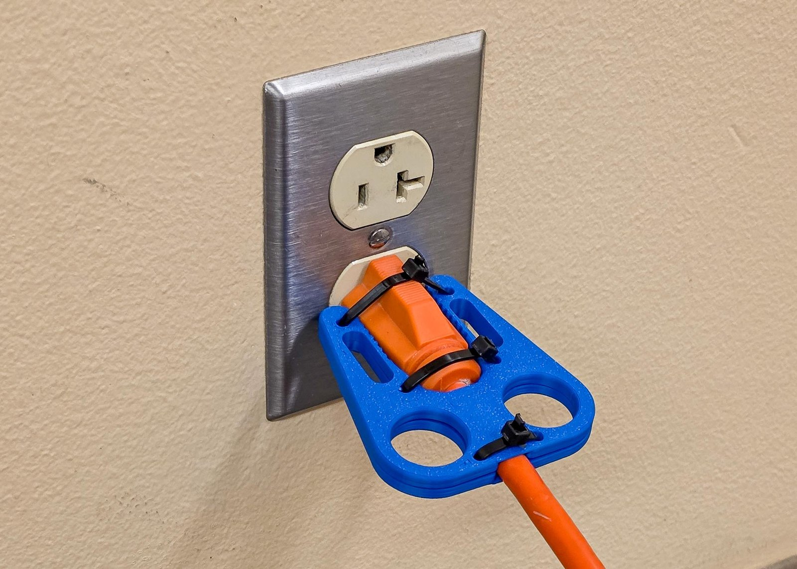
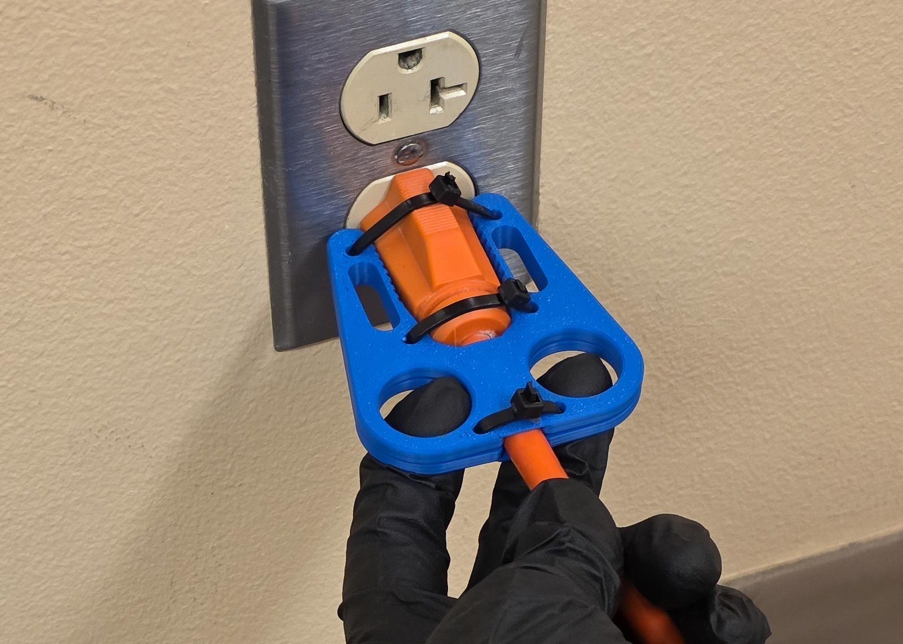

# Full guide, two-sided puller

Everything about the two-sided puller: getting the file, measuring, every dial with a picture, printing, assembly, use and care, what to do when a print does not fit, every warning, and how the advanced dials work.

Model version 0.13.0. [The printable full guide](../../Plug_Puller_Two_Sided_Full_Guide.pdf) has the same text, with the measuring form and the paper stencil sheets at true size as its last pages. The other document for this tool is [the quick start](quick-start.md). Each dial is headed by its plain name, with the name the Customizer shows on the line under it.

## Which tool this is

This guide is for the two-sided puller, src/Plug_Puller_Two_Sided.scad: two serrated plates that zip-tie around the plug and close across it, for a plug 24 mm thick or more and for a plug held from both sides, a USB-C tip or a round extension-cord plug. A thinner wall plug is the one-sided puller's job, and that tool has its own guide.

The Customizer's four steps are your plug, your size, the attachment and the print layout. This full guide covers getting the file, measuring your plug and your hand or matching a card, every dial with a picture, printing, assembly, use and care, what to do when a print does not fit, every warning, and how the advanced dials work.

If red text appears beside the part in the preview, read it: it names the measurement to fix, and the part will not fit until it is gone.

In every picture: black = the tool; teal = your plug; red dashed = the edges this dial moved; the numbers match the key beside the picture.


Five stages of the two-sided puller, left to right, the top row first, the plug end at the top; red dashes mark the edges each step moved. 1, the defaults: the tool as the file opens, with a 20 mm wide plug in teal. 2, Step 1 - Your Plug: plug length 23 mm, plug width at the prong end 13 mm, plug width at the cord end 13 mm, cord thickness 7 mm, plug sides Rounded sides; red on the arms, the finger lobes and the zip stations. 3, Step 2 - Size: hand size Large; red on the arms, the finger lobes and the zip stations. 4, Step 3 - Attachment: attachment Zip ties; no strap slot on a plug this short, so nothing moved. 5, Step 4 - Print Layout: both plates side by side in one file, what you print; nothing marked.

- Step 1: type your plug's numbers and pick Rounded sides or Flat sides
- Step 2: pick your hand size
- Step 3: pick how it attaches; a plug this short gets no strap slot
- Step 4: both plates in one file

## Get the file

The two-sided puller is the file `src/Plug_Puller_Two_Sided.scad`. There are two ways to open it and fill in its form: in your web browser with nothing to install, or in the free OpenSCAD program on your computer. Both show the same form, called the Customizer.

### In your browser

The OpenSCAD Playground runs the whole Customizer in your browser, on a laptop or a phone. Nothing is uploaded: your numbers stay on your device.

1. Open [the two-sided puller in the OpenSCAD Playground](https://ochafik.com/openscad2/#url=https://raw.githubusercontent.com/BrennenJohnston/openscad-plug-puller/main/dist/Plug_Puller_Two_Sided_SingleFile.scad). The first visit downloads the OpenSCAD engine (10 to 20 MB), then the model. You will see code on the left (ignore it) and a preview on the right.
2. Open the **Customize** panel: on a wide screen it is a panel or a tab beside the editor, on a phone a tab at the bottom.

If the link does not load the model, download the whole tool as one file, [`dist/Plug_Puller_Two_Sided_SingleFile.scad`](../../../dist/Plug_Puller_Two_Sided_SingleFile.scad), and drag it into <https://ochafik.com/openscad2/>.

### On your computer

OpenSCAD is the free program that turns your numbers into a printable file. You use one panel of it and never touch the code.

1. Download OpenSCAD from <https://openscad.org/downloads.html>: the **Development Snapshot** for your system. This project is tested with the snapshot of 2026-01-03; any recent snapshot works. The regular release works too, only slower.
2. Get the project: on its GitHub page press the green **Code** button, then **Download ZIP**, and unzip it anywhere. Or download only [`dist/Plug_Puller_Two_Sided_SingleFile.scad`](../../../dist/Plug_Puller_Two_Sided_SingleFile.scad), the whole tool in one file.
3. Open `src/Plug_Puller_Two_Sided.scad` (or the single file) in OpenSCAD: double-click it, or use **File ▸ Open**. A wall of code appears in an editor pane. Ignore it; you will not touch it.
4. Show the Customizer, the form you type into: in the **View** menu, make sure **Hide Customizer** is unchecked. In older versions it is **Window ▸ Customizer**.

The form's sections read top to bottom in the order you decide things: **Step 1 - Your Plug**, **Step 2 - Size**, **Step 3 - Attachment**, then **{step4}**. Everything below Step 4 is optional.

### Working in the browser

The Playground and the desktop program show the same form. Three differences:

- The Playground's preview does not draw the see-through plug; the desktop program does. Both show the red text of a warning.
- Rendering in the browser is slower: half a minute to a few minutes on a laptop, several minutes on a phone. Keep the tab in front while it works.
- On a phone the screen is tight: use the tabs to switch between the editor, the form and the preview. You never need the editor tab. If the tab crashes during a render, close other tabs and try again, or set the `quality` dial (in **Advanced - Render Quality**) to 32 while you test, and back to 64 before the final export.

You can measure, type and render on a phone, then send the downloaded file to whoever runs the printer.

| Problem | What to do |
| ------- | ---------- |
| The link opens the Playground but the model is not there | Download the single file and drag it into the page, as described under Get the file. |
| "Failed to fetch", or a blank editor | The download from GitHub was blocked: offline, a firewall, or GitHub is down. Use the single file. |
| The form is empty | Wait for the first render to finish; the form is built after the model loads. |
| The Render button seems stuck | Browser renders are slow; give it a few minutes. If it never finishes, set `quality` to 32 and try again. |
| The downloaded file is tiny or empty | Render first, then export. |

## Measure your plug and your hand

Everything here is in mm: a US plug is about 25 mm wide, so a 1 on your paper means you measured in inches. You need a caliper or a ruler with mm marks, the plug in its outlet, and your own hand only if you pick Measure my hand. Print the measuring form at 100 % and fill it in as you go: the sections below are the form's rows, in the same order, and the card names (R1, C1, F1 / F2) are the cards of the printed measuring stencil, described under Match a card instead of measuring.

The two-sided puller's widths are the size the two plates close across, so measure across the plug the way the plates will grip it. The thickness pair, the wall plate style and the hand width belong to the one-sided puller only.

### Plug length

Customizer name: `measure_plug_length`. Row 2 of the measuring form.

With the plug in the outlet, ruler from the wall plate face to the plug's back face. On a laptop or charger plug, measure from the device's edge.

Typical: 20 to 50 mm. Example: 23 mm.

With the stencil: card R1.

### Plug width at the prong end

Customizer name: `measure_plug_width_prong_end`. Row 3 of the measuring form.

Caliper across the plug body just behind the prongs, the size the two plates close across. On a USB-C or charger tip, just behind the metal tip; on a round plug it is the diameter.

Typical: 12 to 40 mm. Example: 13 mm.

With the stencil: card R1.

### Plug width at the cord end

Customizer name: `measure_plug_width_cord_end`. Row 4 of the measuring form.

The same direction across the plates, measured where the cord leaves the plug body. Skip the soft rubber strain relief.

Typical: 12 to 40 mm. Example: 13 mm.

With the stencil: card R1.

### Cord thickness

Customizer name: `measure_cord_thickness`. Row 5 of the measuring form.

Caliper across the cord just behind the plug, on its thin side: flat cord the narrow way, round cord the diameter. With the stencil, the smallest C1 slot that slips over the cord is this number.

Typical: 3 to 9 mm. Example: 7 mm.

With the stencil: card C1.

### Plug sides

Customizer name: `plug_sides`. Row 6 of the measuring form.

Look at the plug body where the plates will grip it. Rounded sides for a round cord plug, a USB-C or charger tip; Flat sides for a boxy plug.

The choices: Rounded sides, Flat sides.

### Finger width

Customizer name: `measure_finger_width`. Row 9 of the measuring form.

Caliper across the widest knuckle of your middle finger, the finger that goes into the pull hole. With the stencil, find the smallest F1 or F2 hole your finger passes through comfortably and subtract 5 from its number.

Typical: 16 to 24 mm. Example: 22 mm.

With the stencil: card F1 / F2.

No caliper? Take a ring that fits that finger snugly, measure the ring's inner diameter in mm and add 1.5 mm.

### Strap width

Customizer name: `strap_width`. Row 11 of the measuring form.

Read the width on the strap's packaging. ONE-WRAP comes in 10, 13, 16, 20 and 25 mm.

Typical: 10 to 25 mm. Example: 15 mm.

Sanity check: each plug width is a two-digit number, roughly 12 to 45, and the prong-end width is usually the bigger one; the finger width is roughly 14 to 32. A number like 1.3 is inches: measure again with the mm side.

When you measure for someone else, a relative or a client, measure their hand for the finger and hand rows and their outlet and plug for the plug rows. Doubtful between two values? Round up: a slightly roomy fit works, a tight one does not.

### Match a card instead of measuring

The measuring stencil is a set of thin printed cards. Each has a two-letter name raised on its face, so you can find it by touch. Hold your plug in the plug cards: if it fills one card's openings, snug with no big gaps, that card names the preset to pick in Step 1, and you type no numbers at all.

| Card | What it is | What it answers |
| ---- | ---------- | --------------- |
| P1 | The flat 2-prong lamp plug (NEMA 1-15) | the preset `Flat 2-prong lamp plug - NEMA 1-15` |
| P2 | The standard 3-prong plug (NEMA 5-15) | the preset `Standard 3-prong plug - NEMA 5-15` |
| P3 | The heavy-duty extension cord plug (NEMA 5-15) | the two-sided puller's preset `Heavy-duty extension cord - NEMA 5-15` |
| P4 | The wide 2-prong appliance plug (NEMA 1-15) | the one-sided puller's preset `Wide 2-prong appliance plug - NEMA 1-15` |
| R1 | A ruler: raised mm ticks, numbers every 10 mm, and a notch every 10 mm you can count by touch | the plug's length, widths and thicknesses |
| C1 | A cord gauge: open slots 3 to 9 mm wide along one edge, slid onto the cord from the side | the cord thickness: the smallest slot that slips over the cord |
| F1, F2 | Finger holes 15 to 25 mm across (F1) and 26 to 32 mm (F2) | your finger width: the smallest hole your middle finger passes through comfortably, minus 5 |

Each P card has three openings: W for the plug's width, T for its thickness, and an open slot that slides onto the cord. If no card fits, your plug is between presets: measure it instead. The measured tool fits better than any preset.

**Printing the cards.** Print [`stl/Measuring-Stencil/Visual/Measuring-Stencil_Visual_All-Cards.stl`](../../../stl/Measuring-Stencil/Visual/Measuring-Stencil_Visual_All-Cards.stl): 1.2 mm thick cards, no supports, any rigid filament. Or print one card at a time from [`stl/Measuring-Stencil/`](../../../stl/Measuring-Stencil). The cards pack onto sheets for a 200 by 200 mm bed. For a smaller bed, open [`Measuring_Stencil.scad`](../../../Measuring_Stencil.scad) in OpenSCAD, set `bed_width` and `bed_depth` to your bed, and export `part_index` 1, then 2, and so on, one sheet at a time. `part_index` 0 previews every sheet at once; do not print that one.

**The tactile version** ([`stl/Measuring-Stencil/Tactile/`](../../../stl/Measuring-Stencil/Tactile), or `label_mode` set to Tactile in the file) prints every label as a raised character at ADA size and adds a Grade 2 braille title flap to every card. The flap prints leaning back, held by thin fins. Snap the fins off, then fold the flap away from the card until it lies flat, so the braille lands face up beyond the card's edge. Fold once, gently; a PETG or PP hinge folds more reliably than PLA.

**No 3D printer yet?** The last pages of the printed quick start are paper versions of the cards at true size: the plug outlines, a 100 mm ruler and the finger circles. Print them at 100 % (actual size, never fit to page) and check the 50 by 50 mm square with a ruler before you trust them. On their own they are [`stencil-sheet.svg`](../stencil-sheet.svg) and [`stencil-sheet-2.svg`](../stencil-sheet-2.svg).

### Try it on paper first

Every preset at every size has a printable sheet with one plate's exact outline at true size, its dimensions in mm, a 50 by 50 mm square to check the print scale, and the Customizer settings that make it. Print one at 100 % (actual size, never fit to page) and measure the square with a ruler: it must be exactly 50 by 50 mm, or the print was scaled. Cut out the outline along the solid line and poke through the two finger circles. Hold it against your plug: the plug body sits between the two serrated edges with the cord in the channel at the bottom, and the real tool is two of these plates. Try the finger holes; if they feel wrong, try the next size's sheet.

| Plug preset | Small | Medium | Large |
| ----------- | ----- | ------ | ----- |
| Heavy-duty extension cord (NEMA 5-15) | [sheet](../outline-sheets/outline_two-sided-plate_small.svg) | [sheet](../outline-sheets/outline_two-sided-plate_medium.svg) | [sheet](../outline-sheets/outline_two-sided-plate_large.svg) |
| USB-C laptop tip | [sheet](../outline-sheets/outline_two-sided-plate_usb-c-laptop-tip_small.svg) | [sheet](../outline-sheets/outline_two-sided-plate_usb-c-laptop-tip_medium.svg) | [sheet](../outline-sheets/outline_two-sided-plate_usb-c-laptop-tip_large.svg) |
| Flat 2-prong lamp plug (NEMA 1-15) | [sheet](../outline-sheets/outline_two-sided-plate_flat-2-prong_small.svg) | [sheet](../outline-sheets/outline_two-sided-plate_flat-2-prong_medium.svg) | [sheet](../outline-sheets/outline_two-sided-plate_flat-2-prong_large.svg) |
| Standard 3-prong plug (NEMA 5-15) | [sheet](../outline-sheets/outline_two-sided-plate_standard-3-prong_small.svg) | [sheet](../outline-sheets/outline_two-sided-plate_standard-3-prong_medium.svg) | [sheet](../outline-sheets/outline_two-sided-plate_standard-3-prong_large.svg) |

Every sheet, for both tools, is also in one printable PDF with an index: [`docs/Plug_Puller_Outline_Sheets.pdf`](../../Plug_Puller_Outline_Sheets.pdf). The sheets cover the presets only; a plug or a hand between sizes is better served by measuring.

### The measuring form

The form is the sheet [measuring-form.svg](measuring-form.svg); the paper stencil sheets are [stencil-sheet.svg](../stencil-sheet.svg). Print the form at 100 % (actual size, never fit to page) and check its 50 mm bar with a ruler before you trust it. Fill in the blanks top to bottom as you measure, then type the numbers into the Customizer in the same order.

| # | Customizer name | What you measure | Default | Yours |
|---|---|---|---|---|
| 1 | `plug_preset` | Plug preset: pick one | Measure my plug | ________ |
| 2 | `measure_plug_length` | With the plug in the outlet, ruler from the wall plate face to the plug's back face. | 25.5 mm | ________ |
| 3 | `measure_plug_width_prong_end` | Caliper across the plug body just behind the prongs, the size the two plates close across. | 20 mm | ________ |
| 4 | `measure_plug_width_cord_end` | The same direction across the plates, measured where the cord leaves the plug body. | 20 mm | ________ |
| 5 | `measure_cord_thickness` | Caliper across the cord just behind the plug, on its thin side: flat cord the narrow way, round cord the diameter. | 4 mm | ________ |
| 6 | `plug_sides` | Look at the plug body where the plates will grip it. | Rounded sides | ________ |
| 7 | `show_plug_preview` | Show the see-through plug: leave on | on | ________ |
| 8 | `size` | Hand size: pick one | Medium | ________ |
| 9 | `measure_finger_width` | Caliper across the widest knuckle of your middle finger, the finger that goes into the pull hole. | 20 mm | ________ |
| 10 | `attachment` | Attachment: pick one | Zip ties + Velcro strap | ________ |
| 11 | `strap_width` | Read the width on the strap's packaging. | 15 mm | ________ |
| 12 | `print_layout` | Print layout: pick one | Both plates | ________ |

**What the sheet shows.** The left column is the numbered list above, one row per dial in the Customizer's Step order, each with the dial's name, its plain title and either a blank after the default or a tick box per choice with the default marked. The right half is a schematic plug in teal drawn from the two-sided puller's defaults at 1.5 to 1, a top view with the prong end at the left against a wall plate line, the cord's end as a small circle, a bar of four knuckles at 1:1 and a strap bar at 1:1. A straight black arrow runs from each measured row's blank to a red dimension line on the schematic, the row's number in a red circle at the line:

- Arrow 2 points to the plug's length on the top view, from the wall plate to the plug's back end.
- Arrow 3 points to the plug's width at the prong end, the left edge of the top view.
- Arrow 4 points to the plug's width at the cord end, the right edge of the top view where the cord leaves.
- Arrow 5 points to the cord's thickness on the small circle, the cord seen end on.
- Arrow 9 points to one knuckle of the knuckle bar, drawn 20 mm wide at 1:1.
- Arrow 11 points to the strap bar's width, a 40 by 15 mm bar at 1:1.

- Row 1, plug preset: 5 boxes, Measure my plug marked as the default; the choices are Measure my plug, Heavy-duty extension cord - NEMA 5-15, USB-C laptop tip, Flat 2-prong lamp plug - NEMA 1-15, Standard 3-prong plug - NEMA 5-15.
- Row 6, plug sides: 2 boxes, Rounded sides marked as the default; the choices are Rounded sides, Flat sides.
- Row 7, show the see-through plug: one box marked, leave on.
- Row 8, hand size: 4 boxes, Medium marked as the default; the choices are Small, Medium, Large, Measure my hand.
- Row 10, attachment: 2 boxes, Zip ties + Velcro strap marked as the default; the choices are Zip ties + Velcro strap, Zip ties.
- Row 12, print layout: 2 boxes, Both plates marked as the default; the choices are Both plates, One plate.

Type them into the Customizer in this order.

## Step 1 - Your Plug

Pick a plug preset, or leave it on Measure my plug and type your plug's numbers; then pick Rounded sides or Flat sides.

### Plug preset

Customizer name: `plug_preset`

Fills in the plug's length, both widths and the cord from the measured heavy-duty cord plug, so the arms, the grip gap, the cord channel and the plate length all take that plug's shape at once.


Two top views of one plate of the two-sided puller, before left and after right, the plug end at the top. Left: the defaults, a 20 mm wide plug in teal. Right: plug preset set to Heavy-duty extension cord - NEMA 5-15. Marked in red: 1, the finger lobes, the arms and the plate edge. 2, the finger lobes: the two rounded lobes in the lower half. 3, the zip stations: the three small holes along each arm.

- Default: Measure my plug
- Choices: Measure my plug, Heavy-duty extension cord - NEMA 5-15, USB-C laptop tip, Flat 2-prong lamp plug - NEMA 1-15, Standard 3-prong plug - NEMA 5-15
- Moves: arms, finger lobes, plate edge, zip stations

### Plug length

Customizer name: `measure_plug_length`

Lengthens both arms so the teeth cover the whole plug body, and moves the zip-tie stations and the strap slot with them.


Two top views of one plate of the two-sided puller, before left and after right, the plug end at the top. Left: the defaults, a 20 mm wide plug in teal. Right: plug length at 40 mm. Marked in red: 1, the arms: the two toothed arms in the upper half. The plate edge, the teeth, the finger lobes and the cord channel stay where they were.

- Default: 25.5 mm
- Range: 12 to 85 mm, in steps of 0.5 mm
- Moves: arms

### Plug width at the prong end

Customizer name: `measure_plug_width_prong_end`

Opens or closes the gap between the arms at their tips, where the plug's prong end sits.


Two top views of one plate of the two-sided puller, before left and after right, the plug end at the top. Left: the defaults, a 20 mm wide plug in teal. Right: plug width at the prong end at 28 mm. Marked in red: 1, the arms: the two toothed arms in the upper half. 2, the zip stations: the three small holes along each arm. 3, the finger lobes and the cord channel: the two rounded lobes in the lower half; the gap between the lobes at the bottom.

- Default: 20 mm
- Range: 5 to 40 mm, in steps of 0.5 mm
- Moves: arms, cord channel, finger lobes, zip stations

### Plug width at the cord end

Customizer name: `measure_plug_width_cord_end`

Opens or closes the gap between the arms at the plug's back end, so the arms taper to match the plug.


Two top views of one plate of the two-sided puller, before left and after right, the plug end at the top. Left: the defaults, a 20 mm wide plug in teal. Right: plug width at the cord end at 12 mm. Marked in red: 1, the zip stations: the three small holes along each arm. 2, the teeth and the arms: the serrated inner edges of the arms; the two toothed arms in the upper half.

- Default: 20 mm
- Range: 5 to 40 mm, in steps of 0.5 mm
- Moves: arms, teeth, zip stations

### Cord thickness

Customizer name: `measure_cord_thickness`

Widens the cord channel between the finger holes, and the finger lobes move outward with it.


Two top views of one plate of the two-sided puller, before left and after right, the plug end at the top. Left: the defaults, a 20 mm wide plug in teal. Right: cord thickness at 9 mm. Marked in red: 1, the finger lobes and the cord channel. 2, the finger lobes: the two rounded lobes in the lower half. 3, the finger lobes and the arms. 4, the zip stations: the three small holes along each arm.

- Default: 4 mm
- Range: 1.5 to 12 mm, in steps of 0.5 mm
- Moves: arms, cord channel, finger lobes, zip stations

### Plug sides

Customizer name: `plug_sides`

Removes the sloped cradle from the arms' gripping edges so the teeth bite straight along a flat-sided plug.


Two vertical slices of the two-sided puller at y = 45 mm, before left and after right, the top face up. Left: the defaults, the plug in teal in the cut. Right: plug sides set to Flat sides. Marked in red: 1, the teeth and the arms: the serrated inner edges of the arms; the two toothed arms in the upper half. 2, the arms: the two toothed arms in the upper half.

- Default: Rounded sides
- Choices: Rounded sides, Flat sides
- Moves: arms, teeth

### Show the see-through plug

Customizer name: `show_plug_preview`

Shows or hides the see-through plug in the preview and changes nothing in the printed plates.

No picture. Changes no shape: the see-through plug is a preview aid and is never exported.

- Default: On
- Choices: On or off (a check box)

## Step 2 - Size

Pick your hand size, or pick Measure my hand and type your finger width.

### Hand size

Customizer name: `size`

Widens both finger holes and their lobes, so the whole plate grows around them.


Two top views of one plate of the two-sided puller, before left and after right, the plug end at the top. Left: the defaults, a 20 mm wide plug in teal. Right: hand size set to Large. Marked in red: 1, the zip stations: the three small holes along each arm. 2, the finger lobes and the arms: the two rounded lobes in the lower half; the two toothed arms in the upper half. 3, the finger lobes: the two rounded lobes in the lower half.

- Default: Medium
- Choices: Small, Medium, Large, Measure my hand
- Moves: arms, finger lobes, zip stations

### Finger width

Customizer name: `measure_finger_width`

Widens both finger holes and their lobes.


Two top views of one plate of the two-sided puller, before left and after right, the plug end at the top. Left: the defaults with hand size set to Measure my hand, a 20 mm wide plug in teal. Right: finger width at 26 mm. Marked in red: 1, the zip stations: the three small holes along each arm. 2, the finger lobes, the arms and the plate edge: the two rounded lobes in the lower half; the two toothed arms in the upper half; the outer outline.

- Default: 20 mm
- Range: 14 to 32 mm, in steps of 0.5 mm
- Moves: arms, finger lobes, plate edge, zip stations

Note: Only acts when size is Measure my hand.

## Step 3 - Attachment

Pick how the tool attaches.

### Attachment

Customizer name: `attachment`

Removes the strap slot from each arm, while the zip-tie stations stay because they hold the plates together.


Two top views of one plate of the two-sided puller, before left and after right, the plug end at the top. Left: the defaults with plug length set to 40, a 20 mm wide plug in teal. Right: attachment set to Zip ties. Marked in red: 1, the zip stations: the three small holes along each arm. 2, the strap slot and the arms: the long slot in each arm; the two toothed arms in the upper half.

- Default: Zip ties + Velcro strap
- Choices: Zip ties + Velcro strap, Zip ties
- Moves: arms, strap slot, zip stations

Note: Drawn on a 40 mm plug: on the default 25.5 mm plug the arms are too short for a strap slot.

### Strap width

Customizer name: `strap_width`

Sets the strap the arm slot must clear, and when the slot's window between the zip-tie stations is shorter than the strap plus 1.5 mm the slot is left out.


Two top views of one plate of the two-sided puller, before left and after right, the plug end at the top. Left: the defaults with plug length set to 40, a 20 mm wide plug in teal. Right: strap width at 25 mm. Marked in red: 1, the zip stations: the three small holes along each arm. 2, the strap slot and the arms: the long slot in each arm; the two toothed arms in the upper half.

- Default: 15 mm
- Range: 10 to 25 mm, in steps of 1 mm
- Moves: arms, strap slot, zip stations
- Red warnings: STRAP WIDER THAN ARM SLOT WINDOW - NARROW THE STRAP

Note: Drawn on a 40 mm plug: on the default 25.5 mm plug the arms are too short for a strap slot. At 25 mm the slot leaves too, because the plug is too short for one, so the after picture has no slot and no dimension line.

## Step 4 - Print Layout

Pick whether the file holds both plates or one.

### Print layout

Customizer name: `print_layout`

Puts both identical plates side by side in one file, or just one plate.


One top view of the two-sided puller with both plates side by side, the plug end at the top: what the file prints at Both plates. At One plate it prints one plate. Nothing is marked in red: this dial changes the layout, not the plate.

- Default: Both plates
- Choices: Both plates, One plate
- Moves: arms, finger lobes, plate edge, zip stations

## The optional dials

Everything below Step 4 in the Customizer is optional. These dials apply in every hand size, except the sections marked (Custom size only), which do nothing until Step 2's hand size is Custom. The sections follow in the Customizer's order; how they work together is explained after the troubleshooting sections.

## Advanced - Two-Sided Puller

### Extra wall on the plate

Customizer name: `plate_wall_boost`

Thickens every wall around the finger holes, the cord channel, the zip-tie holes and the strap slot at once, so the plate outline grows and the openings shift to keep their walls.


Two top views of one plate of the two-sided puller, before left and after right, the plug end at the top. Left: the defaults, a 20 mm wide plug in teal. Right: extra wall on the plate at 2 mm. Marked in red: 1, the zip stations: the three small holes along each arm. 2, the finger lobes and the arms: the two rounded lobes in the lower half; the two toothed arms in the upper half. 3, the finger lobes: the two rounded lobes in the lower half.

- Default: 0 mm
- Range: 0 to 5 mm, in steps of 0.25 mm
- Moves: arms, finger lobes, zip stations

### Plate thickness

Customizer name: `plate_thickness`

Thickens each plate, so the finished pair is twice as thick.


Two vertical slices of the two-sided puller at y = 3 mm, before left and after right, the top face up. Left: the defaults, the plug in teal in the cut. Right: plate thickness at 6 mm. Marked in red: 1, the finger lobes: the two rounded lobes in the lower half. 2, the zip stations, the finger lobes and the cord channel: the three small holes along each arm; the two rounded lobes in the lower half; the gap between the lobes at the bottom.

- Default: 4 mm
- Range: 2 to 8 mm, in steps of 0.25 mm
- Moves: cord channel, finger lobes, zip stations
- Red warnings: PLATE THINNER THAN 2MM - TOO FLIMSY

### Grip bite

Customizer name: `plate_grip_bite`

Squeezes the plug harder or softer, because the arms close in by this much per side against the plug's width.


Two vertical slices of the two-sided puller at y = 45 mm, before left and after right, the top face up. Left: the defaults with plug sides set to Flat sides, the plug in teal in the cut. Right: grip bite at -2 mm. Marked in red: 1, the arms: the two toothed arms in the upper half. 2, the teeth and the arms: the serrated inner edges of the arms; the two toothed arms in the upper half.

- Default: -1 mm
- Range: -2 to 2 mm, in steps of 0.1 mm
- Moves: arms, teeth
- Red warnings: NO GRIP BITE - PLUG WONT BE HELD

Note: Only acts when plug_sides is Flat sides or a plug preset is chosen.

### Cradle depth

Customizer name: `plate_cradle_depth`

Slopes each arm's gripping edge from the mating face down to the outer face, so two plates form a cradle that centers a round plug.


Two vertical slices of the two-sided puller at y = 45 mm, before left and after right, the top face up. Left: the defaults with plug sides set to Rounded sides, the plug in teal in the cut. Right: cradle depth at 0 mm. Marked in red: 1, the arms: the two toothed arms in the upper half. 2, the teeth and the arms: the serrated inner edges of the arms; the two toothed arms in the upper half.

- Default: 2.5 mm
- Range: 0 to 3.5 mm, in steps of 0.25 mm
- Moves: arms, teeth
- Red warnings: CRADLE SHALLOWER THAN ASKED - PLUG NARROW

Note: Only acts when plug_sides is Rounded sides.

### Grip clearance

Customizer name: `plate_grip_clearance`

Opens the gap between the arms where the plates meet, so a hard round plug can drop in flat before the cradle holds it.


Two vertical slices of the two-sided puller at y = 45 mm, before left and after right, the top face up. Left: the defaults with plug sides set to Rounded sides, the plug in teal in the cut. Right: grip clearance at 2 mm. Marked in red: 1, the teeth and the arms: the serrated inner edges of the arms; the two toothed arms in the upper half. 2, the arms: the two toothed arms in the upper half.

- Default: 0.5 mm
- Range: 0 to 2 mm, in steps of 0.1 mm
- Moves: arms, teeth

Note: Only acts when plug_sides is Rounded sides.

### Cord channel clearance

Customizer name: `plate_cable_clearance`

Widens the cord channel between the finger holes beyond the cord's thickness.


Two top views of one plate of the two-sided puller, before left and after right, the plug end at the top. Left: the defaults, a 20 mm wide plug in teal. Right: cord channel clearance at 3 mm. Marked in red: 1, the finger lobes and the cord channel: the two rounded lobes in the lower half; the gap between the lobes at the bottom. 2, the finger lobes: the two rounded lobes in the lower half. 3, the zip stations: the three small holes along each arm.

- Default: 0.8 mm
- Range: 0 to 5 mm, in steps of 0.1 mm
- Moves: arms, cord channel, finger lobes, zip stations
- Red warnings: CORD TOO THICK FOR CABLE CHANNEL; PLUG NARROWER THAN THE CORD CHANNEL - ARMS CANNOT TOUCH IT

### Finger hole fit

Customizer name: `plate_finger_fit`

Widens both finger holes beyond your finger width.


Two top views of one plate of the two-sided puller, before left and after right, the plug end at the top. Left: the defaults, a 20 mm wide plug in teal. Right: finger hole fit at 4 mm. Marked in red: 1, the zip stations: the three small holes along each arm. 2, the finger lobes and the arms: the two rounded lobes in the lower half; the two toothed arms in the upper half. 3, the finger lobes: the two rounded lobes in the lower half.

- Default: 1 mm
- Range: 0 to 8 mm, in steps of 0.25 mm
- Moves: arms, finger lobes, zip stations

### Finger lobe wall

Customizer name: `plate_finger_wall`

Thickens the wall around each finger hole, so the rounded lobes grow.


Two top views of one plate of the two-sided puller, before left and after right, the plug end at the top. Left: the defaults, a 20 mm wide plug in teal. Right: finger lobe wall at 9 mm. Marked in red: 1, the zip stations: the three small holes along each arm. 2, the finger lobes and the arms: the two rounded lobes in the lower half; the two toothed arms in the upper half. 3, the finger lobes: the two rounded lobes in the lower half.

- Default: 5 mm
- Range: 3 to 12 mm, in steps of 0.25 mm
- Moves: arms, finger lobes, zip stations

### Wall beside the cord channel

Customizer name: `plate_finger_inner_wall`

Thickens the wall between the cord channel and each finger hole, pushing the finger holes outward.


Two top views of one plate of the two-sided puller, before left and after right, the plug end at the top. Left: the defaults, a 20 mm wide plug in teal. Right: wall beside the cord channel at 6 mm. Marked in red: 1, the finger lobes: the two rounded lobes in the lower half. 2, the finger lobes and the arms: the two rounded lobes in the lower half; the two toothed arms in the upper half.

- Default: 3 mm
- Range: 1 to 8 mm, in steps of 0.25 mm
- Moves: arms, finger lobes, zip stations

### Tooth size

Customizer name: `plate_tooth_diameter`

Cuts bigger or smaller scallops into the arms' gripping edges.


Two top views of one plate of the two-sided puller, before left and after right, the plug end at the top. Left: the defaults, a 20 mm wide plug in teal. Right: tooth size at 4 mm. Marked in red: 1, the teeth: the serrated inner edges of the arms. The plate edge, the arms, the finger lobes and the cord channel stay where they were.

- Default: 2 mm
- Range: 0 to 4 mm, in steps of 0.1 mm
- Moves: teeth

### Tooth spacing

Customizer name: `plate_tooth_pitch`

Spaces the teeth farther apart or closer together along the gripping edges.


Two top views of one plate of the two-sided puller, before left and after right, the plug end at the top. Left: the defaults, a 20 mm wide plug in teal. Right: tooth spacing at 4.5 mm. Marked in red: 1, the teeth: the serrated inner edges of the arms. The plate edge, the arms, the finger lobes and the cord channel stay where they were.

- Default: 2.8 mm
- Range: 0.5 to 5 mm, in steps of 0.1 mm
- Moves: teeth

### Tooth depth

Customizer name: `plate_tooth_depth`

Cuts each tooth deeper or shallower into the gripping edge.


Two top views of one plate of the two-sided puller, before left and after right, the plug end at the top. Left: the defaults, a 20 mm wide plug in teal. Right: tooth depth at 0.3 mm. Marked in red: 1, the teeth: the serrated inner edges of the arms. The plate edge, the arms, the finger lobes and the cord channel stay where they were.

- Default: 1 mm
- Range: 0 to 1.5 mm, in steps of 0.05 mm
- Moves: teeth

### Toothed zone start

Customizer name: `plate_grip_zone_start`

Moves where the teeth begin, measured back from the arm tips, and the arms lengthen when the zone needs the room.


Two top views of one plate of the two-sided puller, before left and after right, the plug end at the top. Left: the defaults, a 20 mm wide plug in teal. Right: toothed zone start at 15 mm. Marked in red: 1, the zip stations: the three small holes along each arm. 2, the teeth and the arms: the serrated inner edges of the arms; the two toothed arms in the upper half.

- Default: 4 mm
- Range: 0 to 25 mm, in steps of 0.5 mm
- Moves: arms, teeth, zip stations

### Toothed zone length

Customizer name: `plate_grip_zone_length`

Sets how far the teeth run along each arm instead of covering the whole plug body.


Two top views of one plate of the two-sided puller, before left and after right, the plug end at the top. Left: the defaults, a 20 mm wide plug in teal. Right: toothed zone length at 12 mm. Marked in red: 1, the zip stations: the three small holes along each arm. 2, the arms: the two toothed arms in the upper half.

- Default: 0 mm
- Range: 0 to 60 mm, in steps of 1 mm
- Moves: arms, zip stations

### Tip flare

Customizer name: `plate_tip_flare`

Opens the gap wider right at the arm tips so the plug head can enter before the teeth bite.


Two top views of one plate of the two-sided puller, before left and after right, the plug end at the top. Left: the defaults, a 20 mm wide plug in teal. Right: tip flare at 3 mm. Marked in red: 1, the arms: the two toothed arms in the upper half. 2, the zip stations: the three small holes along each arm.

- Default: 0.7 mm
- Range: 0 to 4 mm, in steps of 0.1 mm
- Moves: arms, cord channel, finger lobes, zip stations

### Arm tip width

Customizer name: `plate_arm_tip_width`

Widens the rounded tip of each arm, so the arms taper less.


Two top views of one plate of the two-sided puller, before left and after right, the plug end at the top. Left: the defaults, a 20 mm wide plug in teal. Right: arm tip width at 16 mm. Marked in red: 1, the arms: the two toothed arms in the upper half. 2, the zip stations: the three small holes along each arm.

- Default: 11 mm
- Range: 5 to 16 mm, in steps of 0.5 mm
- Moves: arms, zip stations

### Outer edge rounding

Customizer name: `plate_edge_rounding`

Rounds or squares the outer face's edge all around the plate, while the plug-contact face stays square.


Two vertical slices of the two-sided puller at y = 3 mm, before left and after right, the top face up. Left: the defaults, the plug in teal in the cut. Right: outer edge rounding at 0 mm. Marked in red: 1, the finger lobes: the two rounded lobes in the lower half. The plate edge, the arms, the teeth and the cord channel stay where they were.

- Default: 1.2 mm
- Range: 0 to 2 mm, in steps of 0.1 mm
- Moves: finger lobes

### Cable strip thickness

Customizer name: `plate_strip_thickness`

Thickens or removes the thin strip that bridges the cord channel on the outer face and ties the two arms together.


Two vertical slices of the two-sided puller at y = 3 mm, before left and after right, the top face up. Left: the defaults, the plug in teal in the cut. Right: cable strip thickness at 0 mm. Marked in red: 1, the cord channel: the gap between the lobes at the bottom. The plate edge, the arms, the teeth and the finger lobes stay where they were.

- Default: 1 mm
- Range: 0 to 4 mm, in steps of 0.25 mm
- Moves: cord channel

### Zip-tie hole diameter

Customizer name: `plate_zip_hole_diameter`

Widens the three zip-tie holes in each arm, and the stations shift to keep their walls.


Two top views of one plate of the two-sided puller, before left and after right, the plug end at the top. Left: the defaults, a 20 mm wide plug in teal. Right: zip-tie hole diameter at 6 mm. Marked in red: 1, the zip stations and the arms. 2, the zip stations, the finger lobes and the arms. 3, the zip stations and the strap slot.

- Default: 4 mm
- Range: 0 to 8 mm, in steps of 0.1 mm
- Moves: arms, finger lobes, strap slot, zip stations

### Zip-tie station placement

Customizer name: `plate_zip_placement`

Switches the three zip-tie stations in each arm from the automatic positions to the three position dials.


Two top views of one plate of the two-sided puller, before left and after right, the plug end at the top. Left: the defaults with plug length set to 40, a 20 mm wide plug in teal. Right: zip-tie station placement set to Manual. Marked in red: 1, the arms: the two toothed arms in the upper half. 2, the zip stations: the three small holes along each arm. 3, the strap slot: the long slot in each arm.

- Default: Auto
- Choices: Auto, Manual
- Moves: arms, strap slot, zip stations

Note: Drawn on a 40 mm plug so the default manual positions sit on the arm.

### Zip-tie station 1 position

Customizer name: `plate_zip_pos_1`

Slides the rear zip-tie station along each arm, measured from the cord end.


Two top views of one plate of the two-sided puller, before left and after right, the plug end at the top. Left: the defaults with plug length set to 40 and zip-tie station placement set to Manual, a 20 mm wide plug in teal. Right: zip-tie station 1 position at 27 mm. Marked in red: 1, the finger lobes: the two rounded lobes in the lower half. 2, the zip stations: the three small holes along each arm, removed.

- Default: 4 mm
- Range: 0 to 80 mm, in steps of 0.5 mm
- Moves: finger lobes, zip stations
- Red warnings: ZIP STATION OFF THE ARM; ZIP STATIONS OVERLAP EACH OTHER; STRAP WIDER THAN ARM SLOT WINDOW - NARROW THE STRAP

Note: Only acts when plate_zip_placement is Manual; drawn on a 40 mm plug so every station sits on the arm.

### Zip-tie station 2 position

Customizer name: `plate_zip_pos_2`

Slides the middle zip-tie station along each arm, and the strap slot's window moves with it.


Two top views of one plate of the two-sided puller, before left and after right, the plug end at the top. Left: the defaults with plug length set to 40 and zip-tie station placement set to Manual, a 20 mm wide plug in teal. Right: zip-tie station 2 position at 36 mm. Marked in red: 1, the zip stations and the strap slot: the three small holes along each arm; the long slot in each arm.

- Default: 32 mm
- Range: 0 to 80 mm, in steps of 0.5 mm
- Moves: strap slot, zip stations
- Red warnings: ZIP STATION OFF THE ARM; ZIP STATIONS OVERLAP EACH OTHER; ZIP STATION HITS VELCRO SLOT; STRAP WIDER THAN ARM SLOT WINDOW - NARROW THE STRAP

Note: Only acts when plate_zip_placement is Manual; drawn on a 40 mm plug so every station sits on the arm.

### Zip-tie station 3 position

Customizer name: `plate_zip_pos_3`

Slides the tip zip-tie station along each arm, and the strap slot's window moves with it.


Two top views of one plate of the two-sided puller, before left and after right, the plug end at the top. Left: the defaults with plug length set to 40 and zip-tie station placement set to Manual, a 20 mm wide plug in teal. Right: zip-tie station 3 position at 58 mm. Marked in red: 1, the arms: the two toothed arms in the upper half. 2, the zip stations: the three small holes along each arm, removed. 3, the strap slot: the long slot in each arm.

- Default: 63 mm
- Range: 0 to 80 mm, in steps of 0.5 mm
- Moves: arms, strap slot, zip stations
- Red warnings: ZIP STATION OFF THE ARM; ZIP STATIONS OVERLAP EACH OTHER; ZIP STATION HITS VELCRO SLOT; STRAP WIDER THAN ARM SLOT WINDOW - NARROW THE STRAP

Note: Only acts when plate_zip_placement is Manual; drawn on a 40 mm plug so every station sits on the arm.

### Wall between the teeth and the slot

Customizer name: `plate_slot_inner_wall`

Thickens the wall between the toothed edge and the strap slot, moving the slot outward.


Two top views of one plate of the two-sided puller, before left and after right, the plug end at the top. Left: the defaults with plug length set to 40, a 20 mm wide plug in teal. Right: wall between the teeth and the slot at 5 mm. Marked in red: 1, the zip stations: the three small holes along each arm. 2, the strap slot and the arms: the long slot in each arm; the two toothed arms in the upper half.

- Default: 2.2 mm
- Range: 1 to 8 mm, in steps of 0.1 mm
- Moves: arms, strap slot, zip stations

Note: Drawn on a 40 mm plug: on the default 25.5 mm plug the arms are too short for a strap slot.

### Strap slot width

Customizer name: `plate_velcro_slot_width`

Widens the strap slot in each arm, and the arm bulges outward to keep its wall.


Two top views of one plate of the two-sided puller, before left and after right, the plug end at the top. Left: the defaults with plug length set to 40, a 20 mm wide plug in teal. Right: strap slot width at 14 mm. Marked in red: 1, the zip stations: the three small holes along each arm. 2, the strap slot and the arms: the long slot in each arm; the two toothed arms in the upper half.

- Default: 9.3 mm
- Range: 0 to 20 mm, in steps of 0.25 mm
- Moves: arms, strap slot, zip stations

Note: Drawn on a 40 mm plug: on the default 25.5 mm plug the arms are too short for a strap slot.

### Strap slot length

Customizer name: `plate_velcro_slot_length`

Lengthens or shortens the strap slot along each arm, within the window between the zip-tie stations.


Two top views of one plate of the two-sided puller, before left and after right, the plug end at the top. Left: the defaults with plug length set to 40, a 20 mm wide plug in teal. Right: strap slot length at 15 mm. Marked in red: 1, the strap slot: the long slot in each arm. 2, the arms: the two toothed arms in the upper half.

- Default: 28 mm
- Range: 5 to 60 mm, in steps of 1 mm
- Moves: arms, strap slot, zip stations
- Red warnings: STRAP WIDER THAN ARM SLOT WINDOW - NARROW THE STRAP

Note: Drawn on a 40 mm plug: on the default 25.5 mm plug the arms are too short for a strap slot.

## Advanced - Render Quality

### Render quality

Customizer name: `quality`

Sets how many flat segments draw each curve and changes no dimension.

No picture. Changes no shape: it only sets the number of segments in every circle and arc.

- Default: 64 segments
- Range: 24 to 128 segments, in steps of 8 segments

## Render, export and print

1. Press **F6** (or **Design ▸ Render**) and wait for the progress bar to finish. In the browser, press **Render**. A render takes from a few seconds to a minute on a computer, longer in a browser.
2. Look for red text beside the part. If there is any, read it: it names the measurement to fix, and the part will not fit until it is gone.
3. Save the file: **File ▸ Export ▸ Export as STL** on the computer, or the download button in the browser. If you export without rendering, OpenSCAD asks you to render first: press F6 and export again. The quick preview (F5) looks complete but cannot be exported.

Load the STL into your slicer with these settings:

| Setting | Value |
| ------- | ----- |
| Orientation | both plates flat on the bed, exactly as the file lays them out. No supports. |
| Layer height | 0.2 mm |
| Walls | 3 to 4: you pull hard on this part |
| Infill | 25 to 35 percent |
| Material | PETG. PLA, ABS and ASA work too. Never a flexible filament: the tool has to stay stiff. |

The file holds both plates side by side. Most slicers load it as one object with two parts, which prints fine as it is; use your slicer's split-to-objects command if you want to move one plate on its own.

### What to buy

Nothing to solder and almost nothing to buy: filament, zip ties, and a strap if you want one. For the two-sided puller you need three zip ties up to 3.6 mm wide (about 200 mm long). The filament each tool uses, and the strap widths that fit, are in the [bill of materials](../bom.md).

## Assemble

You need three zip ties; the size is in the [bill of materials](../bom.md). The two plates are identical; one is flipped over so the toothed arms face each other.

1. Print both plates. The picture shows the two plates on a table with the plug between them.

   

2. Thread one end of each zip tie through the first plate, then through the second, so the ties lie between the plates. Make sure the cord channel of both plates faces the same way. The picture shows three ties through one plate, lying toward the other.

   

3. Place your plug between the two plates, its prongs toward the arms. The picture shows the plug lying on the first plate between the ties.

   

4. Thread the zip ties through the matching holes of the second plate. The picture shows the second plate over the plug with the ties through it and their tails loose.

   

5. Pull the zip ties tight enough to hold the plug between the plates. The picture shows the ties cinched with their tails still on.

   

6. Cut off the zip-tie tails. The picture shows the finished tool holding the plug.

   

The tool stays on the plug: the serrated arms do the gripping, and the zip ties hold the two plates together.

## Use it

The plug puller is for anyone who cannot grip a plug and pull it out of an outlet: arthritis, low grip strength, tremor, a small hand, one hand. Two finger holes take the pull, so your whole hand does the work instead of a fingertip pinch. The tool touches only the plug's sides and back, never the outlet.

The two plates stay zip-tied around the plug, so there is nothing to seat: the tool is already on. The picture shows a two-sided puller and its plug seated in an outlet, ready to be pulled.



1. Put two fingers through the round holes at the cord end, one in each lobe.
2. Pull straight back, away from the wall. The picture shows the pull.



A two-sided puller on a USB-C laptop tip works the same way, pulling the tip out of the laptop instead of a wall.

## Safety

- Nothing goes between the plug face and the outlet cover: the tool grips only the plug's sides and back.
- Pull straight out. Never lever the tool sideways or up and down.
- Do not use the tool on a damaged cord, a cracked plug, or a plug that is warm to the touch.
- Keep your fingers away from the prongs as the plug comes out.
- The tool has no conductive parts, but it is still plastic near electricity: if it cracks, stop using it.

## Care

- Before each use, look at the finger holes and the places the zip ties or the strap pass through for cracks. A cracked tool is replaced, not repaired.
- Replace a zip tie that has loosened.
- Wash with soap and warm water. No solvents: they attack PETG and PLA.
- Keep it out of direct sun and off heaters; the plastic softens when hot.

## If the print does not fit

Printed your plates and something is not quite right? Every fix is one dial. Change it in the Customizer, render and export again, and reprint.

> Nudge in small steps, 0.5 to 2 mm. Looser always beats tighter: a slightly roomy tool still works, a tight one does not.

| Symptom | Change this |
| ------- | ----------- |
| The plug will not drop in between the arms, or the plates will not close | Plug width at the end that binds, +1 mm. On Rounded sides, a larger Grip clearance also loosens the fit |
| The plug slides out of the closed plates | Flat sides: a more negative Grip bite, −1 to −2 mm, so the arms squeeze. Rounded sides: a deeper Cradle depth |
| The cord is pinched in the channel, or the plates will not close around it | Cord thickness +0.5 mm, or a larger Cord channel clearance |
| Fingers pinch in the holes, or a knuckle drags on the rim | Hand size up one step, or Measure my hand with the finger width +1 mm; or a larger Finger hole fit |
| Fingers swim in the holes | Hand size down one step, or Measure my hand with the finger width −1 mm |
| A plate flexes under load, or feels flimsy | A larger Extra wall on the plate, or a thicker Plate thickness |
| The arms are shorter than the plug, or much longer | Plug length: measure from the surface it plugs into to the plug's back end, not including the cord |

The dials named here are in **Advanced - Two-Sided Puller**, described one by one in this guide. Reports from printed two-sided pullers on the USB-C, lamp and standard presets have not been gathered yet; when they are, their fits go here.

### Red warning tags

If the preview shows red text, or a red text tag printed next to your part, the file found a problem before you wasted a full print. That is on purpose: a bad file fails loudly instead of silently. Read the tag, fix that measurement, and export again.

| The tag says | What it means | What to do |
| ------------ | ------------- | ---------- |
| `CHECK PLUG LENGTH MEASUREMENT (MM?)`, and the same for `PLUG WIDTH`, `CORD THICKNESS`, `FINGER WIDTH` | That number is outside any plausible mm value: usually inches typed into a mm field (1.25 instead of 32) | Measure again with the mm side of the ruler and type it again |
| `CORD TOO THICK FOR CABLE CHANNEL` | The cord will not fit the channel with clearance | Measure the cord thickness again, or raise the cord channel clearance |
| `PLUG TOO WIDE - ARMS BULGE PAST FINGER LOBES` | The plug is so wide that the arms would bulge wider than the finger lobes | Check the plug width; a truly huge plug is beyond this tool |
| `NO GRIP BITE - PLUG WONT BE HELD` | Flat sides or a plug preset with a grip bite of 0 or more, so the arms do not squeeze | Set the grip bite negative, for example −1, so the arms bite the plug |
| `PLATE THINNER THAN 2MM - TOO FLIMSY` | The plate thickness is under 2 mm | Raise the plate thickness to 3 to 5 mm |
| `ZIP STATION OFF THE ARM` | A manual zip-tie station fell past the arm | Bring that station position back within the arm's length |
| `ZIP STATIONS OVERLAP EACH OTHER` | Two manual zip-tie stations landed on top of each other | Spread the station positions at least one hole diameter apart |
| `ZIP STATION HITS VELCRO SLOT` | Manual placement only: a station broke into the strap slot | Move station 2 or 3; in Auto placement the slot always keeps clear of the stations |
| `PLUG TOO LONG - PLATE OVER 120MM, CHECK PLUG LENGTH` | The arms grow with the plug, and this plug length pushed the plate past 120 mm | Measure the plug length again, from the surface it plugs into to the plug's back end, not including the cord |
| `PLUG WIDTH TAPER LOOKS WRONG - RECHECK BOTH ENDS` | The two widths are more than about 20 degrees of taper apart, almost certainly a mistake | Measure the plug width at the prong end and at the cord end again |
| `STEP 3 DISABLED ZIP HOLES - NOTHING SECURES THE TWO PLATES TOGETHER` | The zip-tie stations are gone, but the zip ties are what hold the plates together; both Step 3 choices keep them | Set Step 3 to Zip ties or Zip ties + Velcro strap |
| `STRAP WIDER THAN ARM SLOT WINDOW - NARROW THE STRAP` | Manual placement only: the strap width is wider than the slot the arm can offer between the stations | Use a narrower strap, or raise the strap slot length or move the stations to widen the window |
| `PLUG NARROWER THAN THE CORD CHANNEL - ARMS CANNOT TOUCH IT` | At one end the plug is narrower than the cord channel, so the arms cannot reach it there | Measure the plug widths and the cord itself again, not its strain relief; a smaller cord channel clearance narrows the channel |
| `CRADLE SHALLOWER THAN ASKED - PLUG NARROW` | Rounded sides: the plug is so narrow that the full cradle would close below the cord channel, so it was built shallower | A smaller cradle depth, or measure the cord itself, not its strain relief |
| Orange `STRAP SLOT LEFT OUT - PLUG TOO SHORT FOR ONE` (preview only) | Auto placement: the plug is too short for a strap slot, so the arms have none; the zip ties still hold | Nothing to fix; pick Zip ties in Step 3 and the note goes away |

### Printing problems

| Symptom | Cause | Fix |
| ------- | ----- | --- |
| The slicer complains about floating or disconnected parts | You exported with a red warning tag showing; the tag is a separate object | Fix the named measurement first |
| The slicer shows two separate parts | That is the design: Both plates puts the two plates side by side in one file | Print both; if the slicer asks, let it split them into separate objects |
| Layers split at the pocket floor or around a hole | Under-extrusion, or too few walls | 3 to 4 walls and 25 percent infill or more |
| The tool snapped while pulling | A brittle material, or walls too thin | Reprint in PETG with 4 walls, or raise plate_wall_boost or plate_thickness |

## Advanced settings

Everything below Step 4 in the Customizer is optional. The **Advanced - Two-Sided Puller** section holds the plate dials, which work with your measured sizes and apply in every hand size; there is no Custom size in this file. Every one of these dials is described, with a picture, earlier in this guide.

### How the plate is sized

The plate takes its main sizes from Step 1. The arm's gripping edge follows the plug's own two widths, the prong-end width at the arm tips and the cord-end width at the plug's back end, blended in between. The arms grow so they always cover the whole plug length. The throat, where the gap closes down to the cord channel, sits just below the plug's back end. The cord channel comes from the cord thickness, and the finger holes from the Step 2 hand size. The plate dials tune that result; their defaults carry the field-tested grip: 2 mm teeth on a 2.8 mm pitch biting 1 mm deep, a grip bite of −1, with the toothed zone set automatically to the whole plug body.

Step 3's attachment offers Zip ties + Velcro strap (the default) and Zip ties. The three zip-tie stations per arm are always there, because the ties are what cinch the two plates together; the strap slot in each arm comes with the strap choice. The strap width sets the slot's length so the strap always threads through. In Auto placement, a plug too short for a slot gets none, with the orange preview note `STRAP SLOT LEFT OUT - PLUG TOO SHORT FOR ONE`.

### Rounded or flat sides: the cradle

Step 1's plug sides choice picks how the arms meet the plug. **Rounded sides**, the default, builds a sloped cradle: the gap between the arms is narrower at each plate's outer face than where the plates meet, by the cradle depth per side (2.5 mm by default, so the gap narrows by 5 mm), and the grip clearance (0.5 mm) is the extra room where the plates meet, so a hard plug drops in flat and the cradle does the holding. Stacked face to face, the two plates form a diamond-shaped channel that centers a round plug, a USB-C tip or a charger tip. The teeth follow the slope.

The cradle never makes the outer-face gap narrower than the cord channel. When a narrow plug would need that, the file builds a shallower cradle and shows `CRADLE SHALLOWER THAN ASKED - PLUG NARROW`; a smaller cradle depth, or measuring the cord itself rather than its strain relief, clears it.

**Flat sides** keeps the straight toothed edge, and there the grip bite sets the squeeze. The cradle depth and the grip clearance apply to Rounded sides only; the grip bite applies to Flat sides and to the plug presets, which carry their own tested grip.

### Print layout

Step 4's print layout is Both plates by default: the two identical plates side by side in one file, 8 mm apart at their widest points, so one export prints the whole tool. One plate exports a single plate. Either way, flip one plate over after printing and zip-tie the pair face to face around the plug.

### Strength

| Goal | Dial |
| ---- | ---- |
| A denser, stronger plate all around | Extra wall on the plate: every wall around the inner openings grows by that much; the holes move with it |
| A stiffer sandwich | Plate thickness (each plate; the pair is twice that) |
| A thicker wall between the teeth and the strap slot only | Wall between the teeth and the slot, measured from the deepest tooth bite, so bigger teeth never silently thin it |
| Less plastic | A wider or longer strap slot (the slots double as material reduction), or a cable strip thickness of 0 |

### Grip

| Goal | Dial |
| ---- | ---- |
| A steeper or gentler cradle (Rounded sides) | Cradle depth, per side; 0 is a straight edge |
| More or less room where the plates meet (Rounded sides) | Grip clearance, in total, not per side |
| Squeeze harder or looser (Flat sides and the presets) | Grip bite; negative squeezes, applied per side on top of the plug's own widths |
| Teeth that bite a soft plug body | Tooth size, tooth spacing and tooth depth |
| Where the teeth sit | Toothed zone start and toothed zone length, measured back from the arm tips; a length of 0 covers the whole plug body |
| Easier plug entry | Tip flare, which opens the gap at the tips |
| A cord that slides freely | Cord channel clearance |
| Finger security | Finger hole fit: the hole is the finger width plus this |

Manual zip-tie placement, with the three station position dials, trades the collision guarantees for full control; the red tags name a station that falls off the arm, overlaps another, or breaks into the strap slot.

The full list of dials with their ranges, steps and defaults is the machine-readable file [`parameter_mapping_two_sided.json`](../../../parameter_mapping_two_sided.json), checked against the model by the project's tests.

### Guard rails

The model never silently changes your input. Anything truly wrong prints a red warning tag flat on the bed beside the part, so an exported file shows its own defect, and writes the same message to the console. The see-through plug and the orange strap-slot note appear in the preview only and are never exported.

### Saved settings

The Customizer panel has a preset bar above the sections: the **+** button saves your current values as a named set inside a JSON file next to the `.scad` file. The sets that ship with the project are in [`presets/Plug_Puller_Two_Sided.json`](../../../presets/Plug_Puller_Two_Sided.json). They are plain text: easy to keep, compare and share.

### The command line

Every dial can be set from the command line, which makes batches and A/B tests scriptable:

```bash
# Both plates for the heavy-duty extension cord preset, with 2 mm thicker walls
openscad -o plates.stl --backend Manifold \
  -D 'plug_preset="Heavy-duty extension cord - NEMA 5-15"' -D plate_wall_boost=2 \
  src/Plug_Puller_Two_Sided.scad

# A saved set of settings
openscad -o plates.stl -p presets/Plug_Puller_Two_Sided.json \
  -P "USB-C laptop tip" src/Plug_Puller_Two_Sided.scad
```

## Going deeper

- The one-sided puller has its own quick start and full guide, in the folder beside this one.
- [The design rationale](../design-rationale.md): why each default is what it is, with its number and its source.
- [The engineering reference](../../Plug_Puller_Reference.md): both tools' geometry, coordinate frames, the derivation layer, render modes, the console messages and every validation check.
- [The dial pictures](../../dials/README.md): every picture in this guide with its text alternative, and [how the pictures are described](../describing-pictures.md).
- [The bill of materials](../bom.md): zip ties, the strap, filament per tool.
