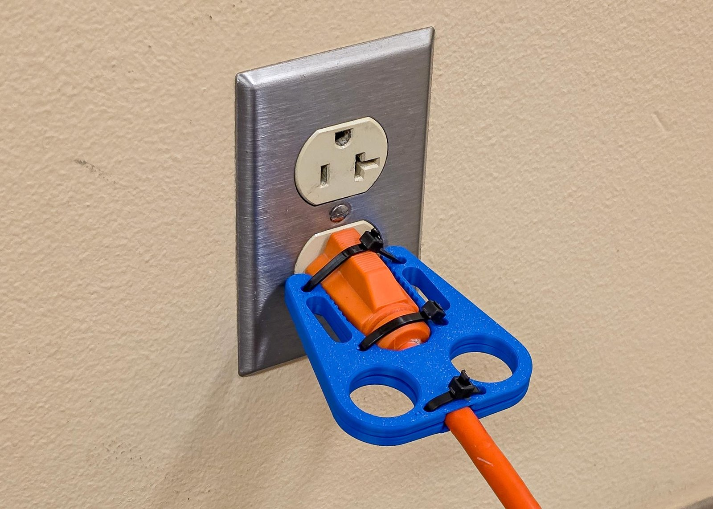
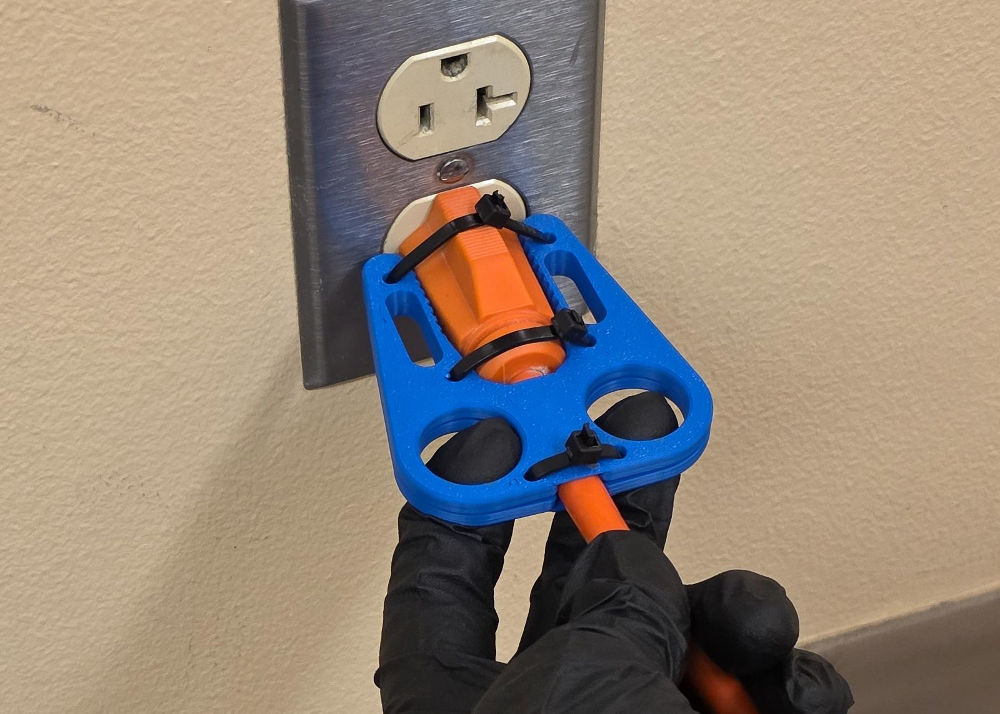
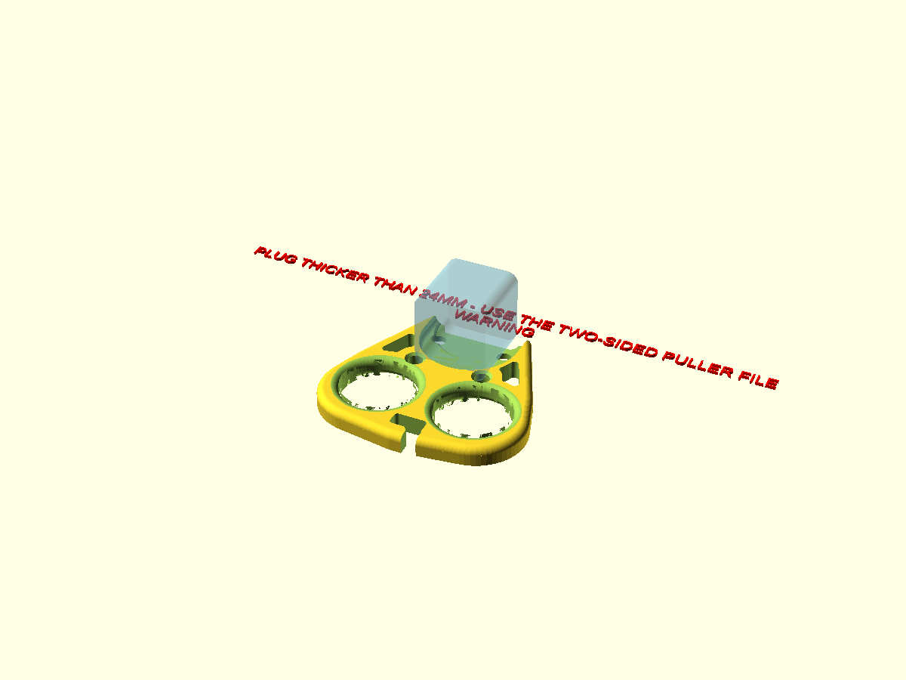

# User Guide

The plug puller is for anyone who cannot grip a plug and pull it out of an outlet: arthritis, low grip strength, tremor, a small hand, one hand. Two finger holes take the pull, so your whole hand does the work instead of a fingertip pinch. The tool stays on the plug; it touches only the plug's sides and back, never the outlet.

## Using the one-sided puller

1. Seat the tool on the plug while the plug is in the outlet: the plug in the pocket, the notch at the plug end over the outlet cover. <!-- photo: shot list item 1 -->
2. Press the cord into the hook at the cord end.
3. Put two fingers through the holes.
4. Pull straight back, away from the wall. <!-- photo: shot list item 2 -->

The tool can stay strapped to the plug between uses.

## Using the two-sided puller

The two plates stay zip-tied around the plug, so there is nothing to seat: the tool is already on. The picture shows a two-sided puller and its plug seated in an outlet, ready to be pulled.

1. Put two fingers through the round holes at the cord end, one in each lobe.
2. Pull straight back, away from the wall. The picture shows the pull.

A two-sided puller on a USB-C laptop tip works the same way, pulling the tip out of the laptop instead of a wall. <!-- photo: shot list item 6 -->

## Safety

- Nothing goes between the plug face and the outlet cover: the tool grips only the plug's sides and back.
- Pull straight out. Never lever the tool sideways or up and down.
- Do not use the tool on a damaged cord, a cracked plug, or a plug that is warm to the touch.
- Keep your fingers away from the prongs as the plug comes out.
- The tool has no conductive parts, but it is still plastic near electricity: if it cracks, stop using it.

## Care

- Before each use, look at the cord hook and the finger holes for cracks; a cracked tool is replaced, not repaired.
- Replace a zip tie that has loosened.
- Wash with soap and warm water. No solvents: they attack PETG and PLA.
- Keep it out of direct sun and off heaters; the plastic softens when hot.

## If something looks wrong

The file checks your numbers before you print. A number that cannot work makes red text appear beside the part in the preview, and if you export anyway the red text prints as an extra piece on the bed. Read it: it names the measurement to fix. What each tag means and what to do is in the [Fit Troubleshooting guide](fit-troubleshooting.md), which also covers a tool that printed fine but does not fit.

